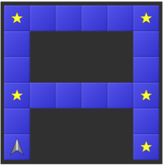
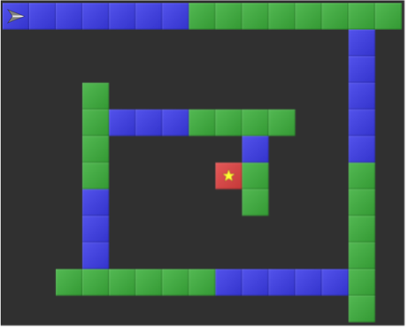

import Answer from "@site/src/components/Answer";

# RoboZZle

<iframe width="100%" height="315" src="https://www.youtube-nocookie.com/embed/MmqBVWi_Pc0?start=21" title="YouTube video player" frameBorder="0" allow="accelerometer; autoplay; clipboard-write; encrypted-media; gyroscope; picture-in-picture" allowFullScreen></iframe>

:::aufgabe Aufgabe 1

[Puzzle 1](http://www.robozzle.com/beta/index.html?puzzle=12419)

<Answer type="array" id="robozzle_a1" label="Lösung F1"  size={4} select={['', '↑', '↰', '↱']}/>

:::

:::aufgabe Aufgabe 2

[Puzzle 2](http://www.robozzle.com/beta/index.html?puzzle=2741)

<Answer type="array" id="robozzle_a2" label="Lösung F1"  size={3} select={['', '↑', '↰', '↱', 'F1']}/>

:::

:::aufgabe Aufgabe 3

[Puzzle 3](http://www.robozzle.com/beta/index.html?puzzle=10858)

<Answer type="array" id="robozzle_a3" label="Lösung F1"  size={7} select={['', '↑', '↰', '↱', 'F1']}/>

:::

:::aufgabe Aufgabe 4

[Puzzle 4](http://www.robozzle.com/beta/index.html?puzzle=12511)

<Answer type="array" id="robozzle_a4" label="Lösung F1"  size={5} select={['', '↑', '↰', '↱', 'F1']}/>

:::

:::aufgabe Aufgabe 5

[Puzzle 5](http://www.robozzle.com/beta/index.html?puzzle=10895)

<Answer type="array" id="robozzle_a5" label="Lösung F1"  size={4} select={['', '↑', '↰', '↱', 'F1', '↑--blue', '↰--blue', '↱--blue', 'F1--blue', '↑--red', '↰--red', '↱--red', 'F1--red', '↑--green', '↰--green', '↱--green', 'F1--green']}/>

:::

:::aufgabe Aufgabe 6.

[Puzzle 6](http://www.robozzle.com/beta/index.html?puzzle=10048)

<Answer type="array" id="robozzle_a6a" label="Lösung F1"  size={5} select={['', '↑', '↰', '↱', 'F1', 'F2', '↑--blue', '↰--blue', '↱--blue', 'F1--blue', 'F2--blue', '↑--red', '↰--red', '↱--red', 'F1--red', 'F2--red', '↑--green', '↰--green', '↱--green', 'F1--green', 'F2--green']}/>
<Answer type="array" id="robozzle_a6b" label="Lösung F1"  size={5} select={['', '↑', '↰', '↱', 'F1', 'F2', '↑--blue', '↰--blue', '↱--blue', 'F1--blue', 'F2--blue', '↑--red', '↰--red', '↱--red', 'F1--red', 'F2--red', '↑--green', '↰--green', '↱--green', 'F1--green', 'F2--green']}/>

:::

:::aufgabe Aufgabe 7.

[Puzzle 7](http://www.robozzle.com/beta/index.html?puzzle=2748)

<Answer type="array" id="robozzle_a7" label="Lösung F1"  size={4} select={['', '↑', '↰', '↱', 'F1', '↑--blue', '↰--blue', '↱--blue', 'F1--blue', '↑--red', '↰--red', '↱--red', 'F1--red', '↑--green', '↰--green', '↱--green', 'F1--green']}/>

:::

:::aufgabe Aufgabe 8.

[Puzzle 8](http://www.robozzle.com/beta/index.html?puzzle=140)

<Answer type="array" id="robozzle_a8" label="Lösung F1"  size={6} select={['', '↑', '↰', '↱', 'F1', '↑--blue', '↰--blue', '↱--blue', 'F1--blue', '↑--red', '↰--red', '↱--red', 'F1--red', '↑--green', '↰--green', '↱--green', 'F1--green']}/>

:::

:::aufgabe Aufgabe 9.

[Puzzle 9](http://www.robozzle.com/beta/index.html?puzzle=1040)

<Answer type="array" id="robozzle_a9" label="Lösung F1"  size={4} select={['', '↑', '↰', '↱', 'F1', '↑--blue', '↰--blue', '↱--blue', 'F1--blue', '↑--red', '↰--red', '↱--red', 'F1--red', '↑--green', '↰--green', '↱--green', 'F1--green']}/>

:::

:::aufgabe Aufgabe 10.

[Puzzle 10](http://www.robozzle.com/beta/index.html?puzzle=87)

<Answer type="array" id="robozzle_a10a" label="Lösung F1"  size={5} select={['', '↑', '↰', '↱', 'F1', 'F2', '↑--blue', '↰--blue', '↱--blue', 'F1--blue', 'F2--blue', '↑--red', '↰--red', '↱--red', 'F1--red', 'F2--red', '↑--green', '↰--green', '↱--green', 'F1--green', 'F2--green']}/>
<Answer type="array" id="robozzle_a10b" label="Lösung F2"  size={3} select={['', '↑', '↰', '↱', 'F1', 'F2', '↑--blue', '↰--blue', '↱--blue', 'F1--blue', 'F2--blue', '↑--red', '↰--red', '↱--red', 'F1--red', 'F2--red', '↑--green', '↰--green', '↱--green', 'F1--green', 'F2--green']}/>

:::