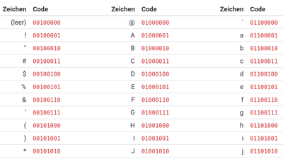
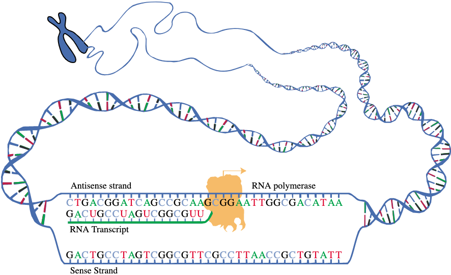
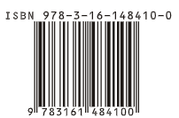
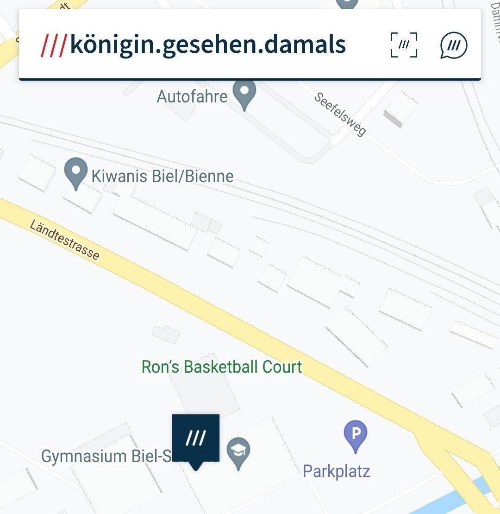

---
sidebar_custom_props:
  id: 4911ff70-5d7b-4836-bb41-ba6f346cb82e
  source:
    name: rothe.io
    ref: https://rothe.io/?page=code/1-basics/1-code/
---

# 1. Begriff

:::aufgabe[Aufgabe]
<Answer type="state" webKey="25824703-94fb-41dd-a773-0386feecad38" />

1. Wo befindet sich der Ort `königin.gesehen.damals`? Verwenden Sie die Seite [what3words.com](https://what3words.com/).
2. Bei welchen drei Wörtern wohnen Sie?
3. In welchen Situationen ist dieser Code vorteilhafter als eine Adresse? 

<Answer type="text" webKey="febd99e4-31b1-451f-89fa-e8f11134758c">

1. <i>königin.gesehen.damals</i> ist in
2. Ich wohne bei:
3. Vorteile:

</Answer>

:::

# Code

:::info[Information]
Unter einer Information versteht man «das Wissen, das ein Sender einem Empfänger über einen Informationskanal übermittelt».[1]
:::

:::info[Daten]
Daten sind Zeichen oder Symbole, die Informationen darstellen. Daten können gesendet, empfangen und verarbeitet werden.
:::

:::info[Code]
Ein Code ist eine «Sprache», die festlegt, wie Informationen vom Sender in Daten übersetzt und vom Empfänger wieder interpretiert werden.
:::

## Code
Die Informationsübertragung kann nur funktionieren, wenn Sender und Empfänger den gleichen Code verwenden. Bei zwischenmenschlicher Kommunikation ist der Code normalerweise nicht explizit festgelegt. Dann muss der Empfänger den Code erraten, was zu Missverständnissen führen kann.

Ein Code ist eine Vorschrift, welche Daten von einer Darstellung in eine andere umwandelt. Dabei darf **keine Information verloren gehen, eine Rückumwandlung muss möglich sein**.

Beispiel eines Codes: Umwandlung von Braillezeichen in Buchstaben und umgekehrt.

Das Ziel dieser Umwandlung ist es, eine für einen bestimmten Zweck optimierte Darstellung Informationen zu erreichen. So ist die Brailleschrift dafür optimiert, per Tastsinn gelesen werden zu können.

## Beispiele für Codes

:::cards{cols=3 width=200px}

#### Brailleschrift
::br

#### ASCII
::br

#### Genetischer Code
::br

#### QR-Code
::br{justify=space-between}

#### ISBN
::br

#### [what3words.com](https://what3words.com/)
:::

