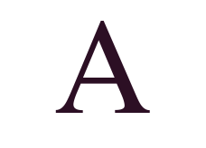
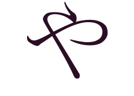
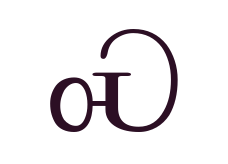
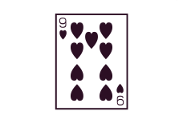
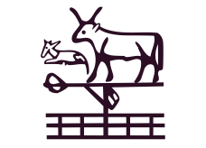

import HexSystem from '@site/docs/Codes-and-Data/01-Codierung/_def-hexa.md';

## Unicode / UTF-8 [^1]

### Unicode

[Unicode](https://de.wikipedia.org/wiki/Unicode) ist ein internationaler Standard für Schriftzeichen und Symbole. Das Unicode-Konsortium erstellt einen Katalog von allen sinnvollen Schriftzeichen, welcher ständig erweitert wird. In der Version 40.0, welche im [Oktober 2021](https://home.unicode.org/unicode-cldr-v40-now-available-2/) veröffentlicht wurde, umfasst Unicode ca. $140'000$ Zeichen.

Hier sind ein paar Zeichen aufgeführt, um zu illustrieren wie umfangreich Unicode ist:

:::cards --cols=4 --min=150px

[Lateinischer Grossbuchstaben A, $65$ oder `U+0041`](https://unicode-table.com/de/0041/)
***

[Hiragana-Buchstabe Ya, $12420$ oder `U+3084`](https://unicode-table.com/de/3084/)
***

[Cherokee-Buchstabe S, $5069$ oder `U+13CD`](https://unicode-table.com/de/13CD/)
***

[Spielkarte Neun der Herzen, $127161$ oder `U+1F0B9`](https://unicode-table.com/de/1F0B9/)
***

[Entsetztes Gesicht mit explodierendem Kopf, $129327$ oder `U+1F92F`](https://unicode-table.com/de/1F92F/)
***

[Affe, $128018$ oder `U+1F412`](https://unicode-table.com/de/1F412/)
***

[Power-Symbol, $9211$ oder `U+23FB`](https://unicode-table.com/de/23FB/)
***

[Ägyptische Hieroplyphe Nl012, $78380$ oder `U+1322C`](https://unicode-table.com/de/1322C/)
:::

Quelle: [UT - Unicode Table](https://unicode-table.com/de/)

Jedes Unicode-Zeichen hat eine eindeutige Unicode-Nummer, welche häufig als hexadezimale Zahl geschrieben wird.

⭐️ Hexadezimal Zahlen

<HexSystem />

[^1]: Remix [rothe.io](https://rothe.io/?page=code/3-text/4-unicode/)