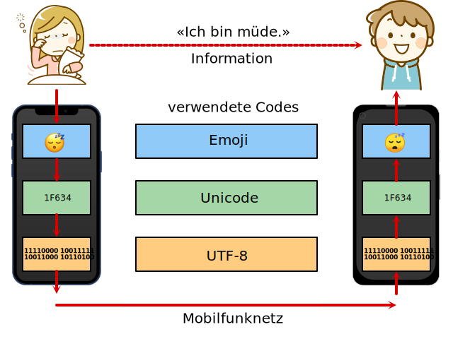

import BinDecoder from '@site/src/components/VisualizationTools/BinDecoder'

### 5. UTF-8

Werden Unicode-Zeichen ins binäre übersetzt wird klar, dass diese Zahlen nicht mehr nur mit einem Byte dargestellt werden können. Beispielsweise ist dem Affen-Emoji 🐒 die Zahl $128018_{10}$ zugewiesen, was der Binärzahl $00000001\:11110100\:00010010_{2}$ entspricht, also `3` Bytes Speicherplatz benötigt.

**UTF-8** ist ein Code, der Unicode-Zeichen in Bitmuster übersetzt. Ein Unicode-Zeichen wird mit ein bis vier Bytes (daher 8-32 bit) dargestellt. Die folgende Tabelle zeigt, wie die Codierung funktioniert:

| Unicode-Bereich |                             Bitmuster | Anzahl Bit | Byte 1: Anzahl Kontroll-Bits |
| --------------: | ------------------------------------: | ---------: | ---------------------------: |
|       0 bis 127 |                            `0xxxxxxx` |          7 |                            1 |
|    128 bis 2047 |                   `110xxxxx 10xxxxxx` |         11 |                            3 |
|  2048 bis 65535 |          `1110xxxx 10xxxxxx 10xxxxxx` |         16 |                            4 |
|        ab 65536 | `11110xxx 10xxxxxx 10xxxxxx 10xxxxxx` |         21 |                            5 |

Unicode-Zeichen mit einer Nummer zwischen 0 und 127 werden mit einem Byte dargestellt, welches mit `0` beginnt. Somit ist UTF-8 in diesem Bereich identisch mit ASCII (und Latin 1).

Für die anderen Zeichen wird mehr als ein Byte verwendet. Dabei beginnt jedes Byte mit einer oder mehreren `1`, gefolgt von einer `0`. Die Anzahl `1` im ersten Byte definieren, wie viele Bytes für das Zeichen verwendet werden. Die folgenden Bytes werden mit `10` markiert. Die `x` werden mit der Binärdarstellung der Unicode-Nummer aufgefüllt.

|                       Zeichen | Nummer |                             Bitmuster |
| ----------------------------: | -----: | ------------------------------------: |
|                             A |     65 |                            `01000001` |
|                             ä |    228 |                   `11000011 10100100` |
| Schwarze Sonne mit Strahlen ☀ |   9728 |          `11100010 10011000 10000000` |
|                        Affe 🐒 | 128018 | `11110000 10011111 10010000 10010010` |

Der Vorteil dieser Codierung ist, dass am Beginn eines Bytes erkannt wird, ob es sich um den Anfang die Fortsetzung eines Zeichens handelt.

| Beginn |                                     Bedeutung |
| -----: | --------------------------------------------: |
|     0… |                                 ASCII-Zeichen |
|    10… | Fortsetzung eines Zeichens mit mehreren Bytes |
|   110… |          Beginn eines Zeichens mit zwei Bytes |
|  1110… |          Beginn eines Zeichens mit drei Bytes |
| 11110… |          Beginn eines Zeichens mit vier Bytes |

Dies wird deutlich, wenn man dies als Binärbaum darstellt:

## Ausprobieren

<BinDecoder />

:::aufgabe
Codieren Sie Ihre zwei lieblings Emojis als UTF-8 Binär-Kette. Verwenden Sie dazu die Hilfe von Python.

<Answer type="text" webKey="91f5e478-a09b-495f-93a4-d7169ae34fdc" />
:::

## Mehrstufige Codierung [^1]

Oft werden Informationen mehrstufig codiert. So wird beispielsweise die Information «Ich bin müde.» als Emoji dargestellt. Das Handy ordnet dem Emoji die entsprechende Unicode-Nummer zu. Diese wird mit UTF-8 in eine Bitfolge übersetzt, welche über das Mobilfunknetz übermittelt wird.

Das Handy des Empfängers übersetzt die Bitfolge wieder zurück in eine Unicode-Nummer und das entsprechende Emoji. Die Interpretation des Emojis muss vom Empfänger selbst vorgenommen werden.

[^1]: Remix [rothe.io](https://rothe.io/?page=code/3-text/5-code/)
