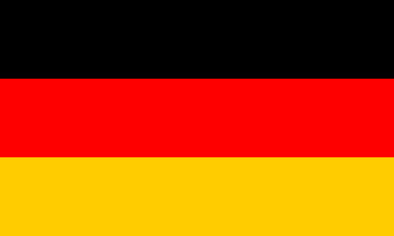

---
sidebar_custom_props:
  id: 87b16e84-0e84-48ed-a03a-ed26446b0545
  source:
    name: S. Rothe, T. Jampen, R. Meyer
    ref: https://informatik.mygymer.ch/base/?b=code&p=860740
---

# 5. Vektorgrafik

Eine SVG-Datei ist eine Textdatei, welche «Befehle» enthält, wie Formen gezeichnet werden sollen.

## Grundstruktur

Eine SVG-Datei hat folgende Grundstruktur:

```html
<svg
  xmlns="http://www.w3.org/2000/svg"
  xmlns:xlink="http://www.w3.org/1999/xlink"
></svg>
```

:::info
Den hier verfassten Code kann auch in eine Datei mit der Dateiendung `.svg` geschrieben werden und anschliessend bspw. in einem Browser betrachtet werden.
:::

## Rechtecke

Das folgende Beispiel stellt die französische Flagge dar:

```jsx live_jsx
<svg width="300" 
  height="200" xmlns="http://www.w3.org/2000/svg" 
  xmlns:xlink="http://www.w3.org/1999/xlink"
>
  <desc>Flagge Frankreichs</desc>
  <rect x="0" y="0" width="100" height="200" fill="rgb(0, 85, 164)" />
  <rect x="100" y="0" width="100" height="200" fill="rgb(255, 255, 255)" />
  <rect x="200" y="0" width="100" height="200" fill="rgb(239, 69, 49)" />
</svg>
```

- `width="300"` legt die Breite des Bildes auf 300 Pixel fest.
- `height="200"` legt die Höhe des Bildes auf 200 Pixel fest.
- `<rect ...>` zeichnet ein Rechteck an den angegebenen Koordinaten mit der angegebenen Breite, Höhe und Farbe.

:::aufgabe Deutsche Flagge

Erstellen Sie eine SVG-Datei, welche die Deutsche Flagge darstellt. Die Flagge ist 500 Pixel breit, jeder Streifen ist 100 Pixel hoch. Das Rot ist rein (d.h. 255 Rot, 0 Grün und 0 Blau). Das Gelb hat einen Rotanteil von 255 und einen Grünanteil von 204.




Halten Sie den verwendeten Code separat im untenstehenden Textfeld fest. 

:::danger
Änderungen im Live-Editor werden nicht gespeichert!
:::

```svg live_py persist noCompare id=642aff2d-c564-4f5a-a32d-09bb1ce461ed
```

```jsx live_jsx
<svg width="300" height="200" 
  xmlns="http://www.w3.org/2000/svg" 
  xmlns:xlink="http://www.w3.org/1999/xlink"
>
    <desc>Flagge Frankreichs</desc>
    <rect x="0" y="0" width="100" height="200" fill="rgb(0, 85, 164)" />
    <rect x="100" y="0" width="100" height="200" fill="rgb(255, 255, 255)" />
    <rect x="200" y="0" width="100" height="200" fill="rgb(239, 69, 49)" />
</svg>
```
:::

## Grundformen

Auf der folgenden Seite sind die Grundformen von SVG zusammengefasst:

- [SVG-Grundformen](https://wiki.selfhtml.org/wiki/SVG/Elemente/Grundformen)

:::aufgabe Grundformen

Erstellen Sie eine neue SVG-Datei und probieren Sie die Grundformen aus.

```svg live_py persist noCompare id=cc4d54db-764e-411e-8577-d1f6d58e76ec
```

```jsx live_jsx
<svg width="300" height="200" 
  xmlns="http://www.w3.org/2000/svg" 
  xmlns:xlink="http://www.w3.org/1999/xlink"
>
  <desc>Grundformen</desc>
</svg>
```
:::

:::aufgabe Eigene Zeichnung

Erstellen Sie mit SVG eine winterliche oder festliche Grafik.

```svg live_py persist noCompare id=4848dc26-9feb-4708-80bc-c17144d3a5e3
```

```jsx live_jsx
<svg width="300" height="200" 
  xmlns="http://www.w3.org/2000/svg" 
  xmlns:xlink="http://www.w3.org/1999/xlink"
>
  <desc>Eigene Zeichnung</desc>
</svg>
```
:::


