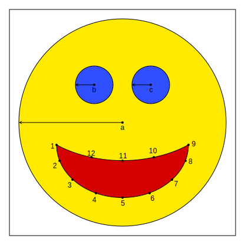

import ColorDepth from "@site/src/components/VisualizationTools/ColorEncoding/ColorDepth";

# 1. Grundlagen [^1]

## Raster- und Vektorgrafik

Bei der Speicherung von Grafiken und Bildern im Computer wird zwischen zwei grundlegenden Darstellungsarten unterschieden: der Raster- und der Vektorgrafik.

:::flex

***

:::

## Rastergrafik

Bei einer Rastergrafik wird das Bild in viele kleine Quadrate unterteilt. Jedes Quadrat wird mit genau einer Farbe eingefärbt. Diese Quadrate werden **Pixel** genannt.

Die Anzahl Pixel, welche für eine Rastergrafik verwendet werden, wird als **Auflösung** des Bildes bezeichnet. Sie berechnet sich aus der Breite $b$ und Höhe $h$ der Grafik in Pixel.

Eine Rastergrafik mit hoher Auflösung hat eine bessere Qualität, benötigt allerdings auch mehr Speicherplatz. Den theoretischen Speicherbedarf einer Rastergrafik hängt von der Anzahl Pixel und dem verwendeten Farbmodell ab.

### Farbtiefe

Die Farbtiefe gibt an, in wie vielen Abstufungen jeder Farbkanal vorliegt. Im interaktiven Tool lässt sich die Farbtiefe untersuchen.

<ColorDepth />

:::aufgabe 1. Aufgabe: Farbtiefe
Erkennen Sie das System, wie die Farbtiefe mit der Anzahl möglicher Farben zusammenhängt?
- Wie viele Farben sind bei einer Farbabstufung von 4, 8, 16, 128 oder 256 Stufen möglich?
- Wie viel bits sind für die Darstellung eines Farbkanals bei 4, 8, 16, 128 oder 256 Abstufungen nötig?

<Answer type="text" webKey="b12401c0-677d-4f31-be14-1a4ca2141ca8" />
<Solution webKey="afafbe0a-8c67-43cc-9281-db6048bcaaca">

- 4 Abstufungen: `2 bit`, $4 \cdot 4 \cdot 4=64$ Farben
- 8 Abstufungen: `3 bit`, $8^3=512$ Farben
- 16 Abstufungen: `4 bit`, $16^3=4'096$ Farben
- 128 Abstufungen: `7 bit`, $128^3=2'097'152$ Farben
- 256 Abstufungen: `8 bit` = `1 Byte`, $256^3=16'777'216$ Farben

</Solution>
:::

Für jedes Pixel werden eine bestimmte Anzahl Bit zur Darstellung der Farben verwendet. Diese Anzahl wird **Farbtiefe** genannt. Typische Farbtiefen sind:

| Farbmodell            | Farbtiefe |           Platzbedarf in Byte |
| :-------------------- | --------: | ----------------------------: |
| Farbe                 |    3 Byte |           $b \cdot h \cdot 3$ |
| Farbe mit Transparenz |    4 Byte |           $b \cdot h \cdot 4$ |
| Graustufen            |    1 Byte |                   $b \cdot h$ |
| Schwarzweiss          |     1 Bit | $b \cdot h \cdot \frac{1}{8}$ |

Rastergrafiken werden in erster Linie zur Speicherung von Fotos verwendet.

## Vektorgrafik

Bei einer Vektorgrafik wird das darzustellende Bild aus geometrischen Objekten wie Linien, Kreise oder Rechtecken zusammengesetzt. Das Prinzip ist dasselbe wie bei der Turtle-Grafik - jeder Pfad wird in einem Koordinatensystem beschrieben. Durch Hinein- oder Herauszoomen kann das Bild beliebig vergrössert oder verkleinert werden, ohne dass mehr Speicherplatz benötigt wird. 

Vektorgrafiken haben also zwei grosse Vorteile gegenüber Pixelgrafiken. Erstens benötigen sie normalerweise **deutlich weniger Speicherplatz** als eine entsprechende Pixelgrafik, da mit einem Objekt die Farbe von vielen Pixeln festgelegt wird.

Zweitens können Vektorgrafiken ohne Qualitätseinbusse **beliebig vergrössert und verkleinert** werden.

Die einzelnen Objekte können einfarbig sein oder einen Farbverlauf haben, sowie teilweise transparent sein.

Vektorgrafiken werden deshalb insbesondere für folgende Anwendungen eingesetzt:

- Logos
- Illustrationen
- Symbole, Icons
- Schriftarten
- Strassen- und Landkarten

[^1]: Inspiration: [S. Rothe, T. Jampen, R. Meyer](https://informatik.mygymer.ch/base/?b=code&p=943166)