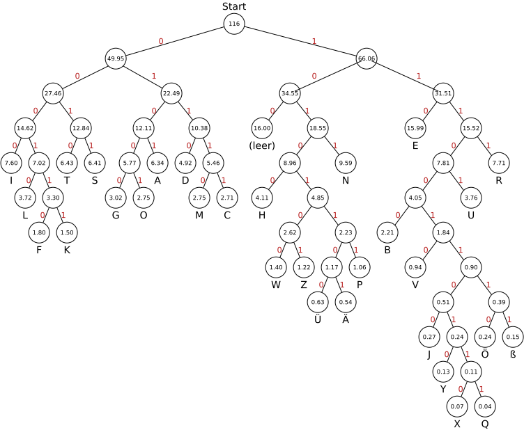

---
sidebar_custom_props:
  id: dd57c06c-5454-41d5-b10d-8fbdeb318933
  source:
    name: S. Rothe, T. Jampen, R. Meyer
    ref: https://informatik.mygymer.ch/base/?b=code&p=195436
---

import Redundancy from "@site/src/components/VisualizationTools/Redundancy";

# 2. Informationsgehalt

## Buchstabenhäufigkeit

Die Buchstabenhäufigkeit gibt an, wie oft ein Buchstabe in einem Text vorkommen. Die Häufigkeit der einzelnen Buchstaben ist je nach Sprache unterschiedlich. Das folgende Diagramm zeigt die durchschnittliche Buchstabenhäufigkeit in deutschen Texten[^1]:

## Informationsgehalt

Wir führen ein Experiment durch. Aus einem deutschen Text werden etwa 40% der Buchstaben entfernt. Zuerst werden die vier häufigsten Buchstaben `E`, `N`, `R` und `I` entfernt. Danach werden diese Buchstaben sowie `T`, `S` und `A` beibehalten und die restlichen entfernt. Obschon etwa die gleiche Menge Buchstaben entfernt worden sind, bleibt der Text nach dem Entfernen der häufigen Buchstaben verständlicher.

*Notizen*
<Redundancy />

Offenbar tragen die häufigen Buchstaben weniger zum Inhalt des Textes bei. Sie haben einen kleineren **Informationsgehalt**.

:::success[Take-Home Message]

<Answer type="text" webKey="18b21da1-1e49-4d1a-a7ea-1c930205abf1" />
:::

⭐️ Huffman Codierung für die deutsche Sprache

Die durchschnittliche Buchstabenhäufigkeit in deutschen Texten kann der folgenden Tabelle entnommen werden:

|      |        |      |       |      |       |      |       |     |        |
| ---: | :----- | ---: | :---- | ---: | :---- | ---: | :---- | --- | ------ |
|    E | 15.99% |    A | 6.34% |    O | 2.75% |    W | 1.40% | J   | 0.27 % |
|    N | 9.59%  |    D | 4.92% |    M | 2.75% |    Z | 1.22% | Ö   | 0.24 % |
|    R | 7.71%  |    H | 4.11% |    C | 2.71% |    P | 1.06% | ß   | 0.15 % |
|    I | 7.60%  |    U | 3.76% |    B | 2.21% |    V | 0.94% | Y   | 0.13 % |
|    T | 6.43%  |    L | 3.72% |    F | 1.80% |    Ü | 0.63% | X   | 0.07 % |
|    S | 6.41%  |    G | 3.02% |    K | 1.50% |    Ä | 0.54% | Q   | 0.04 % |

Daraus ergibt sich

| Zeichen | Code      | Zeichen | Code        |
| ------: | :-------- | ------: | :---------- |
|  (leer) | 100       |       O | 01001       |
|       A | 0101      |       P | 1010111     |
|       B | 111000    |       Q | 11100110111 |
|       C | 01111     |       R | 1111        |
|       D | 0110      |       S | 0011        |
|       E | 110       |       T | 0010        |
|       F | 000110    |       U | 11101       |
|       G | 01000     |       V | 1110010     |
|       H | 10100     |       W | 1010100     |
|       I | 0000      |       X | 11100110110 |
|       J | 111001100 |       Y | 1110011010  |
|       K | 000111    |       Z | 1010101     |
|       L | 000100    |       Ä | 10101101    |
|       M | 01110     |       Ö | 111001110   |
|       N | 1011      |       Ü | 10101100    |

:::danger[Verlustbehaftete Kompression]
Würden bei Textdokumenten Algorithmen eingesetzt, welche Zeichen mit tiefem Informationsgehalt weglassen, so würde man von verlustbehafteter Kompression sprechen, da der Originaltext ggf. nicht wieder hergestellt werden kann. 
:::

[^1]: [Practical Cryptography: German Letter Frequencies](http://practicalcryptography.com/cryptanalysis/letter-frequencies-various-languages/german-letter-frequencies/)
