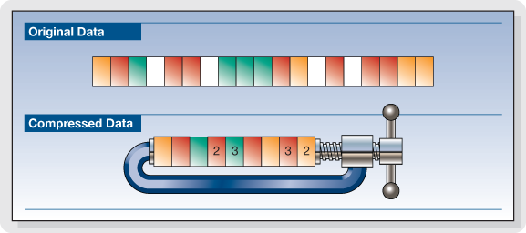

# Kompression

Die Datenkompression (abgeleitet aus dem lateinischen Wort „Compressio“: „Zusammendrücken“) – oder auch Datenkomprimierung genannt – ist ein Vorgang, bei dem die Menge digitaler Daten **verdichtet oder reduziert** wird. Dadurch sinkt der benötigte Speicherplatz, und die Übertragungszeit der Daten verkürzt sich.

Grundsätzlich wird bei der Datenkompression versucht, redundante Informationen (daher mehrfach vorhandene Informationen) zu entfernen. Dazu werden die Daten in eine Darstellung überführt, mit der sich alle – oder zumindest die meisten – Informationen in kürzerer Form darstellen lassen. Diesen Vorgang übernimmt ein *Kodierer* und man bezeichnet den Vorgang als Kompression oder Komprimierung. Die Umkehrung bezeichnet man als Dekompression oder Dekomprimierung.

Man spricht von **verlustfreier Kompression** wenn aus den komprimierten Daten wieder exakt die Originaldaten gewonnen werden können. Das ist beispielsweise bei der Kompression von Textdokumenten notwendig.

Bei der **verlustbehafteten Kompression** können die Originaldaten aus den komprimierten Daten meist nicht mehr exakt zurückgewonnen werden - ein Teil der Information geht also verloren. Die Algorithmen versuchen, möglichst nur „unwichtige“ Informationen wegzulassen. Solche Verfahren werden häufig zur Bild- oder Videokompression und Audiodatenkompression eingesetzt.[^1]

Ein Dateiformat (bspw. `.docx` oder `.jpeg`) enthalten komprimierte Daten, so dass ein spezielles Programm (bspw. Word oder ein Fotobetrachter) verwendet werden muss, damit der Inhalt dekomprimiert und angezeigt werden kann.

:::info ZIP Ordner
Sollen Datei(en) möglichst platzsparend abgespeichert werden, kann eine Benutzer:in daraus eine `.zip`-Datei erstellen. Also eine Datei, die genauso wie ein Reissverschluss (engl. *Zipper*) die Daten platzsparend zusammenfügt und abspeichert.

:::

[^1]: Quelle: [Wikipedia](https://de.wikipedia.org/wiki/Datenkompression)
