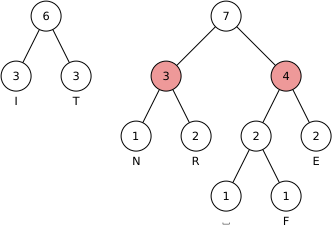

import Solution from '@site/src/components/Solution';
import Answer from '@site/src/components/Answer';

# 1. Huffman-Codierung [^1]

David Huffman hat 1952 ein Verfahren entwickelt, mit welchem Zeichen platzsparender codiert werden können. Seine Idee ist, dass Zeichen, welche häufig im Text vorkommen, einen kürzeren Code erhalten, als Zeichen, welche selten im Text vorkommen.

:::info Alltagsbezug
Die Huffman-Codierung und ähnliche Verfahren werden für das Komprimieren von Dateiformaten wie **DOCX**, **JPG** oder **MP3** eingesetzt. [^2]
:::

## Codebaum

Ein Codebaum ist eine Struktur mit einem Startknoten. Von diesem aus geht es entweder nach links oder rechts unten weiter. Eine `0` im Code bedeutet nach links gehen, eine `1` nach rechts gehen. Wenn ein Knoten mit einem Buchstaben erreicht wird, hat man ein Zeichen decodiert, man beginnt wieder von vorne.


## Erstellen eines Huffman-Baumes

Am Beispiel der Codierung des Texts «EINTRITT FREI» soll der Huffman-Algorithmus erläutert werden.

Zuerst zählt man, wie oft jedes Zeichen im Text vorkommt und erstellt eine Häufigkeitstabelle.

<div className="slim-table">

| Zeichen | Häufigkeit |
| :------ | :--------- |
| ␣       | 1          |
| F       | 1          |
| N       | 1          |
| R       | 2          |
| E       | 2          |
| T       | 3          |
| I       | 3          |

</div>


Nun geht es darum, einen Codierungsbaum zu erstellen. Die Häufigkeiten der Buchstaben bilden je einen Knoten. Die Häufigkeit steht im Knoten, der Buchstaben darunter. **Die Knoten werden nach Häufigkeit sortiert**:


Nun werden die **zwei Knoten mit den kleinsten Häufigkeiten** an einen neuen Knoten angehängt. Der neue Knoten enthält die **Summe der Häufigkeiten** der ursprünglichen Knoten:


<span className="badge badge--success">Dies wird wiederholt</span> bis alle Knoten miteinander verbunden sind. <b>Wenn zwei Knoten die gleiche Häufigkeit haben, spielt es keine Rolle, welcher gewählt wird</b>. Im nächsten Schritt wird der kleinste Knoten «N» mit «R» zusammengefasst. Man könnte aber «N» auch mit «E» oder dem neuen Knoten «2» zusammenfassen.


Wichtig ist, dass **immer die kleinsten Knoten zusammengefasst** werden. Hier werden die zwei Knoten mit Häufigkeit 2 zusammengefasst:





Wenn der Baum fertig ist, werden alle Äste, welche nach links zeigen, mit einer «0» markiert, alle die nach rechts zeigen mit einer «1».


Nun kann eine Codierungstabelle erstellt werden, indem der Code für jedes Zeichen vom Baum abgelesen wird:

<div className="slim-table">

| Zeichen | Code |
| :------ | ---: |
| I       |   00 |
| T       |   01 |
| N       |  100 |
| R       |  101 |
| E       |  111 |
| ⎵       | 1100 |
| F       | 1101 |

</div>

## Zusammenfassung

[@youtube](https://www.youtube-nocookie.com/embed/eSlpTPXbhYw)

## Übungen


:::aufgabe 1. Decodieren


Decodieren Sie diese Bitfolge mit dem obenstehenden Codebaum. Das Symbol `⎵` steht für das Leerzeichen.

`0111101011000110110101`


<Answer type="string" webKey="c7b6af35-fd40-4c50-8298-c3692277d3e4" solution="ANNAS ANANAS" sanitizer={(val) => val.trim().toUpperCase()} />

:::

:::aufgabe 2. Huffman-Codierung 1

1. Erstellen Sie zum Wort «MISSISSIPPI» eine Häufigkeitstabelle.
2. Erstellen Sie einen Huffman-Baum
3. Codieren Sie das Wort.
4. Angenommen, der Text würde mit UTF-8 codiert. Wie viele Bits können eingespart werden? 
5. Angenommen die 4 Buchstaben würden ohne Huffman-Baum Codiert. Wie viele Bits wären dann nötig? Wie viele Bits werden im Vergleich dazu eingespart?

<Answer type="text" webKey="04c0acd5-329d-4ef9-a114-7e46294d5cb6" />
<Solution webKey="990f599b-58ac-4c72-a2a4-d08482a0ca1c">

| Zeichen        | M    | P    | I    | S    |
| :------------- | :--- | :--- | :--- | :--- |
| **Häufigkeit** | 1    | 2    | 4    | 4    |


Codierung: `100 11 0 0 11 0 0 11 101 101 11`, Total 21 Bit


**Einsparung zu UTF8**: $11 \cdot 8 - 21 = 88-21 = 67$ Bits oder -76 % Daten.


**Ohne Huffman**: 

Für 4 Buchstaben reichen 2 bit Information pro Buchstaben aus:

<div className="slim-table">

| Buchstabe | Code |
| :-------- | :--- |
| M         | `00` |
| I         | `01` |
| S         | `10` |
| P         | `11` |
</div>

Also braucht es: $11\cdot2=22$ Zeichen.

**Einsparung**: Es braucht 1 Bit weniger.


<details><summary>Alternativ: MPSI</summary>

| Zeichen        | M    | P    | S    | I    |
| :------------- | :--- | :--- | :--- | :--- |
| **Häufigkeit** | 1    | 2    | 4    | 4    |


Codierung: `100 0 11 11 0 11 11 0 101 101 0`, Total 21 Bit

</details>

</Solution>

:::

:::aufgabe 3. Huffman-Codierung 2

1. Erstellen Sie zum Wort «EXTERNER EFFEKT» eine Häufigkeitstabelle.
2. Erstellen Sie einen Huffman-Baum
3. Codieren Sie das Wort.

<Solution webKey="990f599b-58ac-4c72-a2a4-d08482a0ca1c">

| Zeichen        | ⎵    | X    | N    | K    | T    | R   | F   | E   |
| :------------- | :--- | :--- | :--- | :--- | :--- | --- | --- | --- |
| **Häufigkeit** | 1    | 1    | 1    | 1    | 2    | 2   | 2   | 5   |

```
                ___15___
           ____╱        ╲____
          ╱                  ╲
     ___6___                 _9_
    ╱       ╲               ╱   ╲
   2         4             4     5
 ╱   ╲      ╱ ╲          ╱   ╲   E
1     1    2   2        2     2
N     K    T   R      ╱   ╲   F
                     1     1
                     ⎵     X
```           

Codierung: `11 1001 010 11 011 000 11 011 1000 11 101 101 11 001 010`, Total `42` Bits

Ohne Huffmann: `8` Buchstaben, also braucht jeder Buchstabe 3 Bits. --> $15 \cdot 3 = 45$ 

</Solution>
:::


[^1]: Quelle: [S. Rothe, T. Jampen, R. Meyer](https://informatik.mygymer.ch/base/?b=code&p=597080)
[^2]: Quelle: [Wikipedia: Huffman coding](https://en.wikipedia.org/wiki/Huffman_coding#Applications)
