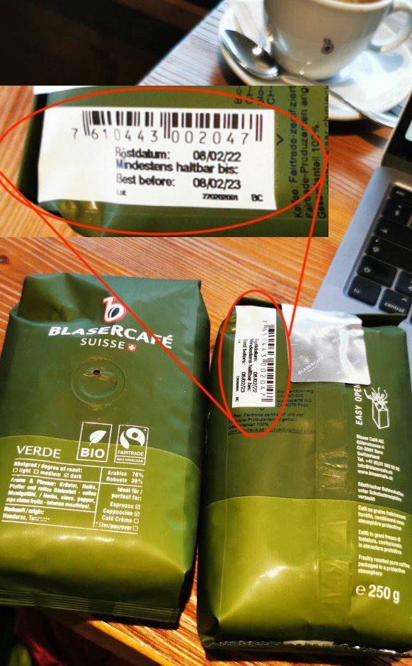

import Answer from '@site/src/components/Answer';
import Bin2Text from '@site/src/components/VisualizationTools/Bin2Text';

# 3. Fehlerkorrektur


Im Unterricht haben Sie gesehen, wie die umgedrehte Karte sofort entdeckt wurde - *Zauberei!?!?*

:::aufgabe Aufgaben

1. Beschreiben Sie, nach welchem Prinzip Herr Hofer das `5x5`-Muster zu einem `6x6`-Muster ergänzt hat.

    <Answer type="text" webKey="18145a45-4a97-47aa-9905-aeb5c332a7da" />

2. Spielen Sie das `XO`-Spiel[^1] mit verschiedenen Mustern durch. Jede Spieler:in darf zweimal „raten“.

**Von nun an soll das gelegte `6x6`-Muster nicht mehr geändert werden.**

3. Überprüfen Sie, ob es eine Position in diesen `6x6`-Muster gibt, bei der die Drehung einer Karte nicht erkannt wird.
4. Zwei nebeneinander liegende Kärtchen werden umgedreht. Überprüfen Sie, ob der Fehler erkannt werden kann. Wenn ja, können Sie den Fehler auch korrigieren?

    <Answer type="text" webKey="9c67d9c3-6abc-4c3d-bd9e-f4f23fd97023" />

5. Nun werden zwei beliebige Kärtchen umgedreht. Überprüfen Sie wieder, ob der Fehler erkannt und korrigiert werden kann.

6. Geben Sie an, wie viele Möglichkeiten zur Korrektur gefunden werden können. Markieren Sie farbig (zusammengehörende Kärtchenpaare jeweils in einer Farbe) in den abgegebenen leeren `6x6`-Raster diejenigen Positionen von Kärtchen, welche zur Korrektur in Frage kommen. Wiederholen Sie Aufgabe 5 noch zwei bis drei weitere Male und ergänzen Sie die Kästchen. Halten Sie Ihre Erkenntnisse mit einem Bild unten fest.

    <Answer type="text" webKey="f0e8b85a-0552-4f87-84a4-8590a57ba25b" />
:::

## Paritätsprüfung (Paritätsbit)
Eine Information soll binär codiert und anschliessend übertragen werden. Dabei soll erkannt werden, ob diese fehlerfrei übertragen wurde. Eine sehr einfache Methode zur Fehlererkennung bei binär codierten Informationen ist die Paritätsprüfung.

Dabei wird die Anzahl der Einsen der binär codierten Information gezählt:

> - Ist sie ungerade, wird an die Bitfolge eine „1“ angehängt, so dass die Anzahl der „Einsen“ gerade wird.
> - Ist sie gerade, wird an die Bitfolge eine „0“ angehängt, so dass die Anzahl der Einsen gerade bleibt.

Man spricht hierbei von einer geraden Parität. Das angehängte Bit wird Paritätsbit genannt.

### Beispiel

Binär codierte Information (7 Bit lang): `100110`

Zu übertragender Code mit Paritätsbit (7+1 Bit lang): `1001101`

Das Paritätsbit ist hier 1.

:::aufgabe Paritätsbit

Schreiben Sie mit Paritätsbit:

<Answer type="string" webKey="cbe3446d-5d38-4720-9548-5c0e937ca7a1" solution="1011010">

$101101$

</Answer>

<Answer type="string" webKey="7be93021-5e4a-45e5-a897-be2051d54151" solution="10101010100010">

$1010101010001$

</Answer>

Sie erhalten 10 Bit-Sequenzen, wobei jede Sequenz mit einem Paritätsbit abgeschlossen ist.

```
10110100
11000011
11101011
01000011
11100001
11001010
11100100
01110011
11001010
11010010
```

<Answer type="string" webKey="d52350db-9392-45f9-b547-95f47170c3e6" solution="10" >

Wie viele zusätzliche Bits waren für die Fehlererkennung nötig?

</Answer>

<Answer type="string" webKey="1c50aa68-bb3e-4421-99e3-272ffc16cc5f" solution="2" >

Wie viele zusätzliche Bits Sequenzen sind kaputt?

</Answer>

Entfernen die fehlerhaft übertragenen Sequenzen und entfernen Sie alle Paritäts-Bits. Welche Nachricht wird angezeigt?

<Bin2Text />

<Answer type="text" webKey="3600db39-dc95-4a5b-beb4-752509e5567a" />

Wieso wird ein `p` statt der Buchstabe `b` angezeigt? (`b` ist binär `1100010`). Weshalb wurde dies nicht als Fehler erkannt? 

<Answer type="text" webKey="d217e695-dd2f-437c-92f4-eeb4e9c982b4" />
:::

## EAN-13

:::flex --columns=2
Letzthin beim Vorbereiten im Kaffee nebenan, wollte ich eine Packung Kaffee kaufen - doch das Einscannen des Codes ging nicht, so dass der Strichcode einer anderen Packung eingelesen werden musste...

Doch wie funktioniert das? Weshalb wurde erkannt, dass der Code kaputt war?

Nach einer kurzen Recherche: Die Strichcodes auf Verpackungen sind sog. **EAN-13-Codes** (EAN = European Article Number). Doch wie funktionieren diese?
***

:::

:::aufgabe Aufgabe
1. Was könnte passieren, wenn ein Strichcode verdreckt oder beschädigt ist?

    <Answer type="text" webKey="a54b9818-5715-4442-a836-9a639ea4e649" />

2. Die ersten 12 Stellen des (richtigen) EAN-13 Codes der Baslercafé Verpackung lautet: `7610 4430 0204`. Wie berechnet sich daraus nun die letzte Stelle, die Prüfziffer? Erkennen Sie das System? (Einfachheitshalber wurde eine weitere EAN-Nummer abgedruckt `4260 0806 8005`).
   - Führen Sie zu diesen Codierungen die beiden untenstehende Rechnungen aus und halten Sie die Ergebnisse fest.

    

   - Ermitteln Sie anhand der beiden Beispiele, wie die letzte Ziffer mit der Rechnung zusammenhängt und beschreiben Sie das gefundene Verfahren.

    <Answer type="text" webKey="611e1a17-f69d-4cc9-9c47-d1777d17a333" />

3. Berechnen Sie auch für die folgenden Strichcodes die Prüfziffer:

    

<Answer type="string" webKey="f6bb3360-2bae-4ebd-81a4-00d9b61dbbaa" solution="2">

401035527731

</Answer>

<Answer type="string" webKey="3a0d5a1c-4eac-4dea-874d-c6ca5d9c4200" solution="9">

400781730180

</Answer>


[^1]: Inspirationsquelle: [lehrerfortbildung-bw.de](https://lehrerfortbildung-bw.de/u_matnatech/imp/gym/bp2016/fb1/1_i1_duc/2_kopiervorlagen/2_xo/)