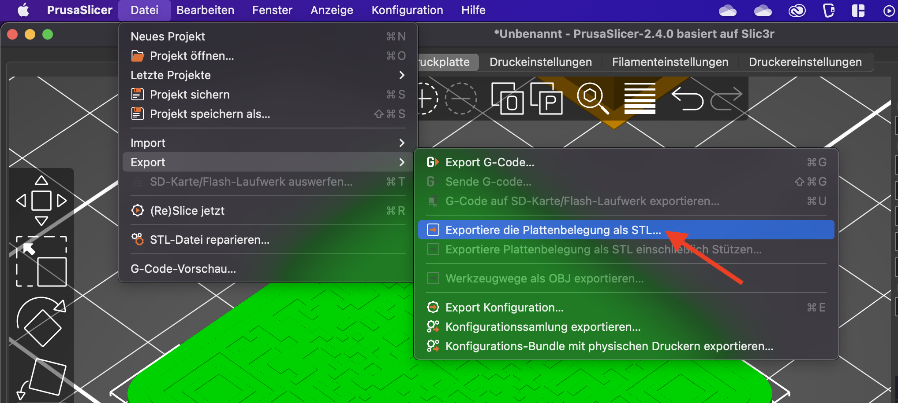

import Tabs from '@theme/Tabs';
import OsTabs from '@site/src/components/OsTabs'
import TabItem from '@theme/TabItem';

# QR-Code 3D-Drucken

Mit einem 3D-Drucker lassen sich dreidimensionale Objekte erzeugen. Dabei arbeiten alle gängigen Druckverfahren schichtweise - das Objekt wird aus mehreren Schichten zusammengesetzt, wobei eine einzelne Schicht zweidimensional auf die darunterliegende Schicht aufgetragen wird.

:::cards --columns=2 --text-align=center --width=200px
***--text-align=center

***--text-align=center

***

***

:::

Um ein Objekt zu drucken, muss in einem ersten Schritt ein 3D-Modell erstellt werden und einem zweiten Schritt muss dieses Modell in einen konkreten Druck-Ablaufplan erstellt werden, welcher Schicht-für-Schicht vorgibt, wo sich der Druck-Kopf durchbewegen soll.
- ein 3D Modell - [tinkercad.com](https://www.tinkercad.com/)
- den Druck-Ablaufplan Plan für das Modell - [slicer](https://www.prusa3d.com/de/page/prusaslicer_424/)

## QR Code 3D-Modell

Das Grundgerüst für den QR-Code kann direkt über die Webapplikation von https://printer.tools/qrcode2stl/ erzeugt werden.

<Tabs
  defaultValue="step-1"
  values={[
    {label: 'QR Code', value: 'step-1'},
    {label: '3D Model', value: 'step-2'},
    {label: 'Speichern', value: 'step-3'},
  ]}>
  <TabItem value="step-1">

</TabItem>
<TabItem value="step-2">

</TabItem>
<TabItem value="step-3">

Die einzelnen Teile des Modells können als `.zip`-Ordner heruntergeladen werden. Dazu muss die Option **Separate Parts** aktiviert sein.

</TabItem>
</Tabs>

Der heruntergeladene `.zip`-Ordner enthält die einzelnen Teile des 3D-Modells, so auch den QR-Code selbst: `qrcode-1645205191753.stl`.

:::danger Offene Kanten
Leider gibt es unterschiedliche Konventionen für die Erzeugung von 3D-Objektmodellen. Obwohl unser erzeugter QR-Code auf den ersten Blick gut aussieht, wurden bei der Erzeugung nicht alle Kanten miteinander verbunden, so dass einige Flächen nicht abgeschlossen wurden. Dies kann automatisch behoben werden:

<OsTabs>
<TabItem value="win">

Die heruntergeladene Datei im [slicer](https://www.prusa3d.com/de/page/prusaslicer_424/) öffnen.

Es wird ein Warn-Symbol angezeigt - durch **Doppelklicken** auf das Symbol können die Fehler korrigiert werden. 

</TabItem>
<TabItem value="mac">

Mac OSX bietet aktuell keine Möglichkeit, unvollständige 3D-Objekte zu flicken. Deshalb muss ein Web-Dienst verwendet werden:

https://tools3d.azurewebsites.net/

Dort kann die `.stl` Datei hochgeladen, repariert und wieder heruntergeladen werden.

</TabItem>
</OsTabs>

Das Dateiformat ändert sich durch die Reparatur zu `.3mf`. Um im nächsten Schritt das 3D-Modell selber anzupassen, muss das Dateiformat aber wieder auf `.stl` geändert werden. Dies gelingt mit dem [slicer](https://www.prusa3d.com/de/page/prusaslicer_424/), welcher  `.3mf` in `.stl` Dateien konvertieren kann:

:::

## 3D-Modell erstellen: Tinkercad

- qr code als png: https://goqr.me/de/#t=url
- png zu (korrektem) svg: https://www.pngtosvg.com/
- 3d modelling: https://www.tinkercad.com/
- everything together: https://printer.tools/qrcode2stl/#shareQR-eyJ0ZXh0IjoiaHR0cHM6Ly9nYnNsLmNoIiwiYmFzZSI6eyJ3aWR0aCI6NDAsImhlaWdodCI6NDAsImJvcmRlckRlcHRoIjowLCJoYXNUZXh0Ijp0cnVlLCJ0ZXh0U2l6ZSI6NiwidGV4dE1lc3NhZ2UiOiJHQlNMIiwidGV4dERlcHRoIjowLjEsImtleWNoYWluUGxhY2VtZW50IjoidG9wTGVmdCJ9LCJjb2RlIjp7ImRlcHRoIjowLjEsIm1hcmdpbiI6MiwiaW52ZXJ0Ijp0cnVlfX0=
- slicer:
