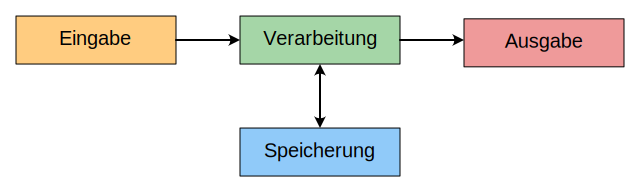
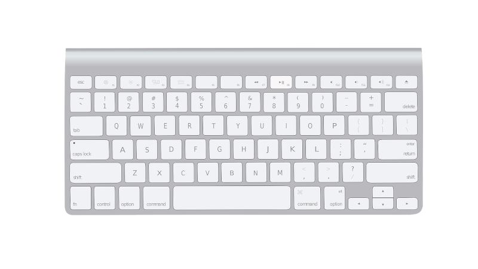
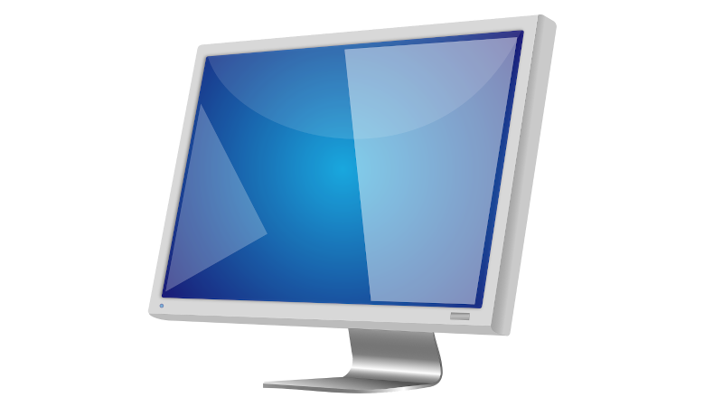
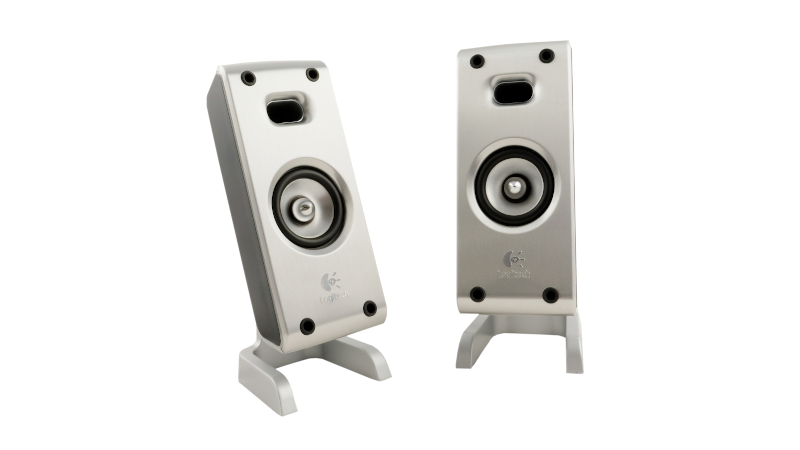

---
sidebar_custom_props:
  id: ed9c1ce4-c3f5-4f3e-9eec-530988759829
---

# 2. EVAS-Prinzip

Das **EVAS-Prinzip** beschreibt ein Grundprinzip der Datenverarbeitung. Die Abkürzung leitet sich aus den ersten Buchstaben der Begriffe **Eingabe**, **Verarbeitung**, **Ausgabe** und **Speicherung** ab.

Daten müssen zuerst in den Computer gelangen. Dazu ist ein **Eingabegerät** notwendig, welches Informationen aus der Umwelt in digitale Daten umwandelt. Diese Informationen können Bewegungen oder Aktionen der Benutzer:innen, Messwerte oder digitale Nachrichten eines anderen Computers sein.

Im Gerät werden die Daten **gespeichert** und **verarbeitet**.

Ein **Ausgabegerät** wandelt Daten wieder in Informationen für die Umwelt um. Diese können beispielsweise visuell oder akustisch sein, um die Sinne der Benutzer:innen anzusprechen. Es kann sich aber auch um digitale Nachrichten handeln, die an andere Computer weitergeleitet werden.

## Ein- und Ausgabegeräte

Typische Ein- und Ausgabegeräte für Computer sind:

:::cards{columns=3}

::br

::br

::br

::br

::br

:::

:::aufgabe[Aufgabe]
<Answer type="state" webKey="46975da2-0cd3-4aa1-96f1-8e29628a2127" />

Welche Möglichkeiten für die Ein- und Ausgabe von Daten hat Ihr Smartphone? Versuchen Sie, möglichst alle aufzuschreiben. Bilden Sie dabei folgende Kategorien:

- **nur** Eingabegerät
- **Ein**- und **Aus**gabegerät
- **nur** Ausgabegerät

Hilfreiche App: [👉 PhyPhox](https://phyphox.org/)

<Answer type="text" webKey="ddb7899f-aa03-4095-aa29-b5f053d46b14" />
:::
