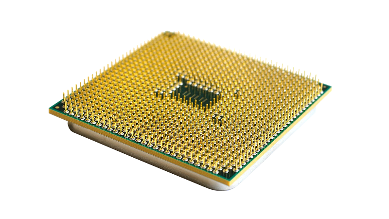
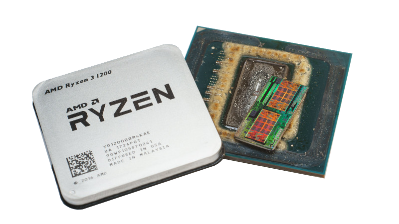

import Answer from '@site/src/components/Answer'

# 3. Prozessor
---

Der Prozessor ist für die **Verarbeitung** von Daten im Computer zuständig. Ausserdem überwacht und steuert er den Ablauf von Programmen.

Moderne Prozessoren enthalten mehrere **Kerne**, welche unabhängig voneinander Programme ausführen und Berechnungen vornehmen können.

## Kenngrössen

Für den Prozessor gibt es folgende wichtige Kenngrössen:

- Die Anzahl **Kerne** gibt an, wie viele Berechnungen ein Prozessor gleichzeitig, also parallel, ausführen kann.
- Die **Taktfrequenz** gibt an, wie schnell der Prozessor Berechnungen durchführen kann. Sie wird in der Einheit **Hertz** angegeben, was «pro Sekunde» bedeutet. `2.1 GHz` sind "2.1 Gigahertz", also `2'100'000'000 Hz` und somit 2.1 Milliarden Operationen, die pro Sekunden berechnet werden können. 

:::cards --columns=3

***

***

:::

## Aufgaben

Der Prozessor hat zwei Hauptaufgaben. Einerseits **kontrolliert** er die Ausführung der Programmanweisungen. Dabei **steuert** er alle anderen Komponenten des Computers.

Andererseits **verarbeitet** der Prozessor Daten. Das heisst, er führt mathematische oder logische Operationen mit binären Zahlen aus, beispielsweise:

- Vergleichen
- Addieren
- Multiplizieren
- Bits um eine Stelle nach links schieben

Im Kapitel [Rechnerarchitektur](../03-architecture/03-cpu.md) wird die Funktionsweise des Prozessors genauer erklärt.

## Weitere Funktionen

In moderne Prozessor-Chips werden auch weitere Funktionen integriert, welche früher von separaten Bauteilen übernommen wurden.

Moderne Desktop-Prozessoren enthalten normalerweise eine Grafikeinheit, welche die Darstellung von Text, Bild und Video auf einem Bildschirm übernimmt.

Bei Prozessoren für Mobiltelefone werden üblicherweise spezialisierte Funktionen für GPS, W-LAN, Mobilfunk und Bluetooth auf dem Chip integriert. Dabei spricht man von einem Ein-Chip-System oder SoC (engl. *system on a chip*).

:::aufgabe Meine CPU

1. Welche Merkmale weist der Prozessor Ihres Laptops auf?
2. Vergleichen Sie Ihre Werte mit herkömmlichen Prozessoren für Desktop-Computer auf Digitec. Beschränken Sie sich dabei auf Prozessoren von den beiden grössten CPU-Herstellern **AMD** und **Intel**. [https://www.digitec.ch](https://www.digitec.ch/de/s1/producttype/prozessor-83)
   1. Welche Taktrate hat die günstigste/teuerste CPU, wenn die CPU dieselbe Anzahl Kerne hat wie Ihr Gerät?
   2. Worin könnte der grosse Unterschied bei den Taktraten zwischen Laptop- und Desktop-Computer liegen?
<Answer type="text" webKey="bd480f52-a373-40fc-8666-33b977b4bc1f" />
:::