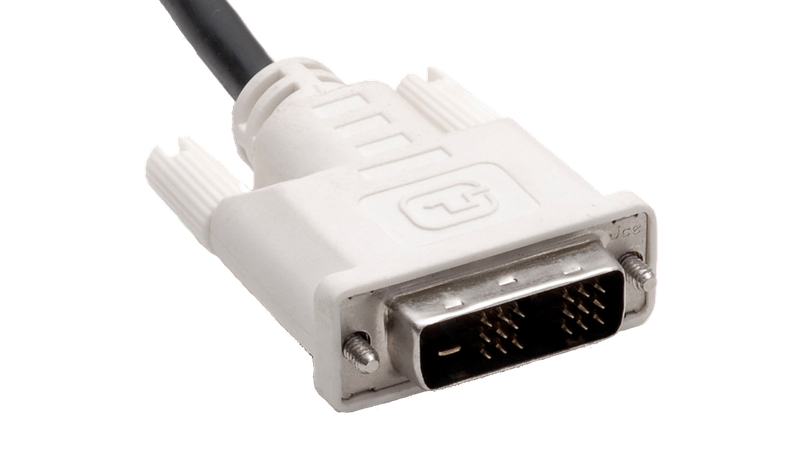
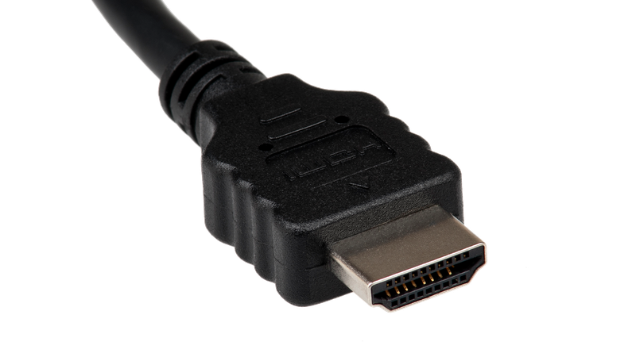

# 5. Grafikkarte

Die Grafikkarte ist neben dem Prozessor die zweite wichtige Komponente, welche im Computer für die **Verarbeitung** von Daten zuständig ist. Grafikkarten haben folgende Aufgaben:

- Erzeugen einer Pixelgrafik aus einer anderen Darstellungsform,
- Speichern dieser Pixelgrafik, des **Bildschirminhalts**,
- Steuerung des Bildschirms, damit er den Bildschirminhalt anzeigt.

## Kenngrössen

Für Grafikkarten gibt es drei wichtige Kenngrössen:

- Die maximale **Auflösung**, also die Anzahl der Bildpunkte (z.B. 7680×4320).
- Die **Taktfrequenz** gibt an, wie schnell der Prozessor Berechnungen durchführen kann. Sie wird in der Einheit **Hertz** angegeben, was «pro Sekunde» bedeutet. Die Grafikakrte hat also auch einen eigenen leistungsfähigen Prozessor.
- Die **Speicherkapazität** ist die Datenmenge, welcher der Speicher maximal aufnehmen kann. Sie wird in Byte angegeben. Die Grafikkarte besitzt also auch einen eigenen Arbeitsspeicher.

:::cards --columns=2

#### Hercules Graphics Card
Hochauflösende monochrome Grafikkarte (720×348 Pixel, 1 Bit Farbe) mit 64 KB Video-RAM aus dem Jahr 1982.

***

#### NVIDIA RTX 2080 TI
Aktuelle Grafikkarte aus dem Jahr 2018 mit einer maximalen Auflösung von 7680×4320 Pixel pro Bildschirm, 11 GB Video-RAM und Unterstützung von Echtzeit-Raytracing.
:::

Frühe Grafikkarten konnten nur aus Text selbständig eine Pixelgrafik erzeugen. Um etwas anderes auf dem Bildschirm darzustellen, mussten Programme oder das Betriebssystem die Grafik selbst berechnen und pixelweise an die Grafikkarte übermitteln.

mit der Zeit konnten neuere Grafikkarten immer mehr Funktionen der Bilderzeugung übernehmen:

- **2D-Rasterung:** Zeichnen von Linien, Rechtecken und Kreisen,
- **3D-Rasterung:** Verdeckungsberechnung und Lichtsimulation,
- **3D-Raytracing:** fotorealistische Berechnung basierend auf der Rückverfolgung von Lichtstrahlen.

Ausserdem werden heute Grafikkarten auch für aufwändige Berechnungen in anderen Bereichen eingesetzt, z.B. für **neuronale Netze** oder für das Mining von **Kryptowährungen**.

### Steuerung des Bildschirms

Für die Steuerung des Bildschirms gibt es vier aktuelle Technologien.

:::cards --columns=2

***

***

***

:::

:::aufgabe Aufgabe Grafikkarte
Wieso ist die Grafikkarte eigentlich ein ganzer Computer (mit eigenem Prozessor, eigenem RAM)?
:::
