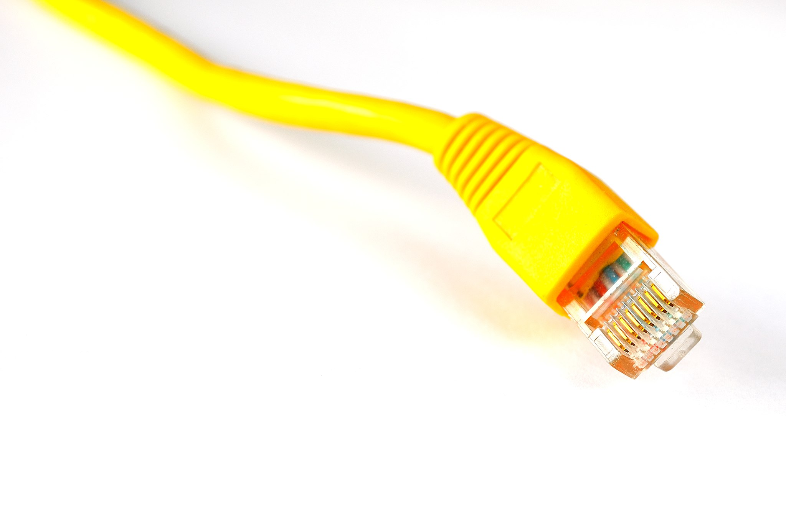

# 6. Netzwerkkarte

Ein Computer ohne Möglichkeiten zur Kommunikation ist nicht mehr vorstellbar. Damit ein Computer sich in ein LAN einbinden kann, benötigt er eine Netzwerkkarte – sei es eine mit Kabelanschluss oder eine drahtlose für die Teilnahme in einem WLAN.

## Kenngrössen

Für die Netzwerkkarte gibt es folgende wichtige Kenngrösse:

- Die maximale **Übertragungsrate** gibt an, wie viele Daten pro Sekunde (im Idealfall) übertragen werden können. Sie wird in der Einheit **Mbps** oder **Gbps** angegeben, was «Mega- resp. Gigabit pro Sekunde» bedeutet. Gemessen wird hier also nicht in Byte sondern in Bit, was etwas ungewöhnlich ist.

## Netzwerkkarte

Heute ist die Netzwerkkarte meist direkt auf dem Mainboard integriert und muss nicht als Steckkarte hinzugefügt werden. Allerdings kann ein Computer (insbesondere Server) so immer noch aufgerüstet und mit mehreren Netzwerkkarten ausgerüstet werden.

:::cards --columns=2

***

:::

## Drahtlose Netzwerkkarte

Netzwerkkarten zur Verbindung mit einem drahtlosen Netzwerk (WLAN) gibt es in etlichen Ausführungen. Einerseits kann sie in PCs und Server wie andere Steckkarten eingebaut werden, andererseits gibt es sie in kleineren Ausführungen für Notebooks oder sogar als USB-Stecker im Miniformat.

:::cards --columns=3

***

***

:::

:::aufgabe Netzwerkkarte

Sie wollen für die Ferien einige Filme von Netflix offline verfügbar machen und müssen insgesamt `10 GB` Daten herunterladen. Ihr WLAN kann in ihr Zimmer maximal `150 Mbps` übertragen. Wie viel Zeit gewinnen Sie, wenn Sie aufstehen um das Gerät per Ethernet an Ihren Glasfaser-Router mit `1 Gbps` anschliessen?\*

Berechnen Sie:
- die Download Dauer per WLAN
- die Download Dauer per Ethernet
- den Zeitgewinn

<Answer type="text" webKey="f1c25b7d-6186-4cbf-9b8d-ca2728017b0c" />

*\* Die Voraussetzung für diesen Vergleich wäre natürlich, dass die Netflix-Server die Filme auch effektiv mit 1Gbps bereitstellen würden.*
:::
