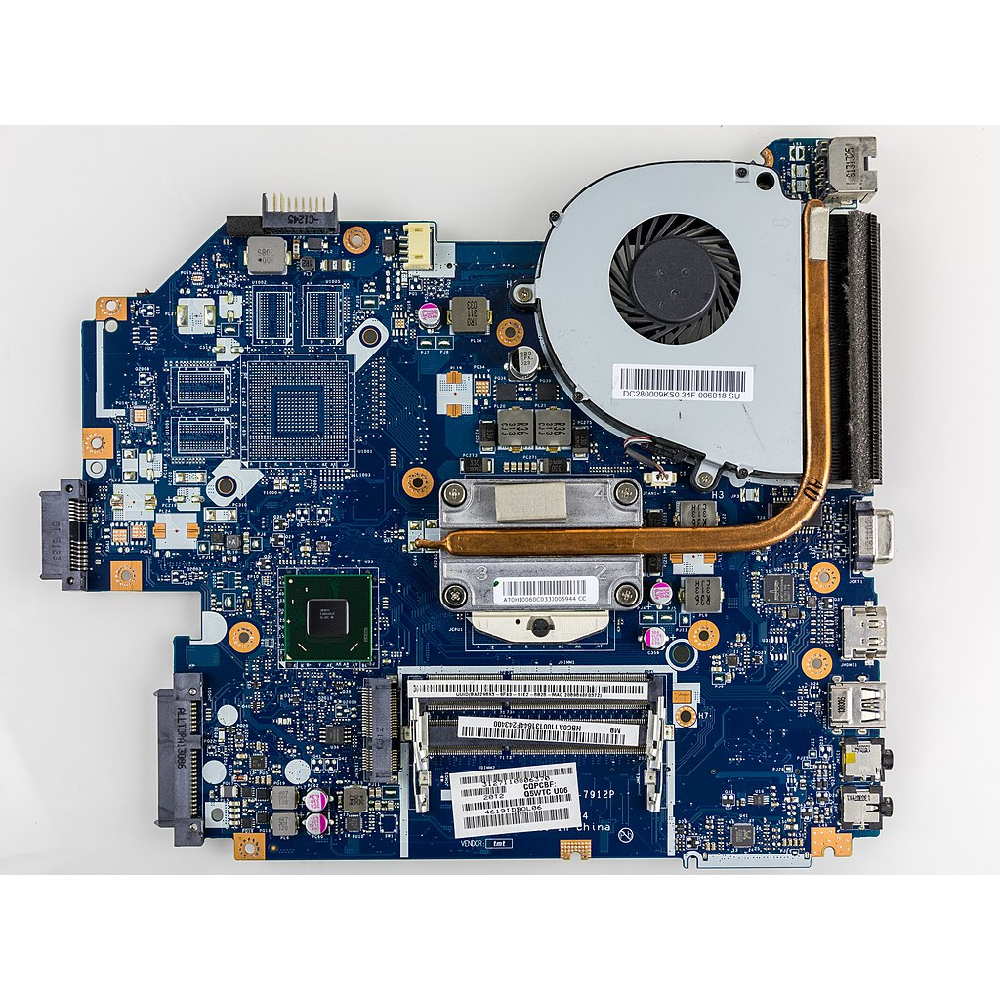

---
sidebar_custom_props:
  id: 60f7cadd-349a-4bec-8860-d3dc6b9de6bd
---

# 8. Stromversorgung

Die Stromversorgung eines Computers erfolgt über Gleichstrom (DC), das heisst, dass der Wechselstrom unseres Stromnetzes zuerst in Gleichstrom umgewandelt werden muss. Diese Funktion übernimmt das Netzteil.

Das Netzteil eines Desktop-Computers ist stets eingebaut. Bei einem Notebook hingegen übernimmt ein externes Netzteil die Stromtransformation, da im Innern des Notebooks nicht genügend Platz dafür vorhanden ist.

## Kenngrössen

Für das Netzteil gibt es die folgende wichtige Kenngrösse:

Leistung
: Die **Leistung** gibt an, wie viel Energie das Netzteil in einer bestimmten Zeit den Komponenten maximal zur Verfügung stellen kann. Die Leistung wird gemessen in **Watt**.

:::cards[--columns=2]

***

:::

## Leistung und Wärme

Die meiste Leistung verpufft als Abwärme, darum brauchen Desktop-PCs (und leistungsfähige Grafikkarten) eine aktive Prozessorkühlung, d.h. einen Kühlkörper mit grosser Oberfläche und darüber einen starken Lüfter, um die Wärme vom Prozessor wegzubringen.

Notebooks verwenden stromsparendere Prozessoren, daher reicht dort ein kleinerer Lüfter aus, oder sie haben gar nur eine passive Kühlung ohne aktiven Lüfter.

:::cards[--columns=2]

***

:::

:::aufgabe[Stromversorgung]
<Answer type="state" webKey="2ab0c869-d189-48bb-9e3f-1f438870a37e" />

1. Recherchieren Sie im Internet und finden Sie heraus, wie viel Leistung (Watt) folgende Geräte typischerweise im Betrieb beziehen:
   - Staubsauger
   - Desktop-PC-Netzteil
   - Notebook-Netzteil
   - Smartphone-Ladegerät
   - LED-Lampe

   <Answer type="text" webKey="3a105b6b-5da9-455a-a654-ef1d86be9d0d" />

2. Wie beurteilen Sie folgende Aussagen? Ist das erwähnte Gerät neu oder alt?
   - Ein Notebook verbraucht zum Bearbeiten eines Textdokuments oder Surfen im Internet ca. 7W.
   - Ein Desktopcomputer braucht ein 1500W-Netzteil.
   - Eine Stereoanlage verbraucht im Standbyzustand knapp 15W.
   - Ein Beamer hat einen Standbystromverbrauch von ca. 0.5W.

   <Answer type="text" webKey="99af8549-e30f-4fbf-b52a-084c320e5c53" />

:::
