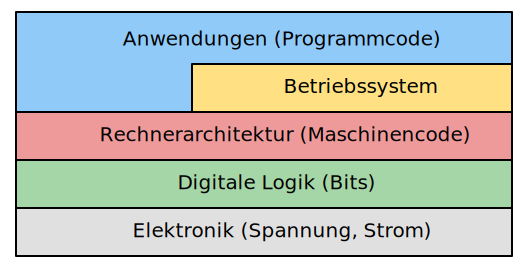

---
sidebar_custom_props:
  id: 5ee6d041-0feb-40f3-8dd4-f5f512dfd8a0
---

# 9. Ebenen

Wie die Netzwerke kann auch der Computer selber auf verschiedenen **Ebenen** betrachtet werden.

## Elektronik

Auf der Ebene der **Elektronik** werden die Zustände 0 und 1 durch unterschiedliche Spannungen dargestellt. Das grundlegende Bauelement für digitale Schaltungen ist der **Transistor**.

::youtube[https://www.youtube-nocookie.com/embed/5wIRJN3DN_8]

:::aufgabe[Transistoren (Wiederholung)]
<Answer type="state" webKey="fefee10f-6ea1-4858-91a3-8406e4571714" />

Sehen Sie sich das obige Video an. Und beschreiben Sie in eigenen Worten:
- welche Analogie aus dem Alltag passt zum Transistor?
- wozu wird ein Transistor bei Computern eingesetzt?

<Answer type="text" webKey="77218889-54e7-4ff2-ac32-10a2de6cb927" />
:::

## Digitale Logik

In der **digitalen Logik** werden aus den Grundelementen (**logische Gatter**) komplexe Schaltungen aufgebaut, welche z.B. Zahlen addieren oder Werte speichern können.

## Rechnerarchitektur

Die **Rechnerarchitektur** legt fest, wie verschiedene Bauelemente (wie z.B. Rechenwerk und Speicher) miteinander verknüpft werden und in welcher zeitlichen Abfolge Daten untereinander ausgetauscht werden. Daraus ergeben sich die grundlegenden Befehle (**Maschinencode**), welche der Computer versteht.

## Betriebssystem

Das **Betriebssystem** kontrolliert und koordiniert den Zugriff auf die Hardware für die verschiedenen Anwendungen, welche auf dem Computer ausgeführt werden. Es stellt grundlegende Funktionen wie die Dateiverwaltung und Netzwerkkommunikation zu Verfügung. Das Betriebssystem enthält viel Programmcode, der speziell für die eingesetzte Rechnerarchitektur und -hardware geschrieben ist.

## Anwendungen

Die **Anwendungen** unterstützen den/die Benutzer/in in der täglichen Arbeit. Sie werden in **höheren Programmiersprachen** geschrieben, d.h. sie brauchen sich dank des Betriebssystems nicht um die eingesetzte Hardware zu kümmern. Solche Programme können vom Prozessor nicht direkt ausgeführt, sondern müssen zuerst noch von einem Compiler in Maschinencode übersetzt werden. Dies erleichtert uns Menschen die Arbeit beim Programmieren, da der Programmcode nicht an bestimmte Hardware und Architektur gebunden und damit allgemeingültiger und einfacher ist.
