---
sidebar_custom_props:
  id: 9fb56ea9-eeff-4fd6-bf00-a9dac54afad5
---

# 2. CircuitVerse

Wir arbeiten in diesem Kapitel zu den Logikgattern mit der Online-Plattform [👉 CircuitVerse](https://circuitverse.org/). Dort können Schaltungen einfach geplant werden. Über diverse Eingabeelemente kann gesteuert werden, ob an den Eingängen eine 1️⃣ oder eine 0️⃣ anliegt. Mit verschiedenen Ausgabeelementen kann die gezeichnete Schaltung überprüft werden.

- [👉 CircuitVerse](https://circuitverse.org/)

## CircuitVerse-Konto erstellen

Um in CircuitVerse ein eigenes Benutzerkonto anzulegen, müssen Sie zuerst im Menü oben rechts auf __Login__ klicken:

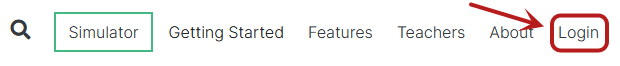

Anschliessend wählen Sie unterhalb des Login-Formulars den Link __Sign up__:

Schliesslich füllen Sie die Benutzerdaten aus (am besten die Schul-E-Mail-Adresse angeben) und klicken auf den grünen __Sign up__-Knopf:

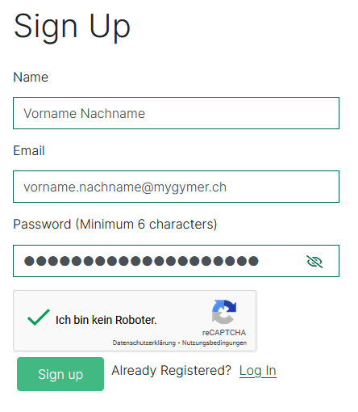

:::aufgabe
<Answer type="state" webKey="f1e3f34f-43b1-48e5-8edb-4718301ee105" />

Erstellen Sie ein eigenes Benutzerkonto bei [👉 CircuitVerse](https://circuitverse.org/users/sign_up), damit Sie die eigenen Schaltungen abspeichern können (bitte den richtigen Namen und die Schul-E-Mail-Adresse verwenden).
:::

## Simulator starten

Nach dem Einloggen klicken Sie im Menü oben rechts auf __Simulator__, um in den Simulator zu wechseln:

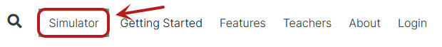

## Eingabeelemente

Es stehen etliche Eingabeelemente zur Auswahl, wir verwenden allerdings nur die beiden ersten (__Input__ und __Button__). Die Elemente werden links in der Spalte der __Circuit Elements__ im Bereich __Input__ ausgewählt und anschliessend im Arbeitsbereich wie gewünscht platziert.

Beim Element __Input__ (oben links) kann durch Mausklick zwischen einer **1** und einer **0** hin- und hergewechselt werden.

Das Element __Button__ (oberste Zeile Mitte) ist stets ausgeschaltet (also 0️⃣), ausser während der Zeit, in der mit der Maus auf den Druckknopf gedrückt wird.

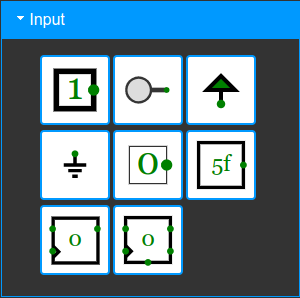

## Ausgabeelemente

Im Bereich __Output__ stehen wiederum etliche Elemente zur Verfügung. Wir verwenden ausschliesslich die beiden oben links (__Output__) und oben rechts (__DigitalLed__).

Das Element __Output__ zeigt als Ausgabe eine **1** oder eine **0** an, während die __DigitalLed__ im Zustand 1️⃣ leuchtet.

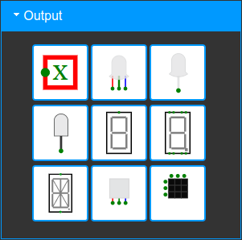

## Elemente verbinden

An sämtlichen Elementen ist mit grünen Punkten markiert, wo Verbindungen angeschlossen werden können. Um Komponenten zu verbinden, klicken Sie auf einen Punkt, halten die Maustaste gedrückt und ziehen die Leitung bis zum anderen Punkt.

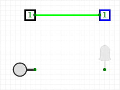

Es ist erlaubt, mehrere Ausgabeelemente zu verbinden:

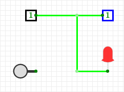

Das Verbinden mehrerer Eingänge führt allerdings zu Fehlern – schliesslich ist dann unklar, was gelten soll, wenn verschiedene Eingabewerte auf derselben Leitung anliegen:

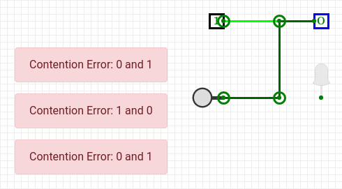

## Elemente benennen

Ist ein Ein- oder Ausgabeelement auf dem Schaltplan aktiv (angeklickt), so können in der linken Spalte ganz unten unter __Properties__ gewisse Einstellungen des Elementes verändert werden. Für uns sind nur __Label__ und __Label Direction__ interessant. So können Ein- oder Ausgabeelemente angeschrieben und diese Beschriftungen sinnvoll platziert werden.

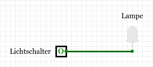

## Logikgatter

Im nächsten Bereich _Gates_ befinden sich alle benötigten Logikgatter. Diese werden in den folgenden Abschnitten vorgestellt.

## Projekt speichern

Sobald Sie auf das weisse Häuschenblatt klicken, werden rechts die __Project Properties__ angezeigt. Dort können Sie das Projekt __Project__ und die aktuelle Registerkarte __Circuit__ benennen:

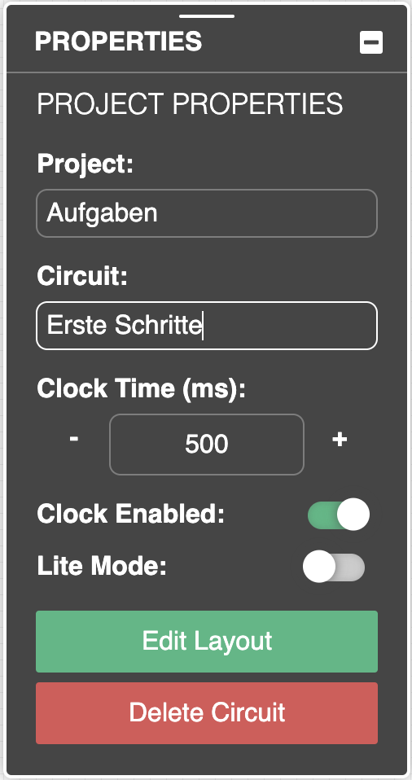

Anschliessend können Sie das Projekt speichern (durch Klicken auf __Save Online__ in der Toolbar). Dabei wählen Sie am besten aus, dass es sich um ein privates Projekt handelt. Schliesslich klicken Sie auf __Update Project__.
Nun sehen Sie das Projekt in der Übersicht. Es ist gespeichert und Sie können es jederzeit wieder durch einen Klick auf __Launch simulator__ öffnen.

:::aufgabe
<Answer type="state" webKey="52721b3e-2e04-4491-ba02-9d72538e872c" />

1. Nach dem Login wechseln Sie zum [Simulator](https://circuitverse.org/simulator).
2. Benennen Sie das Projekt «Aufgaben» und die aktuelle Registerkarte «Erste Schritte».
3. Platzieren Sie die beiden ersten Eingabeelemente **Input** und **Button** in der Registerkarte **Erste Schritte** untereinander und legen Sie rechts davon die beiden Ausgabeelemente **Output** und **DigitalLed** ab. Verbinden Sie jeweils ein Eingabeelement mit einem Ausgabeelement und testen Sie die Ein- und Ausgabe durch umschalten der Eingabewerte.
4. Speichern Sie das Projekt und öffnen Sie es wieder.
5. Beschriften Sie sämtliche Ein- und Ausgabeelemente und wählen Sie einen sinnvollen Platz für die Beschriftungen.
6. Speichern Sie die Aufgabe ab (dies wird in Zukunft nicht mehr erwähnt, sondern versteht sich von selbst).
7. Der Link zur Aufgabe können Sie bei Bedarf direkt im Antwort-Feld hier auf der Webseite festhalten.

<Answer type="text" webKey="74397b5a-3ab0-453e-8551-b11475199871" />
:::

Am besten legen Sie für jede Aufgabe oder zumindest für jedes Kapitel eine neue Registerkarte an, indem Sie oben im Menü auf __Circuit__ und dann __New Circuit +__ klicken:

:::aufgabe
<Answer type="state" webKey="0a463046-255c-4ff7-908a-cb41f53e3a8c" />

1. Erstellen Sie eine neue Registerkarte für die Inverter-Aufgaben im nächsten Kapitel.
2. Vergessen Sie nicht, die Aufgaben immer wieder zu speichern – insbesondere am Lektionsende!

<Answer type="text" webKey="6603f801-28c5-47b1-95ba-9d3f361789c0" />
:::

Im Dashboard – zugänglich oben rechts im Menü beim eigenen Namen – können Sie stets eine Übersicht Ihrer gespeicherten Projekte erhalten:

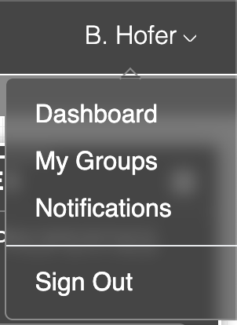
