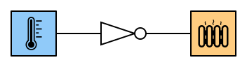

# 3. Inverter

Ein Inverter ist eine Schaltung, bei welcher der Ausgang Y den Wert 1 (hohe Spannung) hat, wenn der Eingang den Wert 0 (tiefe Spannung) hat und umgekehrt.

|   A   |   Y   |
| :---: | :---: |
|   0   |   1   |
|   1   |   0   |

In Schaltungen wird das folgende Symbol für einen Inverter verwendet:

## Interaktive Schaltung

<v-circuit id="rothe-inverter"/>

## Beispiele

### Kühlschrankbeleuchtung

Das Licht im Kühlschrank geht an, sobald die Türe **nicht** mehr auf den Knopf drückt.

### Heizung

Die Heizung soll einschalten, wenn es **nicht** warm ist.

:::aufgabe
Überlege dir, ob bei folgenden Schaltungen ein Inverter eingesetzt werden muss oder nicht:

1. **Einbruchalarm:** Ein akustischer Alarm soll ertönen, wenn eine Bewegung entdeckt wird.

2. **Bewässerungsanlage:** Wenn die Erde in der Blumenkiste trocken ist, soll eine Wasserpumpe (Motor) eingeschaltet werden. Wenn die Erde feucht ist, soll der Motor ausgeschaltet werden.

:::

:::aufgabe Aufgabe CircuitVerse
1. Erstelle in CircuitVerse die Schaltung für die Kühlschrankbeleuchtung mit einem _Button_ als Eingabe und einem _DigitalLed_ als Ausgabe.
2. Erstelle in CircuitVerse die Schaltung für ein Restaurant in Sizilien, das noch keine Klimaanlage besitzt: Sobald genügend Sonnenlicht (Eingabe _Input_) vorhanden ist, soll das Deckenlicht (Ausgabe _DigitalLed_) ausgeschaltet und ein Ventilator (Ausgabe _Output_) eingeschaltet werden. Beschrifte alle Elemente.
3. Baue eine Lichterkette mit 6 _DigitalLed_. Jede zweite LED der Lichterkette soll leuchten. Sobald ein Druckknopf (_Button_) gedrückt wird, soll die andere Hälfte der LEDs leuchten. Da es sich um eine Lichterkette handelt, darf nur eine Leitung vom Druckknopf wegführen.
:::
