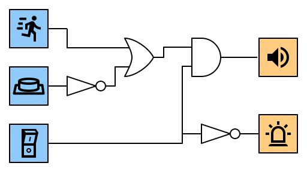

---
sidebar_custom_props:
  id: fbe5ac08-7821-4b1e-8fe7-6f8e281600b2
---

# 5. OR-Gatter

# 5. OR-Gatter

Bei einem OR-Gatter hat der Ausgang Y dann den Wert 1️⃣, wenn Eingang A **oder** Eingang B (oder beide) den Wert 1️⃣ haben.

|   A   |   B   |   Y   |
| :---: | :---: | :---: |
|   0   |   0   |   0   |
|   0   |   1   |   1   |
|   1   |   0   |   1   |
|   1   |   1   |   1   |

In Schaltplänen wird ein OR-Gatter mit folgendem Symbol dargestellt:

## Interaktive Schaltung

[@circuitverse](https://circuitverse.org/simulator/embed/rothe-or-gate)

## Beispiele

### Türöffner

In einem Haus soll die Eingangstüre aus der Wohnung im ersten Stock sowie aus der Wohnung im zweiten Stock durch einen Knopfdruck geöffnet werden können.

### Einbruchsalarm

Ein Einbruchsalarm gibt ein akustisches Signal, wenn eine Bewegung entdeckt wurde oder wenn die Türe geöffnet wurde. Dies wird wie beim Kühlschrank durch einen Druckknopf erkannt, welcher durch die geschlossene Türe gedrückt wird.

:::aufgabe

Entwerfen Sie je eine Schaltung für die folgenden Szenarien. Sie können **Inverter**, **AND-Gatter** und **OR-Gatter** verwenden. Gehen Sie für jedes Szenario so vor:

- Erstellen Sie eine Wahrheitstabelle für das Szenario.
- Entwerfen Sie die Schaltung in CircuitVerse inklusive Beschriftung.
- Überprüfen Sie, ob die Schaltung mit der Wahrheitstabelle übereinstimmt.

1. **Autoinnenbeleuchtung:** Die Innenbeleuchtung in einem Auto soll eingeschaltet werden, wenn die linke oder die rechte Türe geöffnet wird.

    

<Answer type="text" webKey="bf765112-3293-4b61-89d5-e45affeb9c7c" />
<Solution webKey="918932d5-3574-4329-8d54-9097d12d62dd">

</Solution>

2. **Notruf Spitalbett:** In einem Spital soll ein Alarm ertönen, wenn ein Patient auf den Rufknopf drückt oder wenn seine Körpertemperatur zu hoch wird.

    

<Answer type="text" webKey="cc161f1a-0996-40c9-98ab-1054cc065334" />
<Solution webKey="918932d5-3574-4329-8d54-9097d12d62dd">

</Solution>

3. **Einbruchsalarm:** Der Einbruchsalarm aus dem Beispiel oben soll zusätzlich einen Hauptschalter erhalten. Der Alarm wird nur ausgelöst, wenn die Alarmanlage eingeschaltet ist. Wenn die Alarmanlage ausgeschaltet ist, soll als Hinweis ein Lämpchen brennen.

    

<Answer type="text" webKey="a92cb40d-aaa2-4b75-b045-ea088d117ebc" />
<Solution webKey="918932d5-3574-4329-8d54-9097d12d62dd">

</Solution>
:::

:::aufgabe

Analysieren Sie die folgende Schaltung, indem Sie eine Wahrheitstabelle erstellen. Was macht die Schaltung eigentlich? Wie kann man sie vereinfachen?

<Answer type="text" webKey="31754196-92ac-4e16-942e-5532c73b4aa8" />

:::
