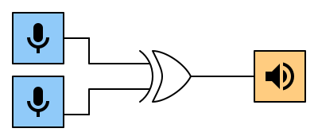
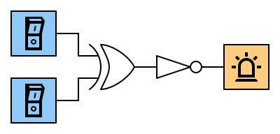
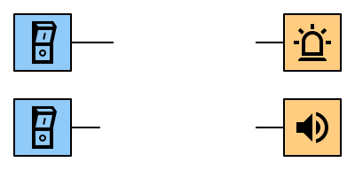
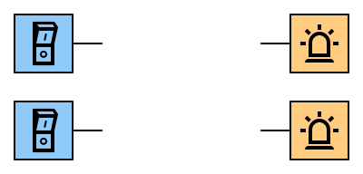
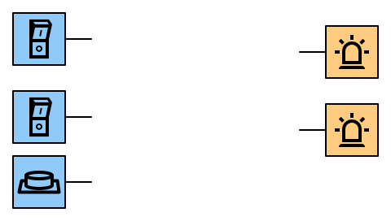
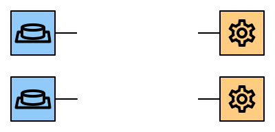
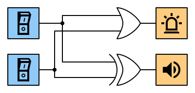
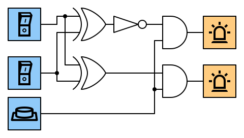
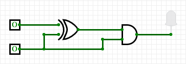
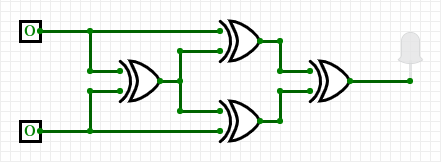

# 6. XOR-Gatter

Ein XOR-Gatter (engl. *exclusive or*) hat der Ausgang Y dann den Wert 1️⃣, wenn Eingang A **oder** Eingang B **aber** nicht beide den Wert 1️⃣ haben.

|   A   |   B   |   Y   |
| :---: | :---: | :---: |
|   0   |   0   |   0   |
|   0   |   1   |   1   |
|   1   |   0   |   1   |
|   1   |   1   |   0   |

In Schaltplänen wird ein XOR-Gatter mit folgendem Symbol dargestellt:

## Interaktive Schaltung

<v-circuit id="rothe-xor-gate"/>

## Beispiele

### TV-Debatte

Für die TV-Debatte zwischen dem US-Präsidenten und seinem Herausforderer soll sichergestellt werden, dass sich die Teilnehmer nicht dreinreden können. Mit einer Schaltung soll die Tonübertragung nur aktiviert werden, wenn einer der Teilnehmer spricht. Wenn keiner oder beide sprechen, soll die Übertragung ausgeschaltet werden.

### Dating-Show

Bei einer Dating-Show sollen die potenziellen Paare gleichzeitig aber unabhängig Ja/Nein-Fragen mittels Ein-/Aus-Schalter beantworten. Bei einer Übereinstimmung der Antworten soll ein Herz aufleuchten.

:::aufgabe

Entwirf je eine Schaltung für die folgenden Szenarien. Du kannst **OR-Gatter** oder **XOR-Gatter** sowie **Inverter** verwenden. Gehe für jedes Szenario so vor:

- Erstelle eine Wahrheitstabelle für das Szenario.
- Entwirf die Schaltung in CircuitVerse inklusive Beschriftung.
- Überprüfe, ob die Schaltung mit der Wahrheitstabelle übereinstimmt.

1. **Anna und Bert**: Anna und Bert arbeiten in einem dunklen Archiv im Keller. Immer wenn jemand von ihnen im Archiv ist, soll Licht brennen. Sie hören gerne Musik – allerdings nicht, wenn beide arbeiten, dann haben sie stets viel zu besprechen. Anna und Bert gegen an, ob sie im Büro sind, indem sie je einen eigenen Schalter betätigen.

    

2. **Dating-Show 1**: Die Schaltung der Dating-Show soll so erweitert werden, dass zusätzlich ein Kreuz aufleuchtet, falls die Antworten **nicht** übereinstimmen.

    

3. **Dating-Show 2**: Das vorherige Beispiel soll so ausgebaut werden, dass die Lampen erst leuchten, wenn die Moderatorin mit einem Druckknopf das Resultat freigibt.

    

4. **⭐️ Schwimmbadabdeckung**: Ein Schwimmbecken verfügt auf einer Seite über eine aufgerollte Abdeckung. Diese wird beim Schliessen von einem Motor mit zwei Seilen über das Schwimmbecken gezogen. Beim Öffnen wird die Abdeckung von einem anderen Motor aufgerollt. Jeder Motor wird mit einem eigenen Druckknopf in Gang gebracht. Es soll sichergestellt werden, dass nie beide Motoren gleichzeitig laufen und dadurch die Abdeckung in Stücke reissen.

    

***

**Anna und Bert**

**Dating-Show 1**

**Dating-Show 2**

**Schwimmbadabdeckung**

:::

:::aufgabe
Analysiere die folgende Schaltungen, indem du eine Wahrheitstabelle erstellst. Kann man die Schaltung vereinfachen? Wie?

1. 

2. 
:::