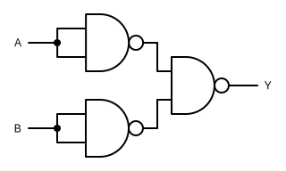
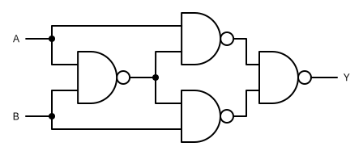

---
sidebar_custom_props:
  id: 4fd34def-f8a4-4a01-90db-c9870b24839d
---

# 7. NAND-Gatter

Ein NAND-Gatter (engl. *not and*) hat der Ausgang Y dann den Wert 0️⃣, wenn Eingange A **und** Eingang B den Wert 1️⃣ haben.

|   A   |   B   |   Y   |
| :---: | :---: | :---: |
|   0   |   0   |   1   |
|   0   |   1   |   1   |
|   1   |   0   |   1   |
|   1   |   1   |   0   |

In Schaltplänen wird ein NAND-Gatter mit folgendem Symbol dargestellt:

## Interaktive Schaltung

[@circuitverse](https://circuitverse.org/simulator/embed/rothe-nand-gate)

Ein NAND-Gatter kann aus einem AND-Gatter, gefolgt von einem Inverter zusammengesetzt werden:

## Universalgatter

Das NAND-Gatter hat eine besondere Bedeutung. Dank dem Mathematiker George Boole kann bewiesen werden, dass **jede** logische Schaltung ausschliesslich aus NAND-Gatter aufgebaut werden kann. Ausserdem sind NAND-Gatter physikalisch relativ einfach aufzubauen. Deshalb bilden NAND-Gatter den Grundbaustein für heutige Mikrochips.

:::aufgabe

1. Bauen Sie eine Inverter-Schaltung ausschliesslich aus NAND-Gattern auf.

<Answer type="text" webKey="14a4eaef-deb8-4021-a16a-04cdd488339c" />
<Solution webKey="918932d5-3574-4329-8d54-9097d12d62dd">

</Solution>

2. ⭐️ Bauen Sie eine AND-Schaltung ausschliesslich aus NAND-Gattern auf.

<Answer type="text" webKey="6b608dfd-a4d3-472b-9d88-03787ac0a48a" />
<Solution webKey="918932d5-3574-4329-8d54-9097d12d62dd">

</Solution>

3. ⭐️ Bauen Sie eine OR-Schaltung  ausschliesslich aus NAND-Gattern auf.

<Answer type="text" webKey="e7e205c1-d5ee-4668-a580-634450c3a2d5" />
<Solution webKey="918932d5-3574-4329-8d54-9097d12d62dd">

</Solution>

4. ⭐️ Bauen Sie eine XOR-Schaltung ausschliesslich aus NAND-Gattern auf.

<Answer type="text" webKey="79185e8d-66c9-412a-a0e8-f2f8dfde3d6f" />
<Solution webKey="918932d5-3574-4329-8d54-9097d12d62dd">

</Solution>
:::
