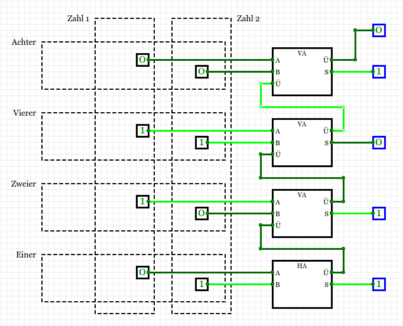
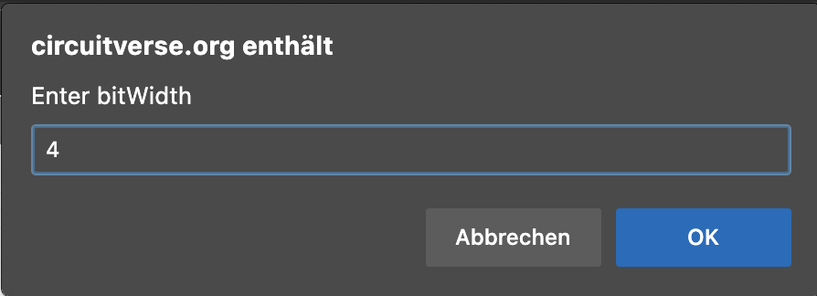

import Answer from '@site/src/components/Answer'
import Solution from '@site/src/components/Solution'
import Hint from "@site/src/components/Solution/Hint";

# 8. Addierer

## Binäre Addition

[@youtube](https://www.youtube-nocookie.com/embed/x7ka0QwKciA)

:::aufgabe Binäre Addition
Führen Sie eine schriftliche Addition für die folgenden binären Zahlen durch:

- $1001_2 + 110_2$
  <Answer type="string" webKey="c862b993-8074-46fa-bf4f-6856b29ebcdf" solution="1111" sanitizer={(val) => val.replaceAll(/[^\d]/g, '')}/>
- $111_2 + 1_2$
  <Answer type="string" webKey="61ea2f9c-86d8-4a36-a882-2ff3416def8b" solution="1000" sanitizer={(val) => val.replaceAll(/[^\d]/g, '')}/>
- $101_2 + 101_2$
  <Answer type="string" webKey="b2e85cad-8403-42b6-aaee-e390cebb2a13" solution="1010" sanitizer={(val) => val.replaceAll(/[^\d]/g, '')}/>

:::

## Halbaddierer

Wie könnte man die Addition zweier einstelliger Zahlen im Binärsystem als Schaltung konstruieren?

$$\begin{aligned}
0 + 0 &= 00_2\\
0 + 1 &= 01_2\\
1 + 0 &= 01_2\\
1 + 1 &= 10_2
\end{aligned}$$

Die entsprechende Schaltung benötigt zwei Eingänge und zwei Ausgänge. Die beiden Eingänge werden für die zwei Summanden verwendet. Die Ausgänge für die Einer- und Zweierstelle des Resultats. Die gesuchte Schaltung muss also folgende Wertetabelle haben:

| A    | B    | Zweier | Einer |
| :--- | :--- | -----: | ----: |
| 0    | 0    |      0 |     0 |
| 0    | 1    |      0 |     1 |
| 1    | 0    |      0 |     1 |
| 1    | 1    |      1 |     0 |

Der Wert der Einerstelle kann durch ein XOR-Gatter berechnet werden, der Wert der Zweierstelle durch ein AND-Gatter. Die Schaltung sieht somit so aus:

[@circuitverse](https://circuitverse.org/simulator/embed/rothe-half-adder-vertical)

:::aufgabe Aufgabe Halbaddierer
1. Erstellen Sie ein neues Projekt in CircuitVerse und nennen Sie es "Addierer".
2. Bauen Sie den Halbaddierer in CircuitVerse nach und probieren Sie aus, ob die Addition von zwei Bits (inklusive Übertrag) korrekt funktioniert.
3. Benennen Sie die Eingänge mit «A» und «B», sowie die Ausgänge korrekt mit «S» (für «Summe») und «Ü» (für «Übertrag»).
4. Benennen Sie die Schaltung (sprich die Registerkarte) mit «HA» (für Halbaddierer).
:::

## Volladdierer

Ein Halbaddierer addiert also 2 separate Bit und sorgt dafür, dass neben dem Resultat auch der Übertrag für die nächste Stelle mittels zweitem Ausgang bereitsteht.

Allerdings berücksichtigt ein Halbaddierer nur die beiden zu addierenden Bits am Eingang, ein allfällig zu berücksichtigender Übertrag von der vorherigen Stelle bleibt unbeachtet.

Wenn zwei mehrstellige binäre Zahlen addiert werden sollen, muss der **Übertrag** der vorhergehenden Stelle berücksichtigt werden. Ab der zweithintersten Stelle muss wie folgt vorgegangen werden:

1. Die Zifferen an der aktuellen Stelle werden addiert.
2. Zum Resultat wird der Übertrag der vorherigen Stelle addiert.
3. Die höhere Stelle des Resultat wird als Übertrag an die nächste Stelle weitergegeben.

Dies kann mit der folgenden Schaltung realisiert werden. Sie besteht aus zwei Halbaddierern sowie einem OR-Gatter. Mit dem OR-Gatter werden die beiden möglichen Überträge zusammengefasst.

[@circuitverse](https://circuitverse.org/simulator/embed/rothe-full-adder-vertical)

:::aufgabe Aufgabe Volladdierer
Bauen Sie basierend auf Ihrer Halbaddierer-Schaltung einen Volladdierer:

1. Erstellen Sie dazu zuerst die Wahrheitstabelle für den Volladdierer. Der Volladdierer hat drei Eingänge:
    - A (erste Zahl)
    - B (zweite Zahl)
    - Ü (Übertrag)

    und zwei Ausgänge:

    - S (Summe)
    - V (Übertrag)

2. Bauen Sie in CircuitVerse eine neue Schaltung (in einer neuen Registerkarte) im Addierer-Projekt und nenne sie «VA» (für Volladdierer).
3. Verwenden Sie zum Erstellen des Volladdierers als Baustein die Schaltung «HA», die Sie bereits als Baustein haben, indem Sie im Menü _Circuit_ auf _Insert SubCircuit_ klicken und den Halbaddierer einfügen. So wird die Schaltung übersichtlicher.

<Solution webKey="e46e1f4f-3032-4c10-94c5-3bd0db8df748">

| A    | B    | Ü    |    V |    S |
| :--- | :--- | :--- | ---: | ---: |
| 0    | 0    | 0    |    0 |    0 |
| 0    | 0    | 1    |    0 |    1 |
| 0    | 1    | 0    |    0 |    1 |
| 0    | 1    | 1    |    1 |    0 |
| 1    | 0    | 0    |    0 |    1 |
| 1    | 0    | 1    |    1 |    0 |
| 1    | 1    | 0    |    1 |    0 |
| 1    | 1    | 1    |    1 |    1 |

</Solution>
:::

## 4-Bit-Addierer
Wir haben mit dem Volladdierer einen Baustein, der zwei 1-Bit-Zahlen addieren kann – inklusive korrekte Behandlung des Übertrags. Nun wollen wir aus mehreren solchen Bausteinen einen kompletten Addierer bauen, der mehrere Stellen gleichzeitig addieren kann.

:::aufgabe

#### Aufgabe 4-Bit-Addierer

Erzeugen Sie eine neue Schaltung, welche zwei 4-Bit Zahlen miteinander addieren kann. Testen Sie Ihre Schaltung, indem Sie einige Rechnungen berechnen lassen:

- `0011 + 0001` soll `0100` ergeben
- `0111 + 0101` soll `1100` ergeben
- `1100 + 0011` soll `1111` ergeben

1. Bauen Sie in CircuitVerse eine neue Schaltung (d.h. eine neue Registerkarte) im Addierer-Projekt und nennen Sie diese «4-Bit-Addierer».
2. Verwenden Sie zum Zeichnen der Schaltung einen Halbaddierer-Baustein «HA» sowie drei Volladdierer-Bausteine «VA».
3. Machen Sie durch Beschriftungen erkennbar, wo die erste Zahl, die zweite Zahl und das Resultat steht. 

<Hint>

Zum Addieren der Einer-Stelle braucht es nur einen Halbaddierer, da dort noch kein Übertrag vorhanden sein kann.
</Hint>

<Solution webKey="e46e1f4f-3032-4c10-94c5-3bd0db8df748">

</Solution>
:::

## ⭐️ Hex-Display

Die Eingaben und das Resultat kann auch mit einem Hexadezimal-Display dargestellt werden.

[@circuitverse](https://circuitverse.org/simulator/embed/hexdisplay-bb9aa46e-4626-442a-ba98-6589c6ab9df1)

Um Bits darzustellen, kann ein Hex-Display als Ausgabe verwendet werden. Damit vier Eingänge angeschlossen werden können, braucht es einen Splitter, welcher vier Eingänge zusammenfasst.

Dieser kann über `Misc > Splitter` eingefügt werden, wobei nacheinander zwei Eingabeboxen angezeigt werden. In der ersten wird `4` (die Anzahl Leitungen) eingegeben, in der zweiten `1 1 1 1` (wie viele Anschlussmöglichkeiten):

:::cards

***

:::

:::info Hexadezimal System
Die Zahlen werden im Hexadezimalsystem angezeigt, also im Sechzehnersystem:

| Dezimal | Hexadezimal | Dezimal | Hexadezimal |
| ------: | :---------- | ------: | :---------- |
|     `0` | `0`         |     `8` | `8`         |
|     `1` | `1`         |     `9` | `9`         |
|     `2` | `2`         |    `10` | `A`         |
|     `3` | `3`         |    `11` | `B`         |
|     `4` | `4`         |    `12` | `C`         |
|     `5` | `5`         |    `13` | `D`         |
|     `6` | `6`         |    `14` | `E`         |
|     `7` | `7`         |    `15` | `F`         |

:::