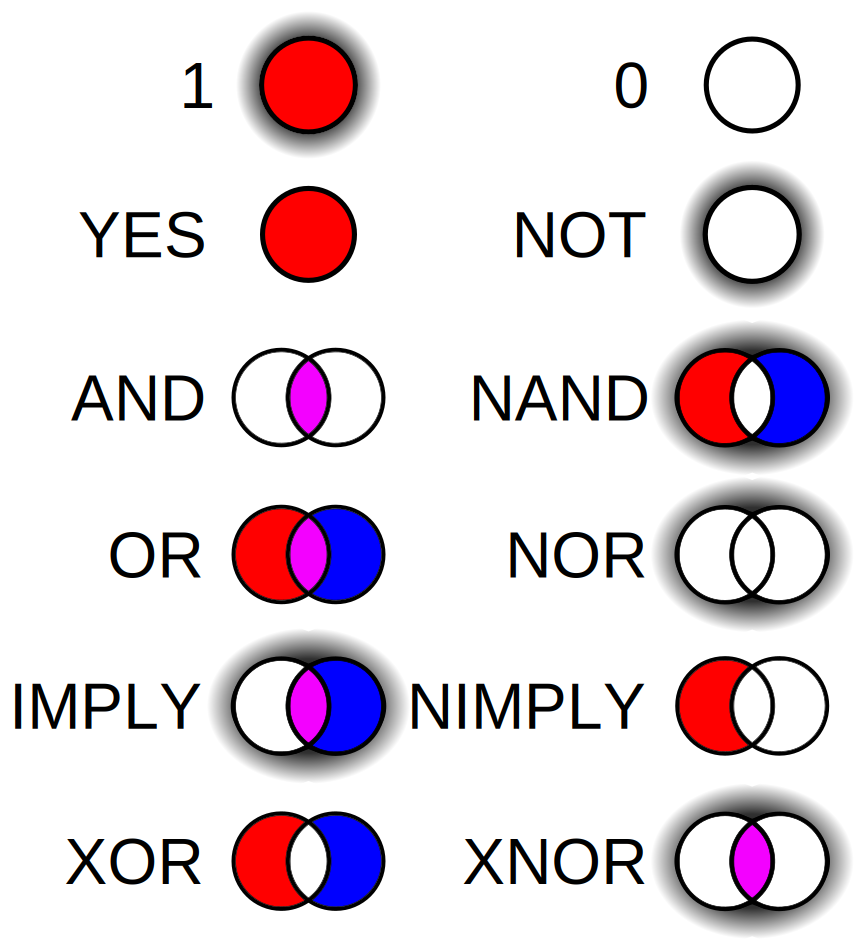

# 2. Logische Gatter

Die logischen Gatter (*logic gates*) sind die Grundbausteine der digitalen Logik. Sie werden durch die Verknüpfung von Transistoren gebaut.

Transistoren

[@youtube --height=315](https://www.youtube-nocookie.com/embed/5wIRJN3DN_8)

<Answer type="text" webKey="77218889-54e7-4ff2-ac32-10a2de6cb927" />

Durch die logischen Gatter lassen sich ganze Schaltungen zusammenbauen, die dann bspw. eine binäre Addition durchführen.

