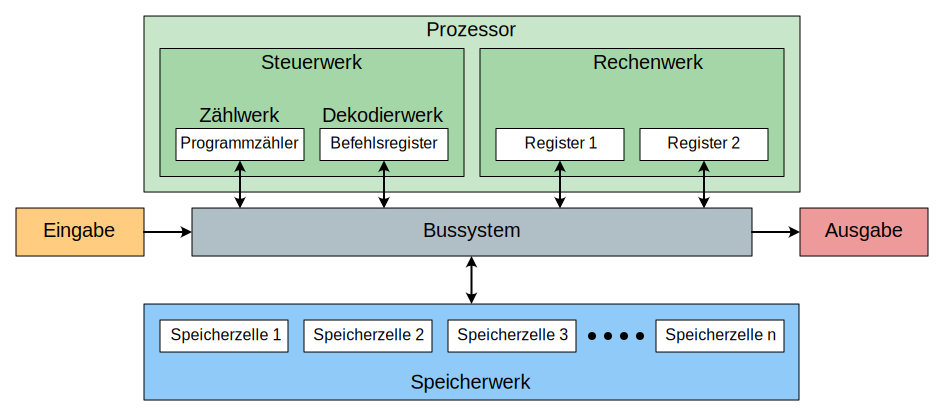

# 1 Von-Neumann-Architektur

Die **Rechnerarchitektur** beschreibt die interne Organisation eines Computers. Es gibt zwei verbreitete Architekturen. Beide sind gegen Ende des zweiten Weltkriegs entstanden, als die ersten elektronischen Computer entwickelt worden sind:

- Von Neumann-Architektur
- Harvard-Architeketur

## Von Neumann-Architektur

Der Mathematiker John von Neumann hat 1945 eine Modellarchitektur für Computer vorgestellt, welche bis heute als Grundlage für die Entwicklung von Computern dient.

Die **Von-Neumann-Architektur** hat folgende Eigenschaften:

- Die Maschine ist nicht auf eine bestimmte Aufgabe zugeschnitten.
- Zur Lösung einer Aufgabe dient ein austauschbares Programm.
- Programme und Daten werden im Speicher abgelegt.
- Ein Programm besteht aus einer Abfolge von einfachen Befehlen.
- Zu jedem Zeitpunkt wird genau ein Befehl ausgeführt, der **genau einen Datenwert ändern** kann.

Ein Von-Neumann-Computer besteht aus folgenden Komponenten:

- Das **Rechenwerk** führt numerische und logische Berechnungen durch (bspw. eine binäre Addition).
- Das **Steuerwerk** steuert die Befehlsverarbeitung im Computer.
- Das **Speicher** speichert Befehle und Daten.
- Das **Ein- und Ausgabewerk** dient der Kommunikation mit der Aussenwelt.

Heute sind das Rechenwerk und das Steuerwerk normalerweise im **Prozessor** (engl. _central processing unit, CPU_) zusammengefasst. Alle Komponenten sind über ein **Bussystem** miteinander verbunden.

:::info Weit verbreitet
Die **Von-Neumann-Architektur** ist heute in den meisten Computern Standard – insbesondere bei Personalcomputern und Servern.
:::

## ⭐ Harvard-Architektur

Der Name «Harvard-Architektur» hat seinen Ursprung im elektromechanischen Computer *Mark I*, der in Kooperation zwischen IBM und der Harvard-Universität entwickelt und 1944 in Betrieb genommen wurde.

Im Unterschied zur Von-Neumann-Architektur sind bei der Harvard-Architektur Daten und Befehle getrennt. Dies führt zu zwei Vorteilen:

- Daten können schneller verarbeitet werden. Bei der Von-Neumann-Architektur wird der Bus durch das Laden von Befehlen aus dem Speicher blockiert.
- Programme sind besser vor Manipulationen und Fehlern geschützt.

Als Nachteil ist zu erwähnen, dass im Vergleich zur Von-Neumann-Architektur die Hardwarekosten höher sind.
