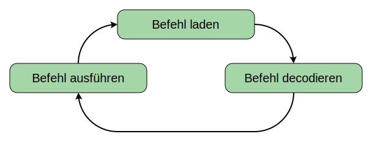
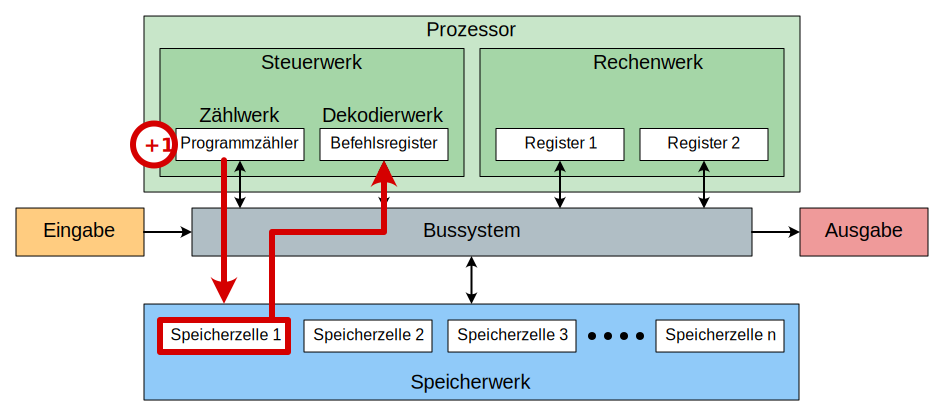
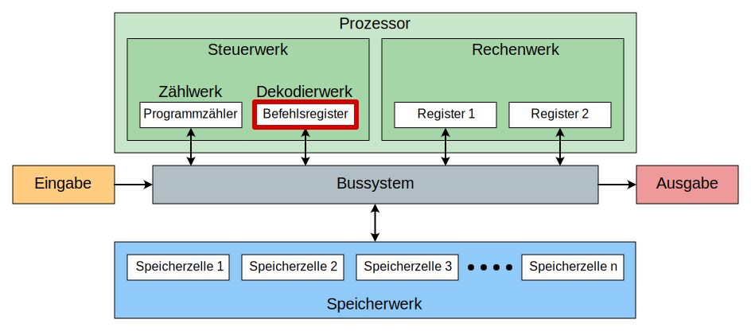

# 4. Von-Neumann-Zyklus

Der Prozessor führt immer wieder den gleichen zyklischen Ablauf aus. Dieser Ablauf wird auch **Von-Neumann-Zyklus** genannt und besteht aus folgenden Schritten:

## 1. Befehl laden

Der nächste Befehl wird aus dem Speicher in das Befehlsregister geladen. Dazu wird die Adresse des nächsten Befehls vom Programmzähler an das Speicherwerk übertragen. Der Befehl wird aus dem Speicher über den Datenbus in das Befehlsregister übertragen. Anschliessend wird der Programmzähler um eins erhöht.

## 2. Befehl decodieren

Nun wird der Befehl, welcher in das Befehlsregister geladen worden ist, decodiert. Das Steuerwerk übersetzt also einen Code zu einer Anweisung und konfiguriert dann das Rechenwerk so, dass die gewünschte Operation auch ausgeführt wird.

Beispiel Addition:
- **Decodieren**: Das Rechenwerk sieht den Code `001000` und weiss (decodiert), dass dies der Befehl für die Addition ist.
- **Konfiguration**: Das Rechenwerk konfiguriert nun das Rechenwerk so, dass es zwei Zahlen miteinander Addiert.

## 3. Befehl ausführen

Schliesslich wird der eigentliche Befehl ausgeführt, indem das Dekodierwerk die Steuersignale an die Komponenten auslöst. Im nächsten Abschnitt werden einige typische Befehle erläutert.

:::success Take-Home Message aus CPU-Rollenspiel

- Wie schnell war ein schneller/langsamer/durchschnittlicher Zyklus in der Menschen-CPU?
- Wie viele Zyklen waren für die Ausführung eines simplen Programms nötig?

<Answer type="text" webKey="56120b26-1904-4dd4-ae34-d5457d98b401" />

:::