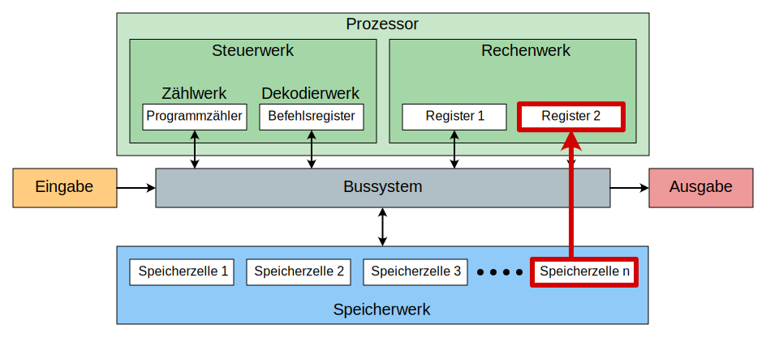
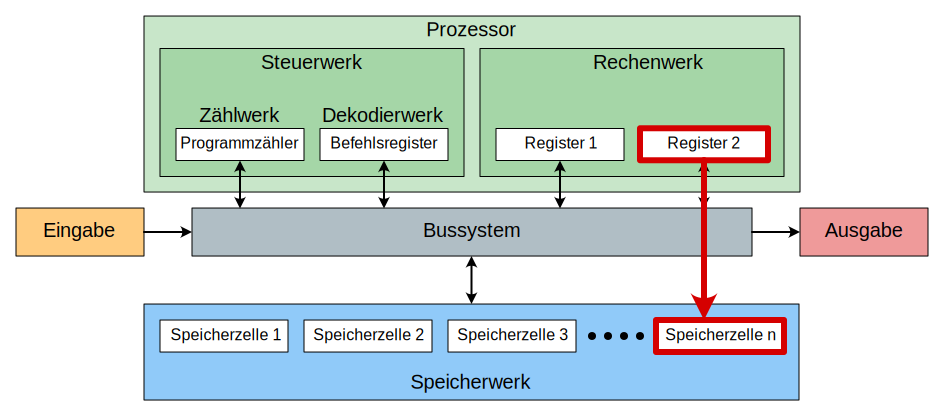
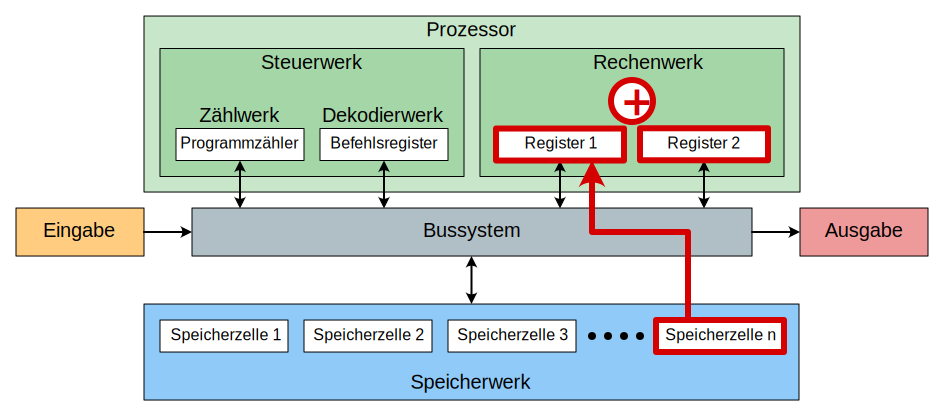
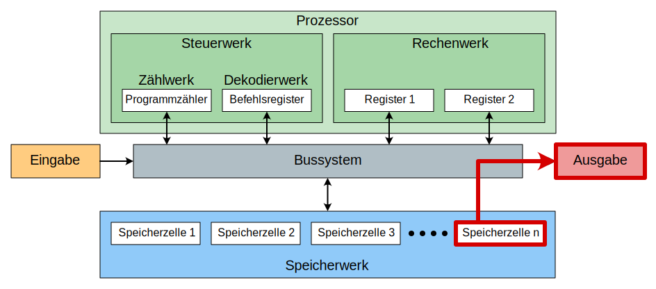

---
sidebar_custom_props:
  id: ba8dcba2-b38b-4fe6-9005-c1f0c9e43332
---

# 5. Befehlssatz

Der Befehlssatz ist die komplette Sammlung von Befehlen, welche ein Prozessor versteht und ausführen kann. Im folgenden werden einige typische Befehle betrachtet.

## Wert laden

Um einen Wert bearbeiten zu können, muss dieser erst aus dem Hauptspeicher geladen werden. Mit einem Lade-Befehl wird ein Wert aus dem Speicher in das Register des Rechenwerks geladen.

## Wert speichern

Wenn im Rechenwerk ein Resultat berechnet wurde, muss es wieder in den Speicher geschrieben werden. Das geschieht mit diesem Befehl.

## Addieren

Im Rechenwerk können arithmetische Operationen durchgeführt werden. Es können also zwei Zahlen addiert, subtrahiert, multipliziert oder dividiert werden.

## Eingabe

Ein Wert kann aus einem Eingabegerät in den Hauptspeicher eingelesen werden.

## Ausgabe

Ein Wert kann aus dem Hauptspeicher auf ein Ausgabegerät ausgegeben werden.

:::success Take-Home Message aus CPU-Rollenspiel

<Answer type="text" webKey="c7958ed6-c67d-4154-8051-6d9c1fadd5e2" />

:::
