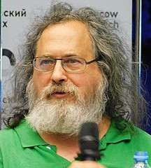

# 3. Freie Open Source Software

:::cards --columns=2

***

:::

:::aufgabe
#### ✏️ Aufgabe Kosten
1. Was bestimmt den Preis einer Ware (z.B. Möbel)?
2. Was bestimmt den Preis einer Software?
3. Was darf/kann man mit ihnen (Ware resp. Software) nach dem Kauf tun?
4. Was haben die beiden Bilder oben mit dieser Aufgabe zu tun?
:::

## Softwarelizenzen
Im Gegensatz zu vielen anderen Betriebssystemen ist Linux **freie Software**. Ziel dieses Kapitels ist es, die wichtigsten Begriffe zu Softwarelizenzen zu erklären.

## Freie Software
Die *Free Software Foundation (FSF)*[^1] unter der Federführung von Richard Stallman

definiert freie Software wie folgt:

> «Free software» means software that respects users’ freedom and community. Roughly, it means that **the users have the freedom to run, copy, distribute, study, change and improve the software**. [...] With these freedoms, the users (both individually and collectively) control the program and what it does for them.[^2]

Als Begründung schreibt die FSF, dass die *Benutzer von der Software kontrolliert* würden, wenn sie diese nicht selber kontrollieren können. Und da Software von Entwicklern geschrieben wird, verfügten diese über zu viel Macht über die Benutzer.

Im Englischen hat das Wort **free** zwei Bedeutungen. Gemeint ist mit freier Software stets die **Freiheit** und
**nicht der Preis**. Häufig wird dies mit folgender Aussage unterstrichen:

:::info
**Free** as in **free speech**, not as in *free beer*.
:::

## Die vier Freiheiten
Gemäss der FSF gibt es vier zentrale Freiheiten:

1. Die Freiheit, das Programm auszuführen wie man möchte, für jeden Zweck.
2. Die Freiheit, die Funktionsweise des Programms zu untersuchen und eigenen Datenverarbeitungbedürfnissen anzupassen. Der Zugang zum Quellcode ist dafür Voraussetzung.
3. Die Freiheit, das Programm zu redistribuieren (also zu verbreiten) und damit Mitmenschen zu helfen.
4. Die Freiheit, das Programm zu verbessern und diese Verbesserungen der Öffentlichkeit freizugeben, damit die gesamte Gesellschaft davon profitiert. Der Zugang zum Quellcode ist dafür Voraussetzung.

## Open Source Software (OSS)
Neben dem Begriff der freien Software wird auch häufig *Open Source Software (OSS)* verwendet. Gemäss der *Open Source Initiative (OSI)*[^3] soll unter dem Begriff **Open Source**[^4] eigentlich dasselbe verstanden werden wie unter *freier Software*. Die Idee bei der Einführung dieses Begriffs lag darin, das zweideutige Wort *free* zu umgehen, um somit potentielle Geldgeber nicht unnötig abzuschrecken. Somit dürfte man eigentlich OSS mit freier Software gleichsetzen.

Allerdings wird mit dem Begriff *Open Source Software* lediglich die Verfügbarkeit des Quellcodes unterstrichen, was einige Firmen dazu bewegt, ihre Programme als Open Source zu bezeichnen, obwohl die Modifikation, uneingeschränkte Nutzung, Weitergabe (in originaler und/oder modifizierter Form) nicht erlaubt ist.

Will man also unmissverständlich mitteilen, wovon man spricht, kann der Begriff **Free Open Source Software (FOSS)** verwendet werden.

## Proprietäre Software
Software, die nicht frei ist, wird als *proprietär* bezeichnet.

## Freie Lizenzen
Als bekannteste und verbreitetste Lizenz für Quellcode muss sicherlich die *GNU General Public License (GPL)*[^5] genannt werden. Es gibt aber viele weitere freie Lizenzen.

Auch für Texte, Bilder und Videos gibt es freie Lizenzen. Die bekannteste Lizenz ist die *Creative Commons License (CC)*[^6] mit ihren verschiedenen Varianten:

:::cards --columns=2

***

:::

## Copyleft
Im Zusammenhang mit freien Lizenzen taucht häufig auch der Begriff **Copyleft** auf. Gemeint ist damit eine freie Lizenz, die vorschreibt, dass veränderter oder unveränderter Code oder Text ebenfalls wieder unter einer freien Lizenz verteilt oder verfügbar gemacht werden muss[^7].

:::info
Im Gegensatz zu Entwicklern proprietärer Software, die in Copyright-Statements den Benutzern Rechte wegnehmen, soll mit freier Software die Rechte der Benutzer garantiert werden. Aus diesem Grund wurde der Begriff Copyright "umgekehrt" zu Copyleft.
:::

[^1]: [FSF](https://fsf.org/)
[^2]: [Definition "Freie Software"](https://www.gnu.org/philosophy/free-sw.html)
[^3]: [OSI](https://www.opensource.org/)
[^4]: [Open Source](https://www.opensource.org/docs/osd)
[^5]: [GPL](https://www.gnu.org/copyleft/gpl.html)
[^6]: [CC](https://creativecommons.org/licenses/)
[^7]: [Copyleft](https://www.gnu.org/copyleft/copyleft.html)
