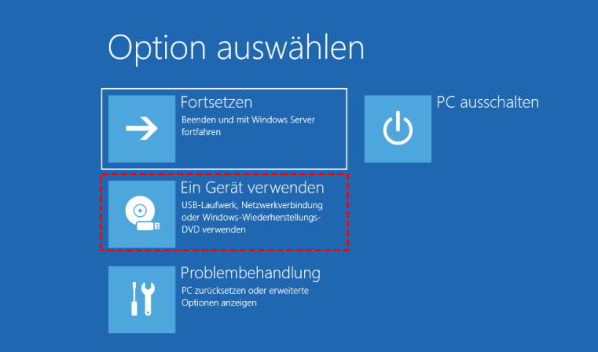

# Vom USB-Stick starten

Damit ein Betriebssystem von einem USB-Stick geladen werden kann, muss
- die Startreihenfolge (*Boot Order*) so eingestellt werden, dass der Computer zuerst die USB-Eingänge nach Startfähigem Speicher überprüft
- der USB-Stick muss startfähig (*bootfähig*) sein.

Das kostenlose und wohl bekannteste Linux-Betriebssystem heisst Ubuntu und kann [hier](https://ubuntu.com/download/desktop) heruntergeladen werden.

Die einfachste Variante um das heruntergeladene Betriebssystem auf einem USB-Stick startfähig zu machen, ist [balenaEtcher](https://www.balena.io/etcher/).

Mit diesem Programm kann eine Abbilddatei eines Betriebssystems (Dateierweiterung `.iso`) auf einen USB Stick geschrieben werden. Dabei wird der USB Stick formatiert und **sämtliche Inhalte des USBs gehen verloren**. Beim Formatieren werden zudem mehrere Speicheraufteilungen vorgenommen (sog. *Partitionen*), so dass der USB-Stick ohne erneute Formatierung nicht mehr als herkömmliches Speichermedium benutzt werden kann.

Sobald das Betriebssystem auf den USB Stick geschrieben wurde, kann im BIOS die Startreihenfolge so eingestellt werden, dass nun vom USB gebootet wird.

## Windows

Bei Windows muss oft nicht der Weg über das BIOS gegangen werden. Es reicht, wenn man sich als **Administrator** anmeldet, und anschliessend einen Erweiterten Start durchführt:

Bei den Einstellungen auf `Update und Sicherheit -> Wiederherstellung` und dort die erweiterten Startoptionen auswählen. Dann erscheint der folgende Screen, wo der Start von einem USB-Stick gewählt werden kann:

## Mac

Unter Mac OS X ist es etwas kniffliger, deshalb hier nur der Link auf eine Anleitung zum Starten des USB's (Abschnitt "Booting the Drive"). Das Erstellen des USB's funktioniert aber auch am einfachsten mit balenaEtcher.

https://www.howtogeek.com/213396/how-to-boot-a-linux-live-usb-drive-on-your-mac/
