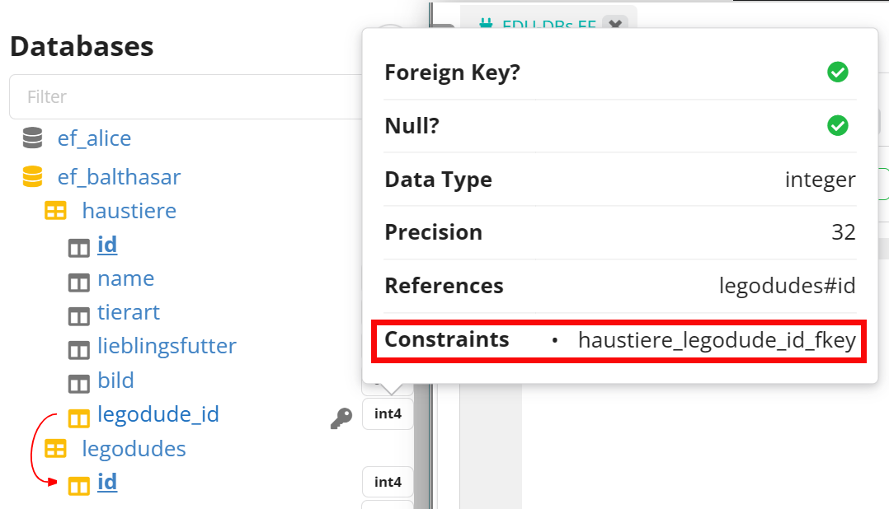

---
sidebar_custom_props:
  id: 22cfa66e-3cbc-40de-8904-95e488adee39
---

# Datensätze Manipulieren

## Datensätze aktualisieren

<div className="slim compact">

| id | name            | alter | lieblingszahl |
|---:|:----------------|------:|--------------:|
|  1 | Litty Feuerwehr |    32 |             7 |
|  2 | Crazy Lego Dude |    23 |            10 |
|  6 | Wigwam Tipi     |    18 |             1 |
|  7 | Botot           |    37 |            99 |
</div>

```sql
UPDATE legodudes
    SET lieblingszahl = 42
    WHERE id = 2;
```

:::details Resultat
<div className="slim compact">

| id | name            | alter | lieblingszahl |
|---:|:----------------|------:|--------------:|
|  1 | Litty Feuerwehr |    32 |             7 |
|  2 | Crazy Lego Dude |    23 |        __42__ |
|  6 | Wigwam Tipi     |    18 |             1 |
|  7 | Botot           |    37 |            99 |
</div>
:::

oder mehrere Attribute auf einmal:

```sql
UPDATE legodudes
    SET lieblingszahl = 42, alter = 18
    WHERE id = 2;
```

:::details Resultat
<div className="slim compact">

| id | name            |  alter | lieblingszahl |
|---:|:----------------|-------:|--------------:|
|  1 | Litty Feuerwehr |     32 |             7 |
|  2 | Crazy Lego Dude | __18__ |        __42__ |
|  6 | Wigwam Tipi     |     18 |             1 |
|  7 | Botot           |     37 |            99 |
</div>
:::

Es können auch alle Datensätze auf einmal aktualisiert werden:

```sql
UPDATE legodudes
    SET lieblingszahl = 42, alter = 18;
```

:::details Resultat
<div className="slim compact">

| id | name            |  alter | lieblingszahl |
|---:|:----------------|-------:|--------------:|
|  1 | Litty Feuerwehr | __18__ |        __42__ |
|  2 | Crazy Lego Dude | __18__ |        __42__ |
|  6 | Wigwam Tipi     | __18__ |        __42__ |
|  7 | Botot           | __18__ |        __42__ |
</div>
:::

oder der Name bspw. mit einem Suffix versehen werden:

```sql
UPDATE legodudes
    SET name = CONCAT('🤡', name);
```

:::details Resultat
<div className="slim compact">

| id | name                   | alter | lieblingszahl |
|---:|:-----------------------|------:|--------------:|
|  1 | __🤡 Litty Feuerwehr__ |    32 |             7 |
|  2 | __🤡 Crazy Lego Dude__ |    18 |            42 |
|  6 | __🤡 Wigwam Tipi__     |    18 |             1 |
|  7 | __🤡 Botot__           |    37 |            99 |
</div>
:::

## Datensätze löschen

```sql
DELETE FROM legodudes
    WHERE id = 2;
```

### Alle Datensätze löschen

```sql
DELETE FROM legodudes;
```


:::aufgabe Datensätze aktualisieren und löschen
<Answer type="state" webKey="765ce9df-981d-48f5-b71e-81e1cdc08580" />

Datenbank
: EDU-DB's EF __ef_name__
: 👉 https://db-sql.ch/connections/d68ea3c2-eb9f-4454-aa19-9c00764757b5

1. Aktualisieren Sie in Ihrer Datenbank eine Textspalte (bspw. `name`), so dass der ganze Text grossgeschrieben ist. (Referenz: [👉 postgresql.org](https://www.postgresql.org/docs/16/functions-string.html#id-1.5.8.10.5.2.2.22.1.1.1:~:text=upper%20(%20text,tom%27)%20%E2%86%92%20TOM))

<Answer type="text" webKey="6ed81378-7aa0-494b-8ca8-b27b4caf9936" monospace />
<Solution webKey="ae32d9fe-a8bd-49bc-90c0-d3931ec0702b">

```sql
UPDATE persons SET name=UPPER(name) WHERE id=1;
```

</Solution>

2. Löschen Sie einen Datensatz aus Ihrer Tabelle.

<Answer type="text" webKey="d099ba55-f2c7-456b-a003-b6e86602622b" monospace/>
<Solution webKey="ae32d9fe-a8bd-49bc-90c0-d3931ec0702b">

```sql
DELETE FROM persons WHERE name='Hans Mosimann';
-- oder
DELETE FROM persons WHERE id=2;
```

</Solution>

:::

::::aufgabe Datensätze aus verbundenen Tabellen löschen
<Answer type="state" webKey="cb6cc9e7-7a68-4204-92b0-2837dbd230bc" />

Datenbank
: EDU-DB's EF __ef_name__
: 👉 https://db-sql.ch/connections/d68ea3c2-eb9f-4454-aa19-9c00764757b5

### Vorbereitung

Erstellen Sie die Legomania Datenbank durch Copy-Paste in Ihrer eignen Datenbank:

:::details Legomania
```sql
DROP TABLE IF EXISTS haustiere;
DROP TABLE IF EXISTS legodudes_freunde;
DROP TABLE IF EXISTS legodudes;


CREATE TABLE legodudes (
    id SERIAL PRIMARY KEY,
    name TEXT NOT NULL,
    beschreibung TEXT,
    land TEXT,
    essen TEXT,
    alter INT,
    lieblingszahl INT,
    bild TEXT,
    mehr TEXT
);

CREATE TABLE legodudes_freunde (
    id SERIAL PRIMARY KEY,
    legodude_id INT REFERENCES legodudes(id) ON DELETE SET NULL,
    freund_id INT REFERENCES legodudes(id) ON DELETE SET NULL
);


CREATE TABLE haustiere (
    id SERIAL PRIMARY KEY,
    name TEXT NOT NULL,
    tierart TEXT,
    lieblingsfutter TEXT,
    bild TEXT,
    legodude_id INT REFERENCES legodudes(id)
);

INSERT INTO legodudes (
    id,
    name,
    beschreibung,
    land,
    essen,
    alter,
    lieblingszahl,
    bild,
    mehr
) VALUES (
    1,
    'Litty Feuerwehr',
    'Sie löscht nicht, sondern bringt die anderen dazu.',
    'Schweden',
    'Heisse Schokolade',
    32,
    7,
    'https://ofi.gbsl.website/img/lego/lego_2.jpg',
    'Litty Feuerwehr hat eine sehr laute Stimme. Diese nutzt sie, um ihren Kolleginnen und Kollegen der städtischen Feuerwehr Anweisungen zukommen zu lassen.'
),(
    2,
    'Crazy Lego Dude',
    'Er hat gerne Dinos und trägt abegahrene Mode.',
    'Österreich',
    'Spaghetti',
    23,
    42,
    'https://ofi.gbsl.website/img/lego/lego_1.jpg',
    'Namentlich Johnson Sicc führt ein kleines Detailhandelsgeschäft in den Alpen. In den Bergen sucht er nach Steinen, welche Dinos ähneln.'
),(
    3,
    'Elon Marsk',
    'Seine Ideologie hat ihn zum Wahnsinn getrieben.',
    'USA',
    'Lasagne',
    69,
    420,
    'https://ofi.gbsl.website/img/lego/lego_3.jpg',
    'Früher wollte er unbedingt Leute zum Mars schicken. Als seine Firma aber bankrott ging und er der einzige Mitarbeiter war, musste er es selbst tun. Das hat er auch geschafft. Das einzige positive an der Mission war aber sein Überleben.'
), (
    4,
    'Larry der Stürmer',
    'Er lebt für sein Rugby-Team und wird früher oder später auch dafür sterben.',
    'Irland',
    'Ovo-Sport',
    19,
    13,
    'https://ofi.gbsl.website/img/lego/lego_4.jpg',
    'Mit seinem Vater besuchte Larry mit 5 Jahren erstmals ein Spiel vom lokalen Rugby-Club "Green Deamons" und war sofort Feuer und Flamme. Er trat dem Club bei und spielt seither bei jedem Spiel mit. Wegen seiner Physis rennt er immer sehr schnell und wird deswegen gern als Stürmer eingesetzt.'
), (
    5,
    'A$AP Geerky',
    'Er ergänzt seinen Squad mit gezielten Animationen und Gamedesign.',
    'USA',
    'G-Fuel',
    24,
    69,
    'https://ofi.gbsl.website/img/lego/lego_5.jpg',
    'Mit seinen hochwertigen Indie-Games, die er in seinem Kinderzimmer gemacht hat, hat er die Aufmerksamkeit von A$AP Mob auf sich gezogen. Diese Gruppe ist ein Games-Verleger. Er ist ein lebender Beweis dafür, dass sich "kein Leben haben" auszahlt. Denn er hat jetzt hella Chicks.'
),(
    6,
    'Wigwam Tipi',
    'Sie setzt sich für eine Häuptlinginnen ein.',
    'USA',
    'Bison-Trockenfleisch',
    18,
    1,
    'https://ofi.gbsl.website/img/lego/lego_6.jpg',
    'Mit 3 Jahren hat sie ihre Leidenschaft für die Jagd entdeckt. Seither ist sie mit ihrem spezifischen Handgeschick im Bogenschiessen nicht mehr von der jährlichen Bison-Jagd wegzudenken.'
),(
    7,
    'Botot',
    'Man weiss nicht so genau, wer er ist. Das macht ihn auch so speziell.',
    'Schweiz',
    'Milch',
    37,
    99,
    'https://ofi.gbsl.website/img/lego/lego_7.jpg',
    'Ein typischer Schweizer. Hat halt einen selbstmähenden Rasenmäher im Garten seines Einfamilien-Neubaus. Er kommt eigentlich nur aus dem Haus, wenn die Nachbarkids zu laut Peter Reber hören.'
);

-- LegodudeFreunde Beziehungen einfügen
INSERT INTO legodudes_freunde (legodude_id, freund_id)
VALUES
    (2, 6),
    (1, 4),
    (3, 3),
    (2, 5),
    (5, 6),
    (7, 1),
    (7, 2),
    (7, 4),
    (7, 5),
    (7, 6);


INSERT INTO haustiere (id, name, tierart, lieblingsfutter, bild, legodude_id)
VALUES
    (1, 'Fluffy', 'Hund', 'Knochen', 'https://ofi.gbsl.website/img/lego/pet_1.webp', 6),
    (2, 'Whiskers', 'Katze', 'Fisch', 'https://ofi.gbsl.website/img/lego/pet_2.webp', 4),
    (3, 'Spike', 'Igel', 'Äpfel', 'https://ofi.gbsl.website/img/lego/pet_3.jpg', 4),
    (4, 'Buddy', 'Papagei', 'Körner', 'https://ofi.gbsl.website/img/lego/pet_4.jpg', 6),
    (5, 'Finn', 'Hamster', 'Körner', 'https://ofi.gbsl.website/img/lego/pet_5.webp', 5),
    (6, 'Max', 'Hund', 'Leckerli', 'https://ofi.gbsl.website/img/lego/pet_6.webp', 1),
    (7, 'Dundun', 'Dino', 'Babaganusch', 'https://ofi.gbsl.website/img/lego/pet_7.jpg', 2);
```
:::

1. Was passiert, wenn Sie den Legodude mit ID 3 Löschen? Wieso geht dies, aber bei ID 2 nicht? Vermutungen?

    <Answer type="text" webKey="40f575c8-9460-49b6-ae93-60955e3d08bc" monospace/>

2. Beim erzeugen des Constraints kann auch angegeben werden, was beim Löschen passieren soll. So können bspw. die Haustiere mitgelöscht werden, wenn der Legodude gelöscht wird. Erstellen Sie einen neuen Constraint, welcher dies erzwingt, und probieren Sie es erneut aus.

    ```sql
    -- aktuelles Constraint löschen
    ALTER TABLE haustiere
        DROP CONSTRAINT constraint_name;
    -- neuen Constraint erstellen - beachten Sie das "ON DELETE CASCADE"
    ALTER TABLE haustiere 
        ADD FOREIGN KEY (legodude_id) REFERENCES legodudes(id) ON DELETE CASCADE;
    ```

    Der Name des Constraints kann beim Fremdschlüssel nachgeschaut werden (oder auch aus der Fehlermeldung von Aufgabe 1 entnommen werden):

    

    Überprüfen Sie, ob alles geklappt hat
    - indem Sie das Datenbankschema neu laden und überprüfen, ob nach wie vor ein einziger Constraint existiert

        
    - erneut versuchen, den Legodude mit ID 2 zu löschen.

    Was ist mit Dundun, dem Haustier von Legodude#2 passiert? Findet man es noch in der Tabelle?

    <Answer type="text" webKey="1b96e897-007b-4d90-9a99-979b442dba08" monospace />


3. Natürlich müssen die Haustiere beim Entfernen eines Legodudes nicht unbedingt auch gleich sterben... Es kann auch der Fremdschlüssel auf `NULL` gesetzt werden:

    ```sql
    -- aktuelles Constraint löschen
    ALTER TABLE haustiere
        DROP CONSTRAINT constraint_name;
    -- neuen Constraint erstellen - beachten Sie das "ON DELETE CASCADE"
    ALTER TABLE haustiere 
        ADD FOREIGN KEY (legodude_id) REFERENCES legodudes(id) ON DELETE SET NULL;
    ```

    <Answer type="text" webKey="78709736-930e-45f9-ae94-9ef845300637" monospace/>

<Solution webKey="e48cbfbf-e41f-476b-88fb-e67d9462a1a0">

#### Aufgabe 1
```sql
/* Funktioniert, da kein Haustier mit dem Legodude#3 verknüpft ist */
DELETE FROM legodudes WHERE id=3;
/* Erzeugt einen Fehler, da Legodude#2 Haustiere hat. */
DELETE FROM legodudes WHERE id=2;
```

:::danger ERROR: update or delete on table "legodudes" violates foreign key constraint "haustiere_legodude_id_fkey" on table "haustiere" DETAIL: Key (id)=(2) is still referenced from table "haustiere".
:::

#### Aufgabe 2

```sql
-- aktuelles Constraint löschen
ALTER TABLE haustiere
    DROP CONSTRAINT haustiere_legodude_id_fkey;

-- neuen Constraint erstellen - beachten Sie das "ON DELETE CASCADE"
ALTER TABLE haustiere 
    ADD FOREIGN KEY (legodude_id) REFERENCES legodudes(id) ON DELETE CASCADE;
```

#### Aufgabe 3

```sql
-- aktuelles Constraint löschen
ALTER TABLE haustiere
    DROP CONSTRAINT haustiere_legodude_id_fkey;

-- neuen Constraint erstellen - beachten Sie das "ON DELETE CASCADE"
ALTER TABLE haustiere 
    ADD FOREIGN KEY (legodude_id) REFERENCES legodudes(id) ON DELETE SET NULL;
```

Achtung, Dundun ist nun obdachlos... 

</Solution>
::::