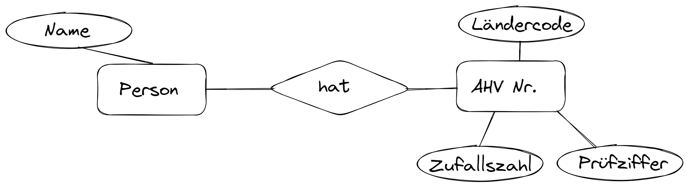
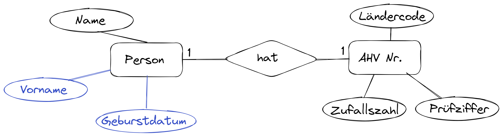

---
sidebar_custom_props:
  id: 1f7a6119-0642-475b-a4d3-4fc3ddff8f51
---

# ER-Diagramme

ERD
: Entity-Relationship-Diagramm

Theorie
: [👉 Buch S. 252-258](https://erzbe.sharepoint.com/:b:/s/24EFInformatik/EWseDuaUYBtOu0I9XIjEzCkBHvd1eNeknJg9kCY8FAe2xQ?e=4yEofE)

## Lösungen

:::aufgabe 1. Weiterbildungs-Organisation
<Answer type="state" webKey="d65644f3-e369-4afe-b620-a14ea482f824" />

Eine Weiterbildungs-Organisation besitzt Dozenten und Vorlesungen
- Dozenten halten Vorlesungen
- In jeder Vorlesung ist genau eine Dozent:in anwesend
- Dozenten haben Name und Telefonnummer
- Vorlesungen haben eine Nummer (z.B. `20727`) und einen Titel.

1. Zeichnen Sie das ER-Diagramm
2. Bestimmen Sie die Kardinalität

<Answer type="text" webKey="5487f817-039d-45ab-a66e-06dde2143015" />

<Solution webKey="ca1207f4-41b2-4a69-94d7-2641b2ea653b">

</Solution>
:::

:::aufgabe 2 Schüler:innen und Aufgaben
<Answer type="state" webKey="034f4caf-4e4e-42e9-a16f-b3d3d5e59980" />

Ausgangslage: SchülerInnen lösen mehrere Aufgaben. Jede Aufgabe hat eine Nummer und eine maximal mögliche Punktezahl. Jede gelöste Aufgabe wird korrigiert und mit Punkten bewertet (von wem spielt hier keine Rolle).
- Erstellen Sie das ER-Diagramm
- Bestimmen Sie die Kardinalität
- Fügen Sie jeweils 3 sinnvolle Attribute pro Entitäts-Typ hinzu

<Answer type="text" webKey="6d54fa27-38cf-4c3c-8d07-a3e356f65f25" />
<Solution webKey="ca1207f4-41b2-4a69-94d7-2641b2ea653b">

</Solution>

:::

:::aufgabe 3. Klinik
<Answer type="state" webKey="c28936ce-60e2-49cf-93fa-6ec11852e669" />

Gegeben sei das folgende ER-Diagramm, welches einen Ausschnitt eines Krankenhauses modellieren soll:

Eine Klinik besteht aus Stationen, eine Station hat mehrere Zimmer. Patienten werden ambulant oder stationär behandelt. Die Zimmer sind entweder Ein- oder Drei-Bett-Zimmer. Stationsmitarbeiter:innen arbeiten in ein- bis zwei Stationen. In einem Zimmer dürfen entweder nur Frauen oder nur Männer untergebracht werden:
- Überlegen Sie sich zu jedem Entity-Typ sinnvolle Attribute.
- Bestimmen Sie für jeden Entity-Typ den Primärschlüssel.
- Bestimme Sie die Kardinalität für alle Relationen.

<Solution webKey="ca1207f4-41b2-4a69-94d7-2641b2ea653b">

</Solution>

:::

:::aufgabe 4. Person-AHV Nummer
<Answer type="state" webKey="e09f6820-e870-45f4-8913-b008b341d7bc" />

1. Bestimmen Sie die Kardinalität und fügen Sie der Person zwei weitere Attribute hinzu.
2. Überführen Sie das ERD in ein relationales Schema (=Tabellenform).
3. Fügen Sie der Tabelle zwei Personen mit ihren AHV Nummern hinzu (erfundene Daten sind erlaubt).

<Solution webKey="ca1207f4-41b2-4a69-94d7-2641b2ea653b" className="slim compact left">

__Personen__

| Name     | Vorname | Geburtsdatum | AHV_ID |
|:---------|:--------|:-------------|:-------|
| Meier    | Alfred  | 2006-01-11   | 1      |
| Mosimann | Maria   | 2000-05-13   | 2      |

__AHV Nummern__

| id | AHV Nr | Zufallszahl | Prüfziffer |
|:---|:-------|:------------|:-----------|
| 1  | 756    | 12345678    | 90         |
| 2  | 756    | 12345669    | 31         |

</Solution>
:::

:::aufgabe 6. Schülerprojekte
<Answer type="state" webKey="e09f6820-e870-45f4-8913-b008b341d7bc" />

1. Bestimmen Sie die Kardinalität.
2. Überführen Sie das ERD in ein relationales Schema (=Tabellenform).
3. Fügen Sie der Tabelle zwei Schüler:innen hinzu, welche an einem gemeinsamen und jeweils an einem eigenen Projekt arbeiten.

<Solution webKey="199dfa13-dee1-4057-ab4e-2006e710fe17" className="slim compact left">

__Schüler:innen__

| id | Name     | Vorname |
|:---|:---------|:--------|
| 1  | Meier    | Alfred  |
| 2  | Mosimann | Maria   |

__schüler_projekte__

| schüler_id | projekt_id |
|:-----------|:-----------|
| 1          | 1          |
| 1          | 2          |
| 2          | 1          |
| 2          | 3          |

__Projekte__

| id | Fach       | Zeitraum              | Thema             |
|:---|:-----------|:----------------------|:------------------|
| 1  | Informatik | September 2023        | Datenbanken       |
| 2  | Deutsch    | August-September 2023 | Lektüre           |
| 3  | Physik     | September 2023        | Praktikumsbericht |

</Solution>
