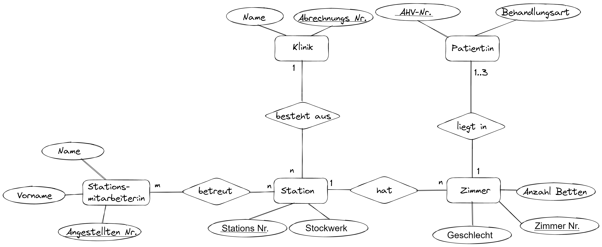
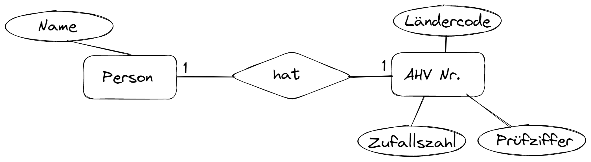

---
sidebar_custom_props:
  id: e1b875ca-d316-4235-9d28-70d126fad1c9
image: ./images/simpsons-excel-is-no-db.png
---
# Datenbanken

## Einstieg Wetten um Smarties

Wir die Wett-Resultate in drei unterschiedlich strukturierten Excel-Tabellen gespeichert. Was sind die Vor- und Nachteile der einzelnen Varianten? Washalb reicht Excel nicht aus, um Daten zu speichern?

<Answer type="text" webKey="6737881f-025a-4df3-878d-35436708518e" />

## Material

Buch
: [👉 Datenbanken](https://erzbe.sharepoint.com/:b:/s/24EFInformatik/EWseDuaUYBtOu0I9XIjEzCkBHvd1eNeknJg9kCY8FAe2xQ?e=4yEofE)
Datenbank
: [👉 DB-SQL.CH](https://db-sql.ch)
Skript
: [👉 Datenbanken](https://erzbe-my.sharepoint.com/:b:/g/personal/balthasar_hofer_gbsl_ch/EVnFr8xMQJBDr4SGmPvLYEgBL6IgKngdCXsNOv7RiLpsYQ?e=gVDCWz)

## Lösungen

### 1. Weiterbildungs-Organisation
<Solution webKey="ca1207f4-41b2-4a69-94d7-2641b2ea653b">

</Solution>

### 2. Schüler:innen und Aaufgaben

<Solution webKey="ca1207f4-41b2-4a69-94d7-2641b2ea653b">

</Solution>

### 3. Klinik
<Solution webKey="ca1207f4-41b2-4a69-94d7-2641b2ea653b">

</Solution>

### 4. Person-AHV Nummer
<Solution webKey="ca1207f4-41b2-4a69-94d7-2641b2ea653b">

</Solution>