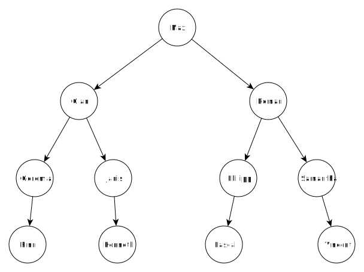
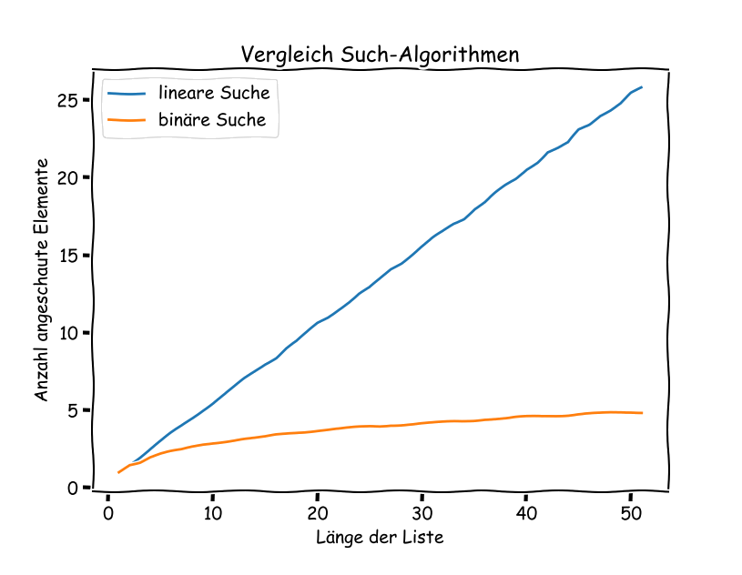

---
sidebar_custom_props:
  id: ae25ed43-edc0-4d36-8cb7-cf6ddfdf360e
  source:
    name: S. Forster, M Lehmann
    ref: https://informatik.mygymer.ch/ef2024/10-komplexitaet/01-suchen.html

---

# Suchen

Wir erforschen die Komplexität am Beispiel der Suche: Gegeben sei eine Liste mit Namen.

```py
liste = ['Finn', 'Gian', 'Philipp', 'Samantha', 'Vincent', 'Pascal',
         'Geremia', 'Janis', 'Kenneth', 'Max', 'Roman']
```

Es gibt nun «intelligente» und «weniger intelligente» Möglichkeiten, diese Liste nach einem bestimmten Element zu durchsuchen.

## Lineare Suche
Wir gehen die Liste Element um Element durch und vergleichen die Elemente mit dem gesuchten Element:

```py live_py slim
liste = ['Finn', 'Gian', 'Philipp', 'Samantha', 'Vincent', 'Pascal',
         'Geremia', 'Janis', 'Kenneth', 'Max', 'Roman']

def suche_linear(liste, begriff):
	i = 1
	for eintrag in liste:
		if eintrag == begriff:
			return i
		i = i + 1

print(suche_linear(liste, 'Finn'))
print(suche_linear(liste, 'Roman'))
```

Wir zählen wie viele Elemente wir vergleichen müssen und geben diese Zahl aus.

Der beste Fall wäre die Suche nach «Finn» – hier können wir gleich beim ersten Element die Suche abbrechen.

Der schlechteste Fall wäre die Suche nach «Roman» – hier müssen wir alle Elemente durchgehen und werden erst beim letzten fündig. (oder gleich schlecht: die Suche nach einem Namen der gar nicht vorkommt!)

Im Durchschnitt werden wir in der Hälfte der Liste fündig!

**Uns interessiert aber der schlechteste Fall!** – Wenn ein Programm im Schnitt einige Sekunden benötigt, aber dann im schlechtesten Fall trotzdem ein Jahr, ist es nicht wirklich brauchbar!

## Komplexität
Was ist nun, wenn wir die Liste verlängern? Dann steigt die Anzahl der Vergleiche natürlich auch: Für eine doppelt so lange Liste müssen wir auch doppelt so viele Vergleiche anstellen.

Wir haben hier also ein lineares Wachstum, welches wir in der sogenannten **O-Notation** wie folgt schreiben:

---

Die __lineare Suche__ gehört zu den Funktionen der Klasse
$$
O(n)
$$

---

## Binäre Suche
Eine «intelligentere Suche» setzt voraus, dass die Liste sortiert ist. Wir sortieren also unsere Liste und erhalten:

```py
liste = ['Finn', 'Geremia', 'Gian', 'Janis', 'Kenneth', 'Max', 'Pascal', 'Philipp', 'Roman', 'Samantha', 'Vincent']
```

Wir vergleichen nun unser gesuchtes Element mit dem Element in der Mitte der Liste. Kommt unser gesuchtes Element im Alphabet nach dem Element in der Mitte, so halbieren wir die Liste und gucken uns nun nur noch den zweiten Teil an. Dort wiederholen wir das Prozedere, bis wir das Element finden.

Dadurch entsteht ein binärer Baum:



«Max» ist genau in der Mitte, «Gian» und «Roman» sind in der Mitte der beiden Hälften, usw.
Mit jedem Vergleich halbieren wir also die Menge der in Frage kommenden Elemente.

Wir kommen in diesem Beispiel in maximal 4 Schritten zu unserem Ziel. (Der Baum hat 4 Ebenen)

## Komplexität
Da die Liste nach jedem Aufruf halbiert wird, haben wir nach dem ersten Teilen noch $n/2$ Elemente, nach dem zweiten Schritt $n/4$ Elemente, nach dem dritten Schritt $n/8$ Elemente, usw. Daher lässt sich allgemein sagen, dass im i-ten Schritt maximal $n/2^i$ Elemente übrigbleiben. Das ergibt $log_2(n)$ Vergleiche bei der Suche.

Diese Suche hat also kein lineares Verhalten mehr, sondern ein logarithmisches. Wir notieren das in der O-Notation wie folgt:

---
Die binäre Suche gehört zu den Funktionen der Klasse
$$
O(log(n))
$$
---

Die binäre Suche ist also schneller als die lineare. Gerade bei längeren Listen macht sich das sehr stark bemerkbar:

| Such-Algorithmus | 10 | 50 | n     |
|:-----------------|:---|:---|:------|
| linear           | 10 | 50 | n     |
| binär            | 4  | 6  | lg(n) |

Eine Möglichkeit, die binäre Suche zu implementieren, sieht wie folgt aus:

```py live_py slim
liste = ['Finn', 'Geremia', 'Gian', 'Janis', 'Kenneth', 'Max', 'Pascal',
         'Philipp', 'Roman', 'Samantha', 'Vincent']

def suche_binaer(liste, begriff):
	i = 1
	min = 0
	max = len(liste)	
	while True:
		index = min + (max - min) // 2
		eintrag = liste[index]		
		if eintrag == begriff:
			return i
		elif eintrag < begriff:
			min = index
		else:
			max = index
		i = i + 1

print(suche_binaer(liste, 'Gian'))
print(suche_binaer(liste, 'Vincent'))
```

Es wird immer nur ein Teil der Liste durchsucht, der nach jedem Schritt kleiner wird. Der Teil der Liste wird durch die Variablen __min__ und __max__ eingegrenzt.

## experimenteller Vergleich
### Direkt-Vergleich für eine Liste
Wir wählen 10000 Mal zufällig ein Element der Liste aus und schauen wie viele Schritte die beiden Suchalgorithmen brauchen, um es zu finden. Den Durchschnitt geben wir aus.

```py
import random

def test1():
	i = 0
	count_linear = 0
	count_binaer = 0
	while i < 10000:
		eintrag = liste[random.randint(0, len(liste) - 1)]
		count_linear = count_linear + suche_linear(liste, eintrag)
		count_binaer = count_binaer + suche_binaer(liste, eintrag)
		i = i + 1
	print('Suche linear: ', count_linear / i)
	print(' Suche binär: ', count_binaer / i)
```

### Vergleich bei Zunahme der Listenlänge
Wir führen denselben Vergleich nun für Listen mit unterschiedlicher Länge aus: Die äussere while-Schleife sorgt dafür, dass aus der ursprünglichen Liste, unterschiedlich lange Unterlisten erstellt werden. Dazu wird die Liste «zerschnitten» mit `liste[0:x]`. Diese Unterliste wird immer länger, bis wir dann die Original-Liste wieder erhalten. Für jede Unterliste wird wiederum der Durchschnitt von 10000 Suchen eines zufälligen Elementes berechnet.

```py
import matplotlib.pyplot as plt

def test2():
	plot_x = []
	plot_y_linear = []
	plot_y_binaer = []

	x = 1
	while x < len(liste):
		liste_kurz = liste[0:x]
		i = 0
		count_linear = 0
		count_binaer = 0
		while i < 10000:
			eintrag = liste[random.randint(0, len(liste_kurz) - 1)]
			count_linear = count_linear + suche_linear(liste_kurz, eintrag)
			count_binaer = count_binaer + suche_binaer(liste_kurz, eintrag)
			i = i + 1

		plot_x.append(x)
		plot_y_linear.append(count_linear / i)
		plot_y_binaer.append(count_binaer / i)
		x = x + 1
		
	plt.plot(plot_x, plot_y_linear, plot_y_binaer)
	plt.show()
```

Am Schluss sind in den Variablen `plot_x`, `plot_y_linear` und `plot_y_binaer` die Ergebnisse abgespeichert. Diese können nun z.B. mit der matplotlib ausgegeben werden.

Für eine Liste bis Länge 50 führt dies zu folgendem Output:


