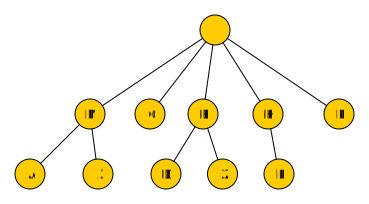

---
sidebar_custom_props:
  id: 2eaa4f27-5c74-4583-b007-29870d4103fa
  source:
    name: S. Forster, M Lehmann
    ref: https://informatik.mygymer.ch/ef2024/08-ki-klassisch/03-breitensuche.html
---
# Breitensuche

Bei der Breitensuche gehen wir – salopp gesagt – in alle Richtungen gleich schnell. Dabei werden etwaige Gewichte zwischen den Knoten ignoriert. Wir werden also einen Weg finden, aber nicht zwingend den Kürzesten!

Für die Suche brauchen wir zwei Listen, womit wir unseren Suchfortschritt festhalten:

__Closed-List__
: Hier werden alle abgehandelten Knoten aufgelistet
__Open-List__
: Hier werden alle bekannten Knoten welche als nächste Kandidaten in Frage kommen aufgeführt

## Vorbereitung
Zu Beginn ist die Closed-List leer. Der Startknoten kommt auf die Open-List:

```
Closed-List: –
  Open-List: I
```

<Tabs>
<TabItem value="Schritt 1">

### Schritt 1

Wir nehmen den ersten Knoten von der Open-List – das ist I – und besuchen alle Nachbarn. Diese werden der Open-List angehängt. Der Knoten I gilt jetzt als besucht: Er wird von der Open-List gestrichen und kommt auf die Closed-List.


```
Closed-List: I
  Open-List: M, C, B, H, P
```

</TabItem>
<TabItem value="Schritt 2">

### Schritt 2
Nun besuchen wir wiederum den ersten Knoten auf der Open-List, nämlich M. Die Nachbarn A und X kommen zuhinterst auf die Open-List. Der Nachbar C ist bereits auf einer Liste, d.h. wir haben bereits einen Weg zu C gefunden. Die Kante zwischen M und C wird entfernt. (Wir wollen am Schluss zu jedem Knoten nur genau einen Weg haben.)
M kommt auf die Closed-List.


```
Closed-List: I, M
  Open-List: C, B, H, P, A, X
```

</TabItem>
<TabItem value="Schritt 3">

### Schritt 3
Erneut gehen wir zum ersten Knoten auf der Open-List, also C, und schauen uns dessen Nachbarn an: M und X sind bereites bekannt.
C kommt auf die Closed-List.


```
Closed-List: I, M, C
  Open-List: B, H, P, A, X
```

</TabItem>
<TabItem value="Schritt 4">

### Schritt 4
Jetzt sind die Nachbarn von B dran: D kommt auf die Open-List, ebenso Z. Den Weg zu H haben wir bereits gefunden. Wir können dies Kante also streichen.
B kommt auf die Closed-List.


```
Closed-List: I, M, C, B
  Open-List: H, P, A, X, D, Z
```

</TabItem>
<TabItem value="Schritt 5">

### Schritt 5
Der nächste Knoten auf der Open-List ist H. Wir fügen die noch nicht besuchten Nachbarn von H zur Open-List hinzu. Es sind dies L, Y und K. L ist unser gesuchtes Ziel: wir haben also einen Weg von I nach L gefunden, und zwar über H. H kommt auf die Closed-List und wir brechen den Algorithmus ab.


```
Closed-List: I, M, C, B, H
  Open-List: P, A, X, D, Z, L, Y, K
```
</TabItem>
</Tabs>

## Ergebnis
Die roten Linien und Knoten im Graphen stellen einen Baum dar. Wenn wir die Knoten nun etwas umpositionieren erhalten wir den folgenden erforschten Baum:



Dieser Baum zeigt zu jedem erforschten Knoten genau einen Weg vom Startknoten aus. Da wir den Algorithmus abgebrochen haben, sobald wir den Zielknoten gefunden haben, sind nicht alle Knoten aufgelistet. Aber wir finden den gesuchten Weg zum Zielknoten.

Wir zeichnen nun noch mit Pfeilen die Reihenfolge ein in welcher wir diese Knoten «durchsucht» haben:


Diese Art der Baumsuche nennt man **Breitensuche**.

:::aufgabe
<Answer type="state" webKey="ea2ba5bf-e9fa-451f-a157-fd7e45920744" />

Führen Sie selbst eine Breitensuche durch: Finden Sie den Weg in umgekehrter Richtung, also vom Knoten `L` zum Knoten `I`.

- Zeichnen Sie Ihren Fortschritt analog zum Beispiel im Graphen auf
- Führen Sie daneben eine Open- und eine Closed-List

<Answer type="text" webKey="0e8d1528-4dd0-432c-b070-bc65058bb267" />
:::