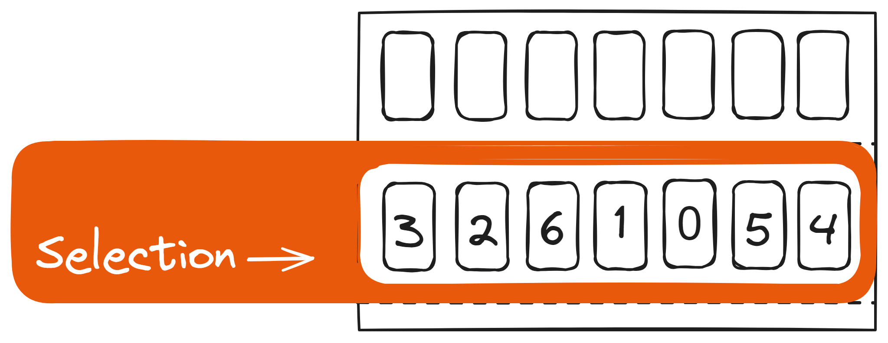
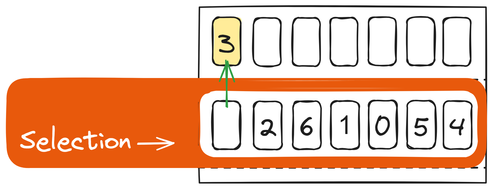
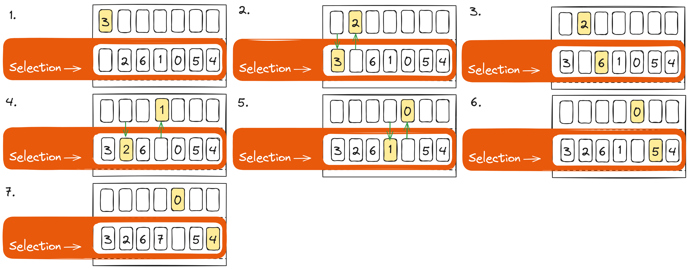
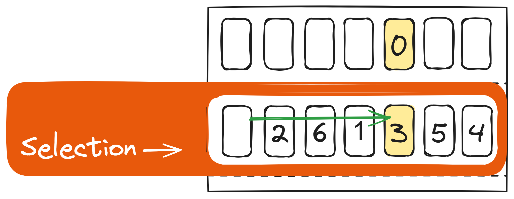
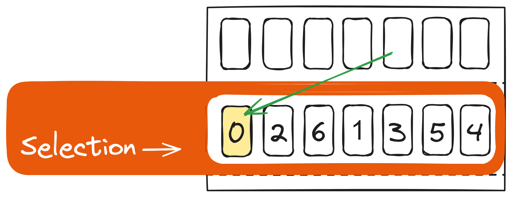
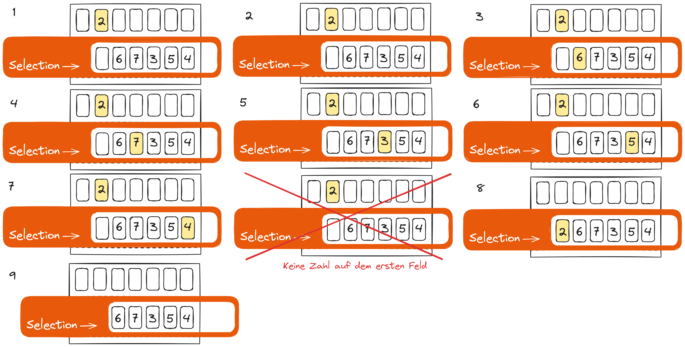
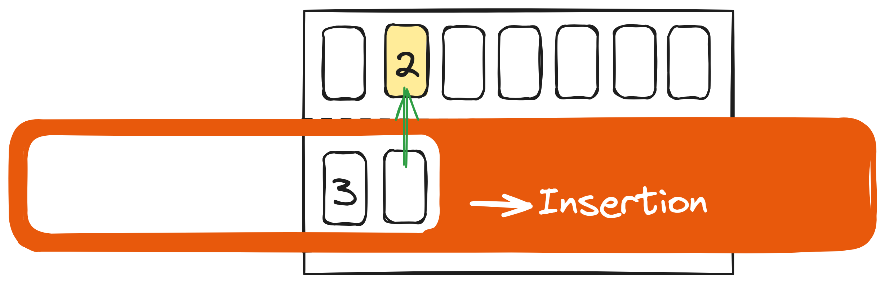
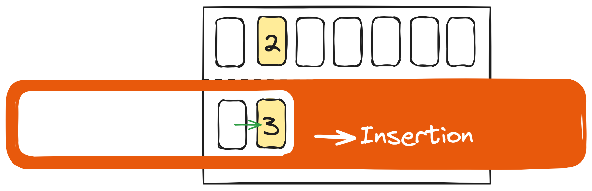
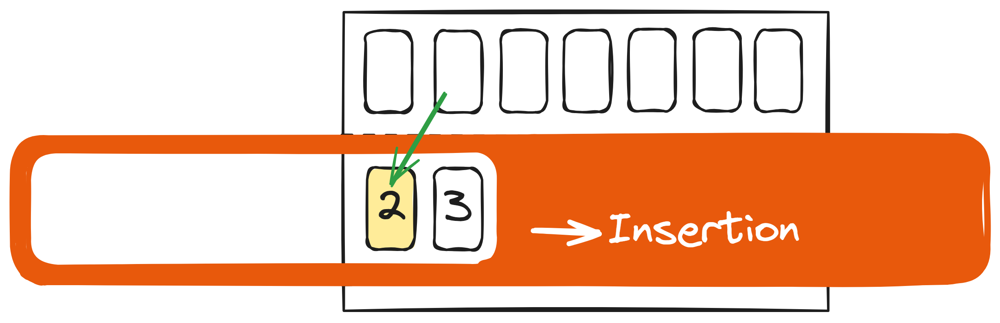
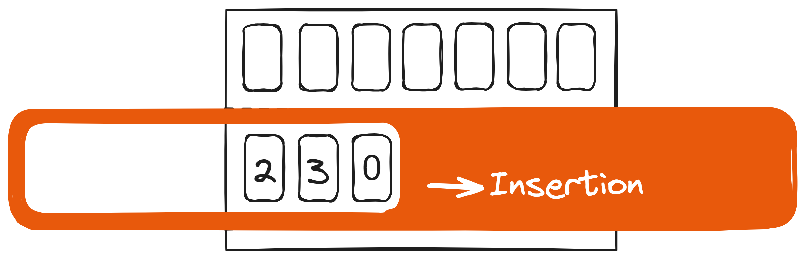

---
sidebar_custom_props:
  id: bd437e66-5090-4f2f-97ca-866d8184d359
---

# Algorithmen

Ziel
: Die Zahlen sollen von links nach rechts sortiert werden.
Material
: 1 Grundplatte, 1 Schiebevorrichtung, 7 Zahlenchips [^1]

<Tabs>
<TabItem value="Selection Sort">

## Selection Sort

Startaufstellung:

### 1. Schritt: Markiere das Feld ganz links

Das Feld ganz links wird markiert und nach oben in den temporären Speicher gelegt: 

### 2. Schritt: Selection

Gehe jede Zahl durch. Falls die Zahl kleiner ist als die Zahl im Zwischenspeicher, wird die aktuelle Zahl im Zwischenspeicher nach unten auf ihren Platz und die kleinere Zahl nach oben in den Zwischenspeicher gelegt:

### 2. Schritt: Tauschen

Die erste Zahl wird (sofern vorhanden) in die leere Position verschoben:

und die markierte Zahl wird ins leere Feld verschoben:

### 3. Schritt: Schieben

Die Schieblehre wird um eine Position nach rechts geschoben:

### ... weiter mit Schritt 1 bis keine Zahl mehr übrig ist

:::details Nächste Runde

:::

<Answer type="text" webKey="b1709e13-1f26-47d2-978e-18a96b7211ab" />

</TabItem>
<TabItem value="Insertion Sort">

## Insertion Sort

Startaufstellung:

### 1. Schritt: Schieben

Die Schieblehre wird um eine Position nach rechts geschoben:

### 2. Schritt: Vergleichen

Ist die Zahl links kleiner oder gleich der markierten Zahl: :mdi-arrow-right-bold: weiter mit **Schritt 1**

Die markierte Zahl wird nach oben in den temporären Speicher gelegt:

### 3. Schritt: Tauschen

Solange die Zahl links neben dem leeren Feld grösser ist als die markierte Zahl, wird sie ins leere Feld verschoben:

## 4. Schritt: Insertion

Die markierte Zahl wird ins leere Feld verschoben:

### ... weiter mit Schritt 1 bis keine Zahl mehr übrig ist

:::details Nächste Runde

:::

<Answer type="text" webKey="13a1e010-9fc8-4639-9e6b-cccea8b8b1dc" />

</TabItem>
</Tabs>

[^1]: Druckvorlage: [apaik5](https://www.printables.com/@apaik5_264920)@[printables.com](https://www.printables.com/model/340344-computer-science-sorting-algorithms-learning-tool)