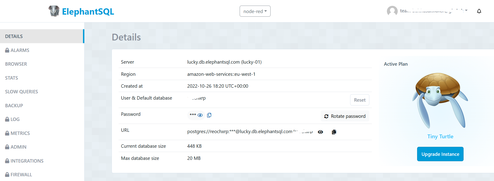
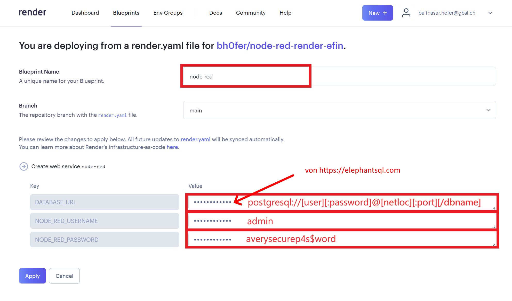

# Vorbereitung auf den IOT-Workshop 2023

## Verwendete Dienste

Datenbank
: PostgreSQL von [ElephantSQL.com](https://www.elephantsql.com/)

Hosting Server
: Plattform as a Service (PaaS) von [Render.com](https://render.com/)

Wir verwenden kostenlose Dienste, um Node-RED zu installieren. Diese Dienste bieten eine gewisse Anzahl von Ressourcen (z.B. Speicherplatz, Datenbanken, ...) kostenlos an. Sobald diese Ressourcen aufgebraucht sind, müssen Sie entweder auf eine kostenpflichtige Version upgraden oder auf einen anderen Anbieter ausweichen. Damit Node-RED durchgehend laufen kann, konfigurieren wir die Datenbank nicht bei render.com (dort wird sie nach 3 Monaten automatisch wieder abgeschalten), sondern bei ElephantSQL.com, wo eine Datenbank kostenlos zur Verfügung steht.

## 1. Datenbank auf ElephantSQL.com erstellen

1. Erstellen Sie sich einen kostenlosen Account bei [ElephantSQL.com](https://www.elephantsql.com/)
2. Über __:mdi[plus] Create New Instance__ eine neue Datenbank erstellen:

Step :mdi-numeric-1-box--orange: Plan
: Name: __node-red__
Step :mdi-numeric-1-box--orange: Plan 
: Plan: __Tiny Turtle (Free)__
Step :mdi-numeric-2-box--green: Datacenter
: Region: __EU-West-1 (Ireland)__

3. In der Übersicht der ebene erstellen Datenbank die URL `postgres://...@....db.elephantsql.com...` kopieren - wir brauchen sie später beim erstellen von Node RED.

  

## 2. Node-RED auf Render.com installieren
1. Erstellen Sie sich einen kostenlosen Account bei [Render.com](https://render.com/)
2. Eine Node-RED Instanz mit einem kostenlosen Server von [Render](https://render.com) erzeugen, indem Sie auf den untenstehenden Knopf [__👉 DEPLOY TO RENDER__](https://render.com/deploy?repo=https://github.com/bh0fer/node-red-render-efin) klicken und dann die drei Felder ausfüllen:

  

  DATABASE_URL
  : Die Datenbank URL, die Sie in der vorherigen Anleitung kopiert haben. Sie sieht ungefähr so aus: `postgres://...@....db.elephantsql.com...
  NODE_RED_USERNAME
  : __admin__
  NODE_RED_PASSWORD
  : Ein **sicheres** Password - Sie brauchen es jedesmal, wenn Sie auf Node-RED zugreifen wollen. **Achtung:** Das Passwort muss mindestens 8 Zeichen lang sein und Zahlen sowie Sonderzeichen enthalten.

  

3. Auf __Apply__ klicken. **Das wars vorerst** 🥳 - im Hintergrund wird jetzt der Node-RED Server aufgesetzt. Dies dauert eine Weile; Dass die Seite nicht sofort verfügbar ist oder Fehlermeldungen anzeigt, ist normal. Das werden wir am EF-IOT-Workshop 2023 gemeinsam lösen.