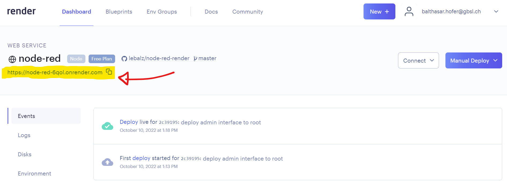

---
sidebar_custom_props:
  id: 88196782-dbfc-4928-94bd-c5885ae07255
---

# Flows

---
:::info[Node, Connection, Flow]
Node
: Ein Kästchen mit einer Funktion
Verbindung
: Verbindet zwei Nodes miteinander
Flow
: Alle Nodes die (auch indirekt) miteinander verbunden sind
:::

:::info[Nodes]
Jede Node kann ein, zwei oder drei Funktionalitäten zur Verfügung stellen:

Input
: Sobald eine Nachricht über die Verbindung eintrifft, wird die Node ausgeführt
Verarbeitung
: Der Inhalt der empfangenen Nachricht verarbeiten, anzeigen, speichern, ... 
Output
: Eine neue Nachricht kann an alle verbundenen Nodes weitergegeben werden.
:::

---

## Node RED Starten

Auf [👉 render.com](https://render.com) kann im Dashboard beim Web Service __node-red__ die URL, unter welcher Ihr persönlicher Node-RED Dienst verfügbar ist, nachgeschaut werden:
   

Navigieren Sie auf diese Seite - es wird relativ lange dauern (ca. 2-3 Minuten), bis die Seite geladen hat. Wieso? Um Rechenzeit und somit auch Kosten zu sparen, werden inaktive Server (nur kostenlose) in einen Ruhezustand versetzt. Ein Server gilt als inaktiv, wenn er länger als 15 Minuten keine Webseite mehr anzeigen musste. Wenn Sie nun zum erste Mal nach einiger Zeit den Dienst aufrufen, dauert es einen Moment, bis die Seite wieder online ist.
  
Hat alles geklappt, können Sie sich mit den bei der Installation gewählten Login-Daten (`NODE_RED_USERNAME` und `NODE_RED_PASSWORD`) einloggen (Username: `admin`, Passwort: `WasSieGesetztHaben`)):

## Installation Überprüfen
:::aufgabe[Erster Flow erzeugen]
<Answer type="state" webKey="5e83c82b-90cc-4cdf-819d-ad9bdffd3b99" />

Erstellen Sie Ihren ersten Flow und Überprüfen Sie, das alles genau so funktioniert wie im Video:

[@video](images/flow-1.mp4)
:::

## Immer Online

Damit unsere Flows ständig aktiv bleiben, müssen wir sicherstellen, dass Render.com unsere Server nicht inaktiv setzt. Dazu erzeugen wir einen Flow, welcher alle 5 Minuten die Startseite aufruft und somit verhindert, dass Node-RED in den Ruhezustand versetzt wird.

:::aufgabe[KeepAlive umsetzen]
Erzeugen Sie einen eigenen `KeepAlive` Flow und deployen sie diesen:

[@video](images/node-red-keep-running.mp4)
:::
