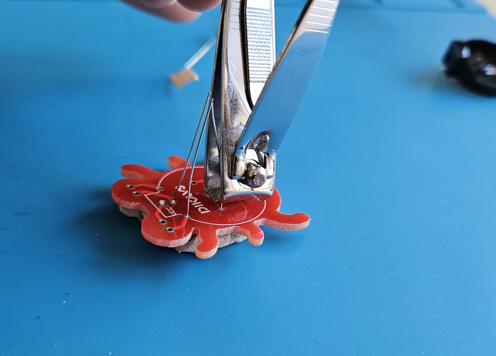
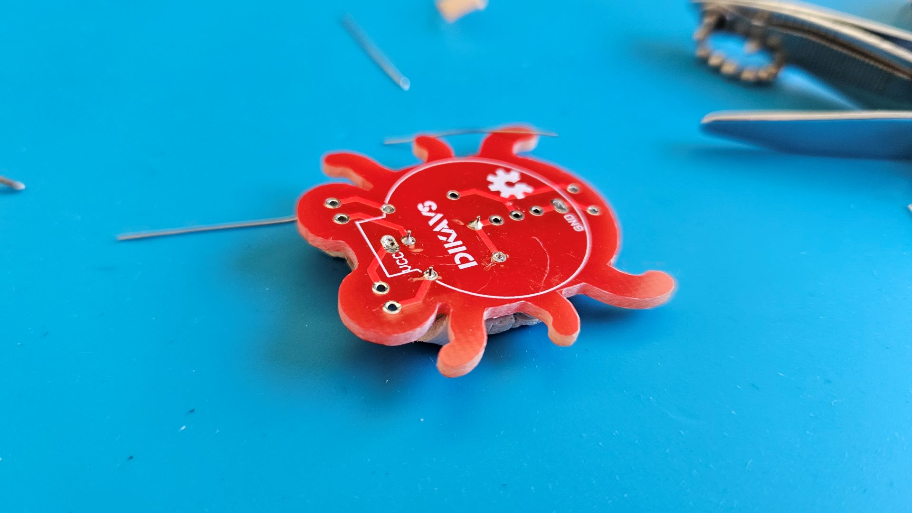
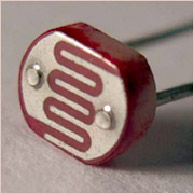
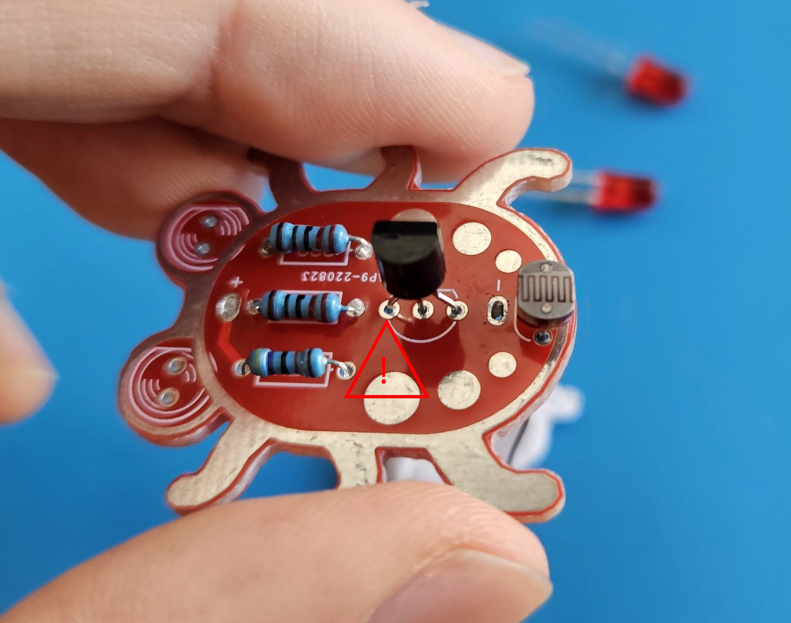
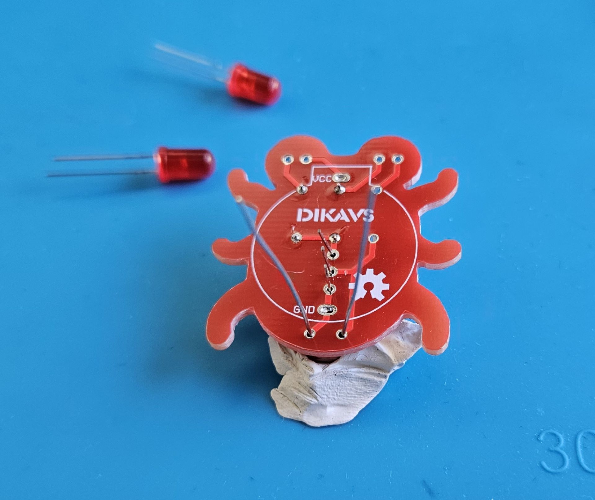

---
sidebar_custom_props:
  id: e315a646-d01a-4377-9dc1-2f4ed9babb4a
---
# 1. Leuchtkäfer

:::aufgabe Leuchtkäfer Löten

Material
: Batterie
: Leuchtkäfer-Set
: Petafix
: **Nasser** Schwamm
: Lötzinn

Löten Sie nach untenstehender Anleitung einen Leuchtkäfer zusammen.
:::

:::cards

:::

:::cards
### Schritt 1: Vorbereitung
Materialien bereitstellen.

:::
:::cards
### Schritt 2: 220 :mdi-omega: Widerstände löten
- Die beiden **gleichaussehenden** Widerstände Zurechtbiegen
- Die Richtung der Widerstände spielt keine Rolle!
- Das Käferchen mit den Widerständen nach Unten auf das Petafix drücken - nun sollte alles fixiert sein

:::cards --min-width=300px

***

:::
:::
:::cards
### Schritt 3: Löten und überständiges Material abschneiden
- Die vier Lötstellen löten
- Die überständigen Füsschen abschneiden - wenn kein Seitenschneider vorhanden ist, tut's auch ein Nagelknipser 

:::cards --min-width=300px

***

:::
:::

:::cards
### Schritt 4: 4.7k :mdi-ohm: Widerstand, Transistor und Fotowiderstand löten

:::cards

***
> Ein **Transistor** ist ein elektronisches Halbleiter-Bauelement zum Steuern elektrischer Spannungen und Ströme. Er ist der **weitaus wichtigste** „aktive“ Bestandteil elektronischer Schaltungen [...] in Computersystemen. Besondere Bedeutung haben Transistoren – zumeist als Ein/Aus-Schalter – in integrierten Schaltkreisen, was die weit verbreitete Mikroelektronik ermöglicht.
>
> Die Bezeichnung „Transistor“ ist ein Kofferwort des englischen transfer resistor, was in der Funktion einem durch eine angelegte elektrische Spannung oder einen elektrischen Strom steuerbaren elektrischen Widerstand entspricht. [^1]
:::

:::cards

***
> Ein **Fotowiderstand** [...] ist ein lichtempfindlicher elektrischer Widerstand. Je mehr Licht auf den Fotowiderstand fällt, desto kleiner wird sein Widerstand. Im Vergleich zu anderen lichtempfindlichen elektronischen Bauelementen wie Fotodioden reagieren Fotowiderstände sehr langsam. [^2]
:::

Mit dem Fotoresistor wird also der elektrische Widerstand verändert - der Transistor ist dann dafür zuständig, aus diesem Widerstandssignal einen Stromkreis für die LED's zu schliessen (bei hohem Widerstand) bzw. den Stromkreis zu öffnen, wenn viel Licht einfällt.

- Den Transistor korrekt orientiert (es hat eine abgeflachte Seite) einsetzen
- Auf dem Petafix platzieren
- Löten
- Füsschen abschneiden

:::cards --min-width=300px

***

:::
:::
:::cards
### Schritt 5: LED's löten
- Die LED's korrekt orientiert einsetzen
  - das längere Beinchen muss links sein
  - in der LED drin muss die Spitze des Dreiecks nach Links zeigen
- Auf dem Petafix platzieren
- Löten
- Füsschen abschneiden

:::
:::cards
### Schritt 6: Batteriehalter löten und Spielen
- Den Batteriehalter anbringen und löten
- Batterie einsetzen
- ausprobieren - die LED's sollten leuchten, wenn kein Licht zum Lichtsensor kommt

:::

[^1]: [Transistor – Wikipedia](https://de.wikipedia.org/wiki/Transistor)
[^2]: [Transistor – Fotowiderstand](https://de.wikipedia.org/wiki/Fotowiderstand)