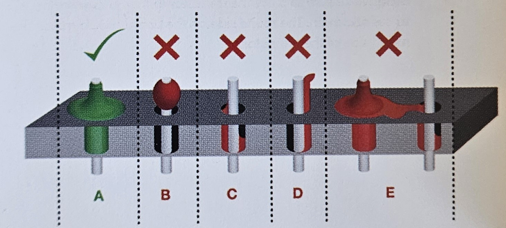

---
sidebar_custom_props:
  id: be5f9367-fe84-426b-82a6-043414616bcc
---
# Löten

:::cards[--min-width=300px]

- Beide Flächen erhitzen
- möglichst etwas unterhalb der Spitze
- :mdi-flash-triangle-outline--red: Lötzinn **nicht** direkt an die Spitze halten
- :mdi-flash-triangle-outline--red: **nicht** mit unsauberer Spitze löten
***

A
: So wünschen wir es uns
B, C, D, E
: Mist - insbesondere bei **D** kann es zu Kurzschlüssen kommen
:::

## Löten einfach gemacht... :mdi-thought-bubble-outline:

[@pdf](assets/SolderComic.pdf)

