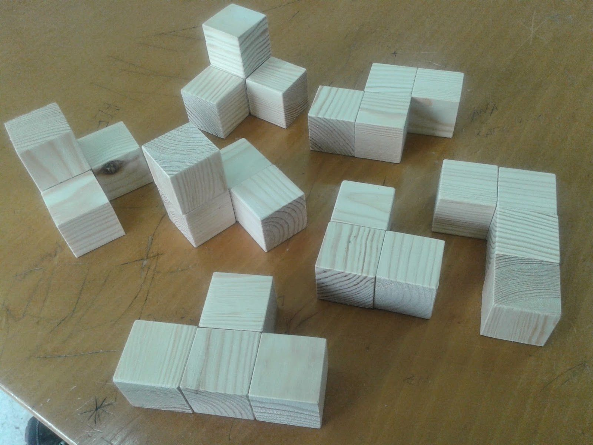

---
sidebar_custom_props:
  id: 4b3fea32-c56f-4c49-9a78-19318215c777
---
# OpenSCAD

[👉 OpenSCAD](https://www.openscad.org/) herunterladen und installieren.


## Einführung

[@video](images/intro.mp4)

:::details __intro.scad__
```scad
module baustein() {
    difference() {
        union() {
            cube([3, 1, 1]);
            translate([1, 1, 0])
                cube([1, 1, 1]);
        }
        translate([1.25,0.25,-0.01])
            cube([0.5, 0.5, 1.02]);
    }
}
translate([2, 2, 0])
    rotate([90, 0, 0])
        scale([0.5, 0.5, 1])
            baustein();
```
:::

:::aufgabe Knobelwürfel
Dateiname
: __EF-Info/docs/IOT-Day/knobelwuerfel.md__

Erstellen Sie in ein 3D Modell mit den 7 Elementen eines Knobel-Würfels. Die Elemente sollen sich nicht berühren und sollen sich auch nicht gegenseitig überlappen. Die Grösse der Elemente können Sie selber wählen.



- Exportieren Sie ein Bild __Datei > Exportieren > Bild exportieren...__
- Fügen Sie ein Dokument __knobelwuerfel.md__ mit der Überschrift `Knobelwürfel` zu Ihrem EF-Repository hinzu:
  - Überschrift: *Knobelwürfel*
  - Das Bild
  - Codeblock mit dem Modell ```` ```scad ```` 
- `Commit & Push`
:::

## Parameter und Schrift

[@video](images/params-and-text.mp4)

:::details __simple-box.scad__
```scad

BOX_X = 40;
BOX_Y = 40;
BOX_Z = 30;
BOX_WALL = 1.2;

// Interne Parameter
BOX_INNER_X = BOX_X - 2*BOX_WALL;
BOX_INNER_Y = BOX_Y - 2*BOX_WALL;

module txt() {
    translate([BOX_X / 2, 0.25 * BOX_WALL, BOX_Z / 2])
    rotate([90, 0, 0])
        linear_extrude(1)
            text("EF INFO", size=3, halign="center", valign="center");
}

module box() {
    difference() {
        cube([BOX_X, BOX_Y, BOX_Z]);
        translate([BOX_WALL, BOX_WALL, BOX_WALL])
            cube([BOX_INNER_X , BOX_INNER_Y, BOX_Z]);
        txt();
    }
}

module deckel() {
    union() {
        cube([BOX_X, BOX_Y, BOX_WALL]);
        translate([BOX_WALL, BOX_WALL, BOX_WALL])
            cube([BOX_INNER_X, BOX_INNER_Y, BOX_WALL]);
    }
}


box();
translate([BOX_X + 10, 0, 0])
    deckel();
```
:::

## Sensor-Box

:::aufgabe Sensor-Box
Das Modell [sensor-box.scad](sensor-box.scad) enthält das Grundgerüst für unsere Sensorbox. Untersuchen Sie das Modell und fügen Sie einen Schriftzug bspw. mit Ihrem Namen hinzu.

:::details
```scad
https://github.com/lebalz/ofi-blog/blob/main/docs/EF-IOT-Workshop/03-printing/01-OpenScad/assets/sensor-box.scad
```
:::

:::

:::danger Achtung überhängende Teile
Achten Sie darauf, dass Sie keine (zusätzlichen) überhängenden Teile hinzufügen.
:::
