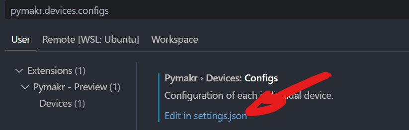

---
sidebar_custom_props:
  id: e0629f86-9d64-4675-b3c0-0fff0d6d4507
---
# Micro Python


:::cards{min-width=300px}
#### MicroPython

> MicroPython ist eine Softwareimplementierung einer Programmiersprache. Sie ist weitgehend kompatibel mit Python 3 und für den Betrieb auf einem Mikrocontroller optimiert.
>
> MicroPython ist ein in C geschriebener, vollständiger Python-Compiler und eine Laufzeitumgebung, die auf der Mikrocontroller-Hardware läuft. Enthalten ist eine Auswahl von Python-Kernbibliotheken; MicroPython enthält Module, die dem Programmierer Zugriff auf Low-Level-Hardware ermöglichen. Der Quellcode für das Projekt ist auf [👉 GitHub](https://github.com/micropython/micropython) unter der MIT-Lizenz verfügbar. [^1]

[👉 MicroPython Dokumentation](https://docs.micropython.org/en/latest/)
::br
#### Mikrocontroller

> Als Mikrocontroller (auch µController, µC, MCU oder Einchipmikrorechner) werden Halbleiterchips bezeichnet, die einen Prozessor und zugleich auch Peripheriefunktionen enthalten. In vielen Fällen befindet sich auch der Arbeits- und Programmspeicher teilweise oder komplett auf demselben Chip. Ein Mikrocontroller ist ein Ein-Chip-Computersystem. Für manche Mikrocontroller wird auch der Begriff System-on-a-Chip (SoC) verwendet. [^2]
:::

## Tutorial

::::aufgabe[MicroPython in VS Code installieren]
Arbeiten Sie sich durch das Tutorial durch. Erstellen Sie für jedes Programm, welches Sie auf den ESP8266 laden, ein neues Projekt - daher ein neuer Ordner im EF-Repository, den Sie direkt in VS Code öffnen (__File > Open Folder__)

[👉 MicroPython in VS Code](https://www.donskytech.com/micropython-using-vscode-pymakr-on-esp32-esp8266/)

:::details[Troubleshooting Keine Verbingung zum esp8266 möglich (Windows)]
Möglicherweise ist der installierte USB-Serial Treiber nicht kompatibel. VErsuchen Sie den folgenden Treiber:

👉 https://sparks.gogo.co.nz/ch340.html

:::

:::details[Troubleshooting Dateien hochladen]
Damit der Datei-Upload funktioniert, muss über eine Konfiguration festgelegt werden, wie der ESP8266 angeschlossen ist.

Suchen :mdi[magnify] Sie dazu in den Einstellungen :mdi-cog-outline: nach 

```
pymakr.devices.configs
```



:::flex{min-width=300px}
und klicken Sie auf `Edit in settings.json`. Dort wird für eine Schnittstelle (ein konkreter USB-Anschluss am Laptop oder für jeden USB-Dongle) eine eigene Konfiguration angelegt. Wir benötigen für den ESP8266 eine Konfiguration mit folgenden Einstellungen:

```json
"pymakr.devices.configs": {
    "5&1487bdb9&0&6": {
        "autoConnect": "onLostConnection",
        "name": "USB-Links-Oben",
        "username": "micro",
        "password": "python",
        "hidden": false,
        "rootPath": "/",
        "adapterOptions": {
            "chunkDelay": 20,
            "chunkSize": 2048
        }
    }
}
```
::br

:::
Die Hardware-ID (im obigen Beispiel `5&1487bdb9&0&6`) muss dabei für jeden USB-Anschluss individuell angepasst werden. Die Hardware-ID kann über die Seitenleiste `PYMAKR: DEVICES` ermittelt werden, indem der ESP8266 angeschlossen und verbunden wird:


:::
:::details[Troubleshooting Keine Ausgabe]
Kann passieren, wenn die Ausgaben herausgefiltert werden. In diesem Fall muss das Benachrichtigungsverhalten in den Einstellungen :mdi-cog-outline: auf `debug` festgelegt werden.

Suchen :mdi[magnify] Sie nach

```
pymakr.logLevel
```
:::
::::

[^1]: [Wikipedia MicroPython](https://de.wikipedia.org/wiki/MicroPython)
[^2]: [Wikipedia Mikrocontroller](https://de.wikipedia.org/wiki/Mikrocontroller)
