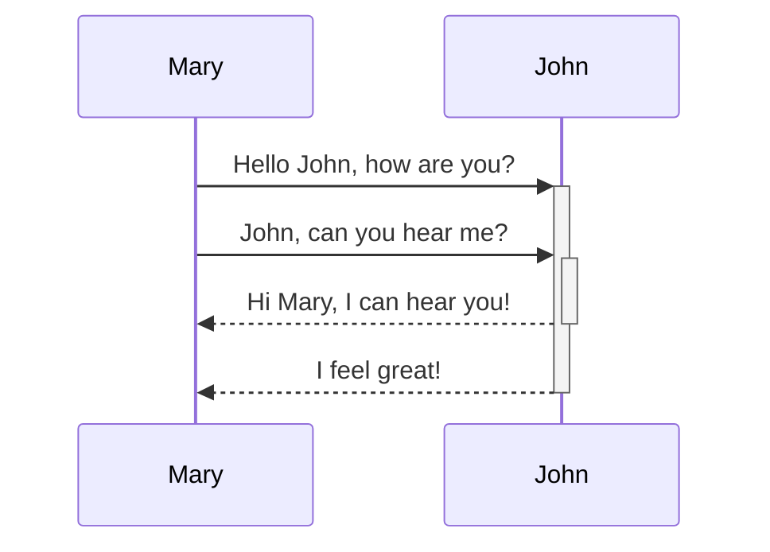
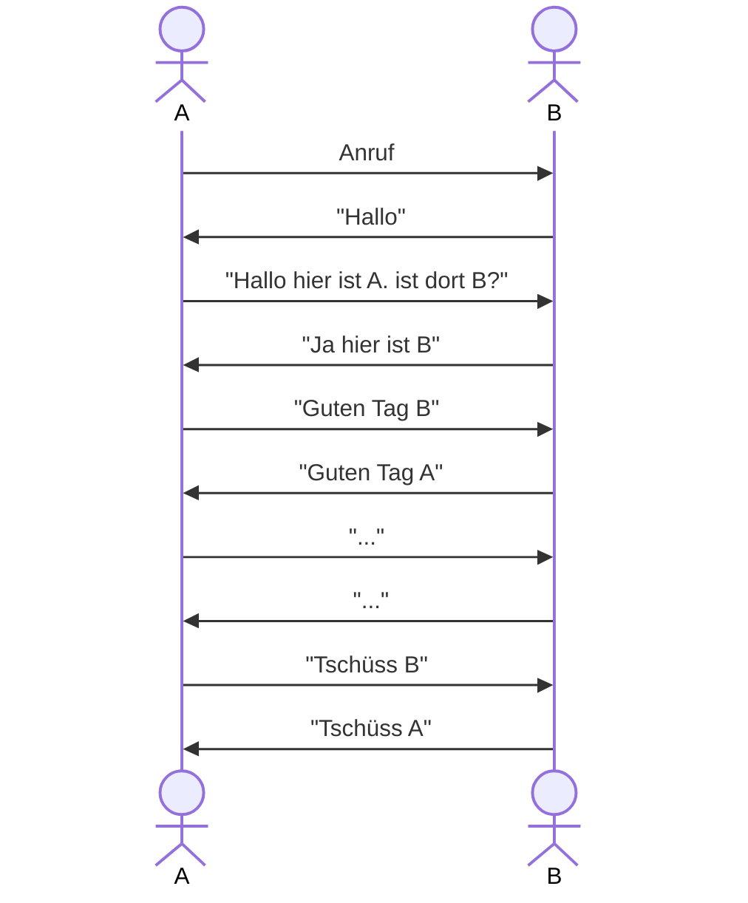

---
sidebar_custom_props:
  id: 616c6b51-3cf1-44ae-a98b-605ed97d9ded
---
# Aufgabe

:::::aufgabe
<Answer type="state" webKey="2acd3a18-6e33-44a0-9a6f-73c27a28069c" />

Dateiname
: __EF-Info/docs/Netzwerke/protokolle.md__

Entwerfen Sie ein **Protokoll** für den nötigen Dialog zwischen einer Person A und einer Person B zur **Eröffnung** und den **Abschluss** eines Telefongesprächs.
Skizzieren Sie dazu auf ein Papier den Nachrichtenaustausch in Form eines **Sequenzdiagramms** und zeichnen Sie das **Zustandsdiagramm** für die Person B (angerufene Person).

Machen Sie anschliessend eine Foto und laden Sie diese mit einer kurzen Beschreibung hier hoch.

::::details[Alternativ: Digitales Sequenz und Zustandsdiagramm mit Mermaid]
Mermaid ist eine simple Syntax, um unterschiedliche Diagramme zu erzeugen. Auf 👉 https://mermaid.live/ können die verschiedenen Diagramm-Typen (unter anderem Sequenz- und Zustandsdiagramme) live erzeugt werden. Der Code kann im Markdown verwendet werden und wird anschliessend sowohl auf Github wie auch auf der Webseite direkt als Diagramm angezeigt. Dazu muss der Diagramm-Code in einen `mermaid`-Codeblock eingefügt werden:

:::cards{code=true}
````

````
::br

:::

::::

<Answer type="text" webKey="5b6c0def-74de-4052-9f6f-0eb8f61f664f" />

<Solution webKey="7d4d84ff-90a1-4135-97c2-d99bed1777dd">

### Sequenzdiagramm




### Zustandsdiagramm


</Solution>
:::::
