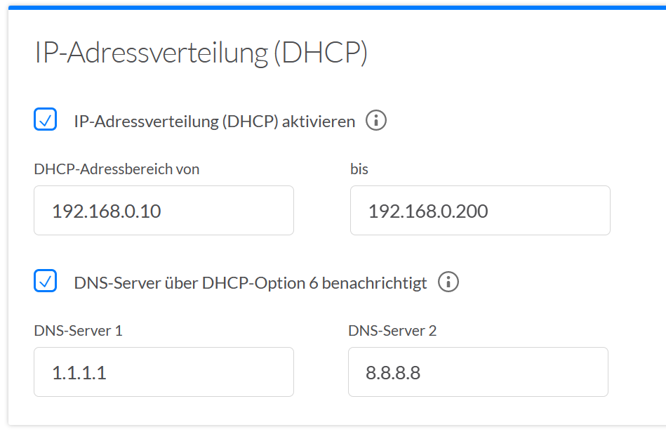

# 13. DHCP - Dynamic Host Configuration Protocol

Die am häufigsten verwendete Art der Zuordnung von IP-Adressen an Geräte ist dynamisch, d.h. Geräte erhalten beim Start eine IP-Adresse von einem speziellen Gerät, dem __DHCP-Server__. Diese Funktionalität ist oft in WLAN-Router integriert. Am Endgerät muss i.d.R. nichts eingestellt werden, weil __DHCP__ voreingestellt ist. DHCP weist zudem auch weitere Netzwerk-Einstellungen zu: **Default Gateway** und **Nameserver** (fürs __DNS__).

In Netzwerken, die sich relativ selten ändern (Firmen, Banken...) kann mit statischen IP-Adressen gearbeitet werden. Das erhöht zwar den Konfigurationsaufwand, ermöglicht aber eine einfachere Zuordnung Datenverkehr-Gerät (z.B. für Filterung von Internetverkehr). In einem häufig ändernden Netzwerk hingegen ist es einfacher, mit dynamischen IP-Adressen zu arbeiten. Hier sollte jedoch darauf geachtet werden, dass die Server immer über eine feste IP-Adresse verfügen, damit sichergestellt ist, dass sie immer erreichbar sind. Außerdem kann ein DHCP Server sich selbst keine dynamische IP-Adresse geben.

Dienstprogramme zur Kontrolle der Netzwerkeinstellungen sind `ipconfig /all` (Windows) und `ifconfig` (Mac/Linux). Mit `ping` kann man einfach testen, ob eine Adresse erreicht werden kann.

## Anwendung im Heimnetzwerk

Ab und zu scheint das Internet unendlich langsam zu sein - so auch geschehen letzthin bei mir zu Hause (nach der Umstellung des ISP zu einer Budget-Variante). Der Download Speed-Test hat schnell gezeigt, dass der Download-Speed eigentlich hoch war, jedoch der Verbindungs-Aufbau gefühlt ewig dauerte. Es fiel auf, dass keiner der bekannten Namensserver (Cloudflare `1.1.1.1` oder Google `8.8.8.8`) verwendet wurde. Wieso? Damit spezielle, lokale Domains für die Verwaltung vom ISP konfiguriert werden konnten. So konnte bspw. über `http://box.local` auf den WIFI-Router zugegriffen werden (anstatt dass man `192.168.0.1` oder `192.168.0.254` von Hand eingeben musste).

Der WIFI-Router kann standardmässig DNS-Records zwischenspeichern, was eigentlich eine tolle Sache ist. Allerdings war als Nameserver ein langsamer, vom ISP zur Verfügung gestellter Server konfiguriert. Dies konnte man ändern:

Zudem konnte auch eingestellt werden, dass der DHCP-Server die DNS-Server sich verbindenen Hosts mit dem Namensserver von Cloudflare konfiguriert:

