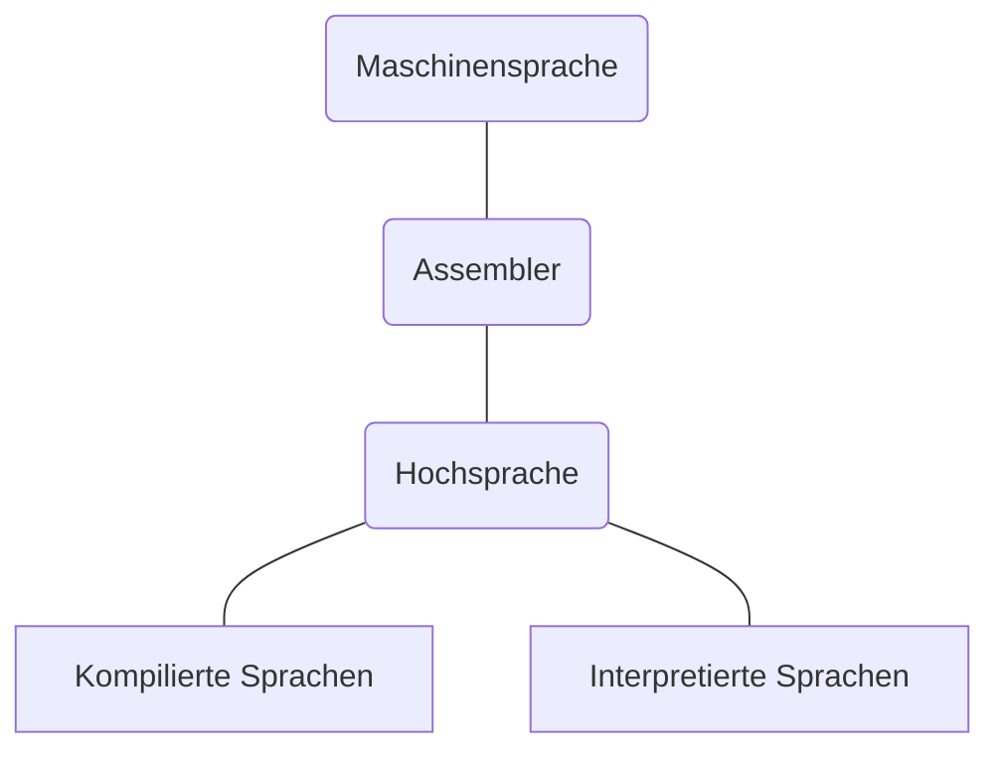
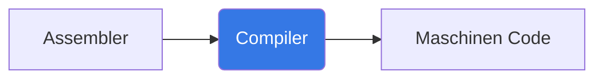
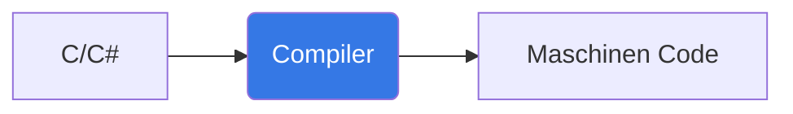
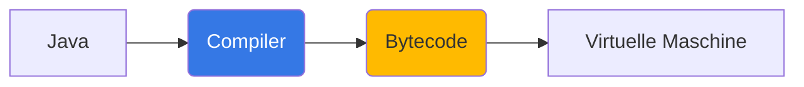
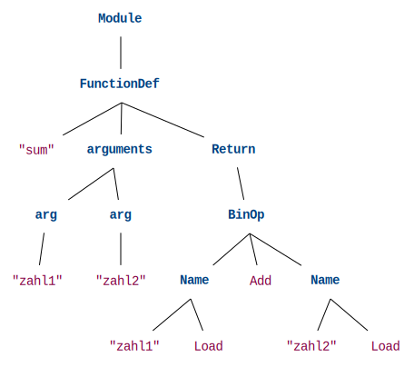
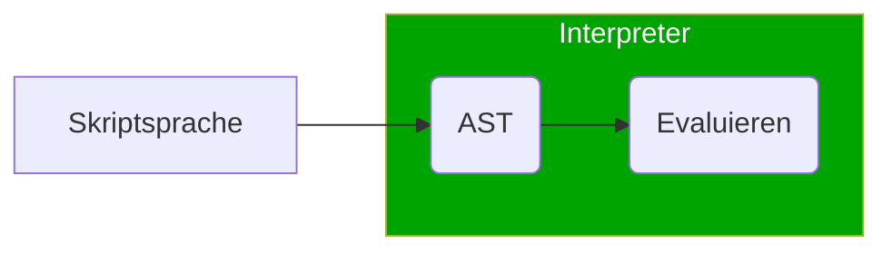

---
sidebar_custom_props:
  id: 91a22690-48d6-4d3b-b355-36ea196f45c5
---

# Programmiersprachen

Jede Programmiersprache hat eigene Regeln und Richtlinien, wie ein Programm geschrieben wird. Es wird dabei zwischen der Syntax und der Semantik unterschieden.

Syntax
: Wörter und Symbole, die in einer Programmiersprache verwendet werden dürfen
: :mdi-flash-triangle--red: Fehler werden bereits vor dem Programmstart erkannt
Semantik
: Inhaltliche Bedeutung des Codes
: :mdi-information--blue: Die Bedeutung ergibt sich durch die Verwendung der gegebenen Syntax
: :mdi-flash-triangle--red: Fehler werden erst zur Laufzeit erkannt

Mittlerweilen gibt es eine schier unüberschaubar grosse Anzahl an Programmiersprachen ([Liste aller Programmiersprachen](https://en.wikipedia.org/wiki/List_of_programming_languages_by_type)). Im EF werden wir zu Beginn mit Python 3 programmieren, bevor wir dann auch Einblicke in andere Programmiersprachen und Domänenspezifische Sprachen (SQL) erhalten werden.

## Sprachstufen

Bei der Klassifizierung von Programmiersprachen wird aktuell unter vier Typen von Programmiersprachen unterschieden:



Wobei die Interpretierten Sprachen auch oft Skriptsprachen genannt werden

## Maschinensprache

Zu den Pionierzeiten der Computerentwicklung war die einzige Möglichkeit, ein Programm für einen Computer zu erstellen, dieses in binärem Maschinencode zu schreiben (bzw. auf Lochkarten zu stanzen). Aufgrund ihrere für Menschen extrem schwer verständlichen Form ist die Programmierung in Maschinensprache nicht mehr gebräuchlich.

Die Maschinensprache kann direkt von einer CPU ausgeführt werden. 

:::danger Achtung 
Maschinencode läuft nicht einfach auf allen Prozessoren - je nach Aufbau/Architektur des Prozessors müssen andere Befehle verwendet werden.
:::

```
    0  00101001111101100111101101
	1  00101001111110101110000010
	2  10001001010101000100000000
	3  00101001111101100100100101
	4  10001001010101000100000000
	5  00100110001110010111001100
	6  01010111110110100100010010
	7  00100110010001010101110100
	8  00011000000100100011110011
	9  10000101100000111101000011
	10 01110110010000010111100011
	11 00100111001000111110110000
	12 00101001111101100111101101
	13 00101001111111000111000010
	14 10001001010101000100000000
	15 00101001111101100110001001
	16 00100110010000110001111000	
	17 10001001010101000100000000
	18 00101001111101100111101101
	19 00101001111111100011001010
	20 10001001010101000100000000
	21 00101001111101100110001001
	22 00100110010011001110001000
	23 10001001010101000100000000
```

:::info
- unlesbar, unveränderbar
- nur [Linus Torvalds](https://en.wikipedia.org/wiki/Linus_Torvalds), Erfinder von Linux, schreibt und ändert Maschinencode

In einigen wenigen Spezialfällen (wenn z.B. der eigentliche Quellcode oder die ursprüngliche Programmierumgebung nicht mehr verfügbar ist) kann es unter Umständen erforderlich sein, direkt den Maschinencode zu bearbeiten.
:::

## Assembler Sprache

In Assembler gibt es als Erleichterung für die Programmierer:in sogenannte mnemonische Kürzel (Mnemonics), die eine Gedächtnisstütze für die entsprechend möglichen CPU-Befehle sein sollen, bspw. `addiu` für die *Addition von positiven ganzen Zahlen* (*Add Integer Unsigned*).
Die Assemblersprache ist gerade noch verständlich für einen Menschen und kann leicht von einem Programm, dem sogenannten **Compiler** in Maschinensprache übersetzt werden, da für jeden Mnemonics ein CPU-Befehl existiert. Dennoch ist Assembler-Sprache bereits auf eine CPU-Architektur zugeschnitten und es muss im Voraus entschieden werden, welches Ziel man sich vornimmt (nicht jede CPU-Familie weist dieselbe Befehlspalette auf).




Ein einfaches Beispiel einer Addition von zwei ganzen Zahlen

```mips {7-10} showLineNumbers
sum:
	addiu   $sp,$sp,-8
	sw      $fp,4($sp)
	move    $fp,$sp
	sw      $4,8($fp)
	sw      $5,12($fp)
	lw      $3,8($fp)
	lw      $2,12($fp)
	nop
	addiu   $2,$3,$2
	move    $sp,$fp
	lw      $fp,4($sp)
	addiu   $sp,$sp,8
	jr      $31
	nop
```

:::info
Aufgrund der mühseligen Programmierung und der fehlenden Portabilität von Programmen auf unterschiedliche Systeme ist Assembler nicht für komplexe Projekte zu empfehlen. Für bestimmte zeitkritische Aufgaben (Echtzeit), wo es auf Geschwindigkeit ankommt (bspw. Grafiktreiber) oder nur sehr wenig Platz zur Verfügung steht (embedded systems), wird auch heute noch auf Assembler zurückgegriffen.
:::

<!--
Weitere Übersetzungen
👉 https://godbolt.org/

# mips gcc 11.2.0

```c
int sum(int zahl1, int zahl2) {
    return zahl1 + zahl2;
}
```

Notes:

* Speicher reservieren, Position merken, Zahl 1 laden, Zahl 1 addieren
* schwerer, trotzdem noch machbar
* läuft nur noch auf einer CPU -> vorher entscheiden, welches Ziel
* spezifischer Compiler für jede CPU
-->

## Hochsprachen
In Hochsprachen wird eine Abstraktionsschicht für komplexen Funktionen wie

- Speichermanagment
- Repetition von immer gleichen Mustern
- Betriebssystemabhängige Unterschiede

hinzugefügt. Dadurch müssen Programmierer:innen Algorithmen nicht für jede CPU-Architektur neu schreiben. Zudem ist der Code nochmals bedeutend besser lesbar als in der Assembler Sprache.

Obiges Beispiel in Assemblersprache sieht in Hochsprachen wie folgt aus:

<GTabs getLabel={(idx) => ['C', 'Java', 'C#', 'Python', 'Ruby', 'JavaScript'][idx]} highlighted={[]}>

```c showLineNumbers
#include <stdio.h>

int sum(int zahl1, int zahl2) {
    return zahl1 + zahl2;
}

int main()
{
    printf("3 + 4 = %d", sum(3, 4));
    return 0;
}
```

```java showLineNumbers
public class MyClass {
    public static int sum(int zahl1, int zahl2) {
        return zahl1 + zahl2;
    }
    public static void main(String args[]) {
      System.out.println("3 + 4 = " + sum(3, 4));
    }
}
```

```cs showLineNumbers
using System;
					
public class Program
{
	public static int sum(int zahl1, int zahl2)
	{
		return zahl1 + zahl2;
	}

	public static void Main()
	{
		int s = sum(3, 4);
		Console.WriteLine($"3 + 4 = {s}");
	}
}
```

```py
def sum(zahl1, zahl2):
    return zahl1 + zahl2

print(f'3 + 4 = {sum(3, 4)}')
```

```rb showLineNumbers
def sum(zahl1, zahl2)
    return zahl1 + zahl2
end

puts "3 + 4 = #{sum(3, 4)}"

```

```js showLineNumbers
function sum(zahl1, zahl2) {
    return zahl1 + zahl2;
}
console.log(`3 + 4 = ${sum(3, 4)}`)
```

</GTabs>

:::finding
Was fällt Ihnen bei den verschiedenen Programmiersprachen auf?
:::

In Hochsprachen wird zusätzlich unterschieden zwischen __kompilierten__ und __interpretierten__ Sprachen.

### Kompilierte Sprachen

<span className="badge badge--secondary">C</span>{' '}<span className="badge badge--secondary">C#</span>{' '}<span className="badge badge--secondary">Java</span>{' '}<span className="badge badge--secondary">...</span>

Wie bei der Assemblersprache muss ein geschriebenes Programm durch einen Compiler in Maschinensprache übersetzt werden. Dieser Prozess ist bei Hochsprachen um einiges komplexer als bei Assemblersprache, da keine direkte Übersetzung möglich ist. Da das Programm nach der Kompilierung von einem Prozessor ausgeführt wird, braucht es einen vorgegebenen Einstiegspunkt - eine Funktion namens `main`. 

<!-- 
Notes:
Keine direkte Übersetzung, da nun weitere Sprachkonzepte wie Wiederholungen, Verzweigungen, Listen, etc. möglich sind.
-->



:::details Zwischenschritt Bytecode
Einige kompilierte Sprachen verwenden zur Erhöhung der Portabilität eine Zwischensprache, sogenannter Bytecode verwendet. Dieser Bytecode ist quasi die Maschinensprache für eine virtuelle Maschine (**VM** für Virtual Machine). Um den Bytecode auszuführen, muss also lediglich die VM auf einem System installiert werden, und der Bytecode kann ausgeführt werden.


:::


### Interpretierte Sprachen

<span className="badge badge--secondary">Python</span>{' '}<span className="badge badge--secondary">Ruby</span>{' '}<span className="badge badge--secondary">Java Script</span>{' '}<span className="badge badge--secondary">...</span>

Für die Programmierung einer Skriptsprache braucht es keine Installation eines zusätzlichen Compilers. Die Programmiersprache, also bspw. Python, interpretiert den Quellcode direkt. Dazu wird der Code gelesen (__Parsen__) und gemäss der Syntax-Vorgaben in einen Syntax-Baum (__AST__, *Abstract Syntax Tree*) übersetzt. 

:::cards
*** --code --flex-basis=272px --justify-content=center
```py title="Python Code"
def sum(zahl1, zahl2):
    return zahl1 + zahl2
```
*** --flex-basis=400px

:::

[👉 Jupyter Notebook zur Erzeugung eines AST](https://jupyter.gbsl.website/user-redirect/lab/tree/shared/ef-24/Programmieren/Visualize-AST.ipynb)[^1]

Auf dieser Basis entscheidet der Interpreter für jeden Knoten im Baum, welche kompilierte Funktion ausgeführt werden soll. Diese kompilierten Funktionen werden oft in `C` geschrieben und bei der Installation der Programmiersprache in Maschinencode compiliert (bzw. bereits compiliert heruntergeladen).



Da kein eigentlicher Compile-Schritt notwendig ist, muss bei Skriptsprachen auch keine `main` als Einstiegspunkt vorhanden sein. Zudem ist es im Gegensatz zu kompilierten Sprachen möglich, den Quellcode von laufenden Programmen zu verändern. Deshalb ist es etwa auch möglich, eine interaktive Code-Konsole (__REPL__ **R**ead**E**valuate**P**rint**L**oop) für Skriptsprachen auszuführen.

Insgesamt ist das Arbeiten mit Skriptsprachen mit weniger Konfigurationsaufwand, weniger Standardcode (Boilerplate Code) verbunden und daher effizienter. Der Nachteil ist, dass die Programme deutlich langsamer (ca. 10x langsamer) ausgeführt werden.


[^1]: Jupyter Notebook: [⬇️ Visualize-AST.ipynb](./code/Visualize-AST.ipynb), [:mdi-github: Github](https://github.com/lebalz/ofi-blog/blob/main/docs/EF-Python/01-Programmiersprachen/code/Visualize-AST.ipynb)
