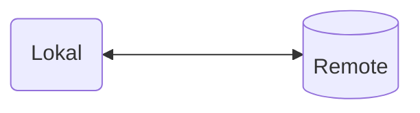
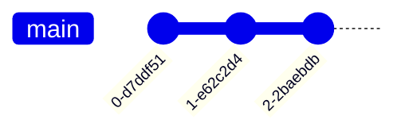
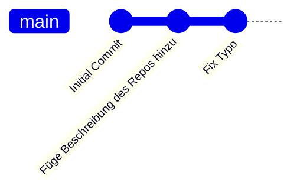
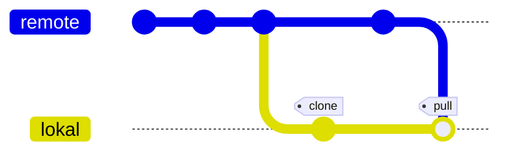
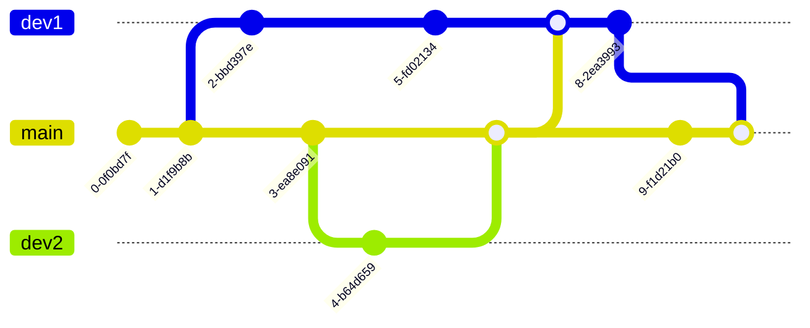

---
sidebar_custom_props:
  id: 62311a9a-917a-4591-9a9d-c40bdb09f173
sidebar_label: Git Grundlagen
---

import DiffViewer from '@site/src/components/DiffViewer';
import BrowserWindow from '@site/src/components/BrowserWindow';

# Git Grundlagen :mdi-git--orange:

👉 https://git-scm.com/


<BrowserWindow url="https://www.lernmoment.de/alle/warum-git/">

## Warum Git? [^1]
Die Entwicklung von Git ist eine Erfolgsgeschichte. Als [Linus Torvalds](https://de.wikipedia.org/wiki/Linus_Torvalds) 2005 die Entwicklung von Git initiierte lag dem ein ganz pragmatisches Problem zugrunde: Als Verwalter der Entwicklung des [Linux-Kernels](https://www.kernel.org/) benötigte er ein mächtiges, verteiltes und kollaboratives Werkzeug zur Versionsverwaltung von Quellcode. Das zuvor verwendete proprietäre Tool bot keine Möglichkeit der kostenlosen Verwendung und die kostenfreien Alternativen genügten den Anforderungen von Torvalds nicht. Die Idee ein eigenes, freies Softwareprodukt zu schreiben war geboren. Seitdem wurde Git von Jahr zu Jahr populärer und hat eine ganze Reihe auf Git aufsetzender Anwendungen (etwa *Sourcetree* und *GitHub Desktop*) und Webplattformen (etwa *GitHub* und *Bitbucket*) hervorgebracht. Doch warum wird Git so vielfach verwendet?

- **Paralleles Arbeiten**: Git erlaubt es mehreren Entwicklern parallel und dezentral an einem Projekt (*repository*) in verschiedenen Entwicklungszweigen (*branches*) zu arbeiten. Der eigentliche Clou liegt dabei darin, dass Git eine ganze Reihe an Möglichkeiten (*merge*, *rebasing*, *cherry picking*, etc.) bietet diese Entwicklungszweige auch wieder zusammenzuführen.

- **Flexibilität**: Es ist möglich verschiedenste Arbeitsweisen und Arbeitsmodelle (*workflows*) in Git zu realisieren. So eignet sich Git für die lokale Verwendung bei einem einzelnen Entwickler bis zur servergestützten Teamarbeit in einem internationalen Softwarekonzern. In gewisser Art und Weise baut man sich auf der Basis von Git seine eigene Versionsverwaltung auf.

- **Einfache Beiträge**: Git macht es vergleichsweise einfach zu einem Projekt beizutragen bei dem man weder der Besitzer noch Teil des Kernteams ist. Bei zentralen Versionsverwaltungssystemen steht hier oft die Rechteverwaltung im Weg, doch erlaubt Git das einfache Kopieren (*clone*) des Quellcodes von einem gefolgten Änderungsvorschlag (*pull request*).

- **Performance**: Selbst bei sehr großen Projekten bleibt Git schnell. Auf meinem *MacBook Air* (11 Zoll, 2016) konnte ich von einer aktuellen Version des Quellcodes des Linux-Kernels auf eine sechs Jahre alte Version von 2010 unter einer Minute wechseln. Das mag zunächst gar nicht so beeindruckend klingen, doch man sollte bedenken das hier etwa 40.000 Dateiänderungen vorlagen!

- **Robustheit**: Aufgrund der Architektur von Git ist ein gravierender Datenverlust sehr unwahrscheinlich. Prüfsummen verhindern eine unbeabsichtigte Korruption von Daten, der dezentrale Aufbau sorgt dafür, dass der Code auf mehreren Rechnern vorliegt und die einfache Datenstruktur sorgt für die Interpretierbarkeit der Daten. Schlussendlich erlaubt die Versionierung und Verzweigung des Quellcodes wieder zu einem funktionierenden Stand zurückzukehren.

- **Offsite und Offline**: Die dezentrale und zugleich verknüpfbare Struktur von Git erlaubt sowohl die Arbeit mit verteilten Entwicklungsteams als auch – zumindest eine gewisse Zeit lang – die Arbeit ohne Zugriff auf den Server.

- **Erweiterbarkeit und Integrationsfähigkeit**: Git ist nahezu beliebig erweiterbar und integrierbar. Es ist offen für individuelle Anwendungen und Zusammenarbeit mit nahezu jeder belieben anderen Software.

- **Gemeinschaft und Freiheit**: Git ist nicht nur kostenlose, sondern auch [freie Software](https://de.wikipedia.org/wiki/Freie_Software). Das heisst der Quellcode steht offen bereit und Mitarbeit ist sogar erwünscht. Verletzungen des Urheberrechts oder rechtliche Konflikte sind ausgeschlossen. Darüber hinaus existiert ein nahezu riesiges Ökosystem aus Dokumentationen und Erklärungen, Tools, Plattformen, Dienstleistern sowie Plug-Ins. Hinsichtlich des gemeinschaftlichen Aspekts sei GitHub hervorgehoben, welches sich in den letzten Jahren zum Quasi-Standard von OpenSource-Projekten entwickelt hat. Hier findet man abertausende Entwickler und deren Softwareprojekte.

</BrowserWindow>

## Konzepte


Das Kernelement von Git sind die Repositories (Repo - ein ganz normaler Ordner, dessen Dokumente mit Git versioniert werden). Dabei wird zwischen dem __remote Repos__ auf dem Server und den __lokalen Repos__ auf einem Computer unterschieden.




Um mit Git verwalteten Projekten zu arbeiten, muss das Repository heruntergeladen werden. Man spricht von Klonen (`clone`), weil 
- sich Git die Internet-Adresse des Remote Repos merkt und man somit zu einem späteren Zeitpunkt Änderungen (manuell) synchronisieren kann
- auch alle Vorgängerversionen der Projektdateien enthalten sind

:::info Repo Klonen in VS Code
Anleitung, wie in VS Code ein Repository von Github geklont wird.

👉 https://code.visualstudio.com/docs/editor/github#_setting-up-a-repository
:::

Dateien in diesem Ordner sind versioniert - dies bedeutet für Git, dass zu einem gewissen Zeitpunkt Änderungen vorgenommen wurden. Jede Änderung ist mit einer von der Programmierer:in geschriebenen Nachricht versehen.

<GTabs getLabel={(idx) => ['Versionen', 'ID', 'Nachricht'][idx]}>


<div>

Änderungen werden zu einem Paket - einem __Commit__ zusammengefasst und mit einem Hashwert der Änderungen identifiziert.


</div>

<div>

Jeder __Commit__ wird mit einer Nachricht versehen. So kann nachvollzogen werden, bei welchem Schritt was dazugekommen ist.


</div>

</GTabs>

Nach dem Klonen des Projektes, kann zu beliebigen späteren Zeitpunkten durch einen `pull` der neueste Stand vom remote Repository ins lokale Repository synchronisiert werden. Dadurch stellt man sicher, dass man keine Änderungen von anderen Projektmitarbeitern verpasst.




### Änderungen vornehmen

Jetzt kann die Datei bearbeitet werden. Git kann nun anzeigen, welche Zeilen und Zeichen verändert. Dadurch können Änderungen nochmals überprüft werden. 

<DiffViewer titles={['', 'Änderungen']}>

```py
def aaa(a, b):
    return (a + b) / 2
```


```py
def durchschnitt(a, b):
    return (a + b) / 2
```

</DiffViewer>


Ist man zufrieden, wählt man die veränderten Dateien, deren Änderungen man zusammenfassen möchte, aus und fügt sie einem `Stage` hinzu (man bündelt diese Änderungen zusammen). Mit einer Nachricht wird beschrieben, was in dieser Änderung gemacht wurde, der anschliessende __Commit__ finalisiert das Änderungspaket. 
Im obigen Beispiel könnte die Nachricht etwa

> Verwende einen sinnvollen Funktionsnamen

lauten.

Mit dem __push__ Befehl wird anschliessend dieses Änderungspaket an das Remote-Repository geschickt.

Die wichtigste Eigenschaft von Git ist, dass es Änderungen, welche von verschiedenen Personen vorgenommen wurden, zusammenführen kann, und dafür sorgt, dass alle Repositories auf dem gleichen Stand sind. Dieser Vorgang wird in Git merge genannt.



Visual Studio Code verfügt über eine eingebaute Schnitstelle zu Git. Diese werden wir im Normallfall brauchen. Manchmal ist es aber nötig direkt mit Git zu arbeiten. Dazu dient die App Git Bash auf Windows. Auf dem Mac kann man dazu direkt das Terminal brauchen. Die nötigen Kommandos werden wir nach und nach kennenlernen.

[^1]: Quelle: [Tobias Vetter](https://www.lernmoment.de/alle/warum-git/)