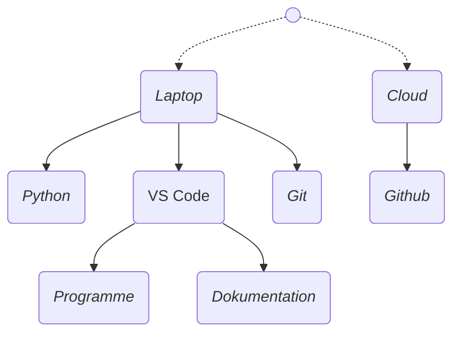

---
sidebar_custom_props:
  id: 7fd74e51-6324-4e53-a09d-e57acfe8bc03
---
# Infrastruktur

:::info[Ziele]
- Sie haben die nötige Software für diesen Themenblock auf Ihrem Notebook installiert
- Sie wissen, wozu die einzelnen Apps dienen
- Sie haben einen ersten Einblick in diese Apps genommen
- Sie haben einen ersten Eintrag in Ihrer Dokumentation geschrieben.
:::
