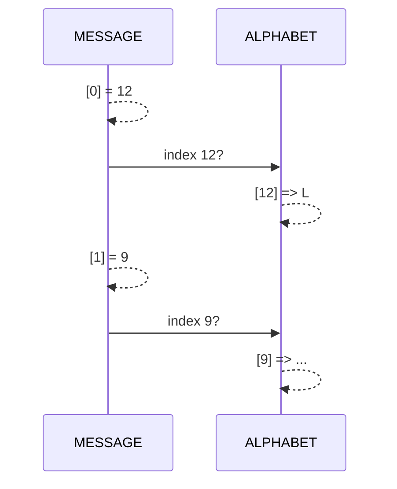
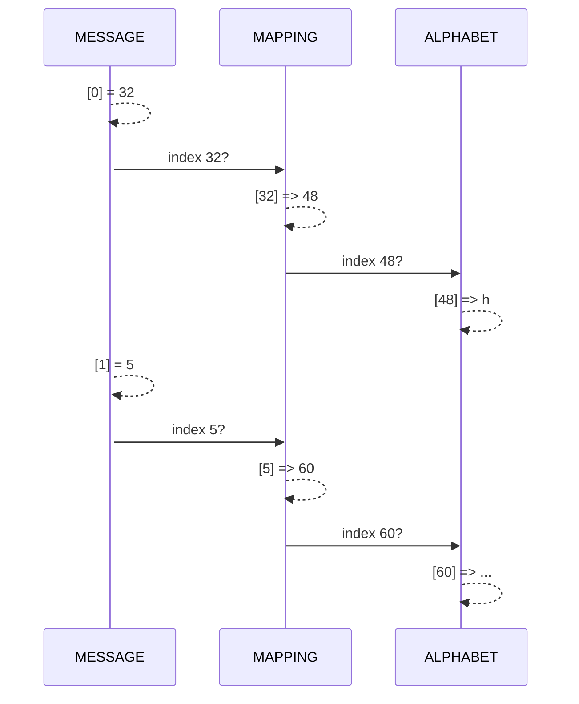

# Listen

Zum Speichern von **mehreren Werten** unter einem **einzigen Namen** verwendet man in Python Listen. Man kann sich __Listen__ als Tabellen mit einer Spalte vorstellen. Die Zellen in der Tabelle werden als **Elemente** bezeichnet und sind durchnummeriert. So kann man einzelne in der Liste gespeichert Werte unterscheiden. Die Nummer eines Elements wird als dessen **Index** bezeichnet.

:::important Wichtig
- Das erste Element in der Liste trägt den Index 0.
- Der Index des letzten Elementes ist die Länge der Liste minus 1.
:::

Das folgende Bild illustriert dies für eine Liste mit 4 Noten. Die **Länge** der Liste ist **4**, das letzte Element trägt den **Index 3**.

Index
: 　**Wert**
`0`
: :mdi-arrow-right-thin: `4.5`
`1`
: :mdi-arrow-right-thin: `5`
`2`
: :mdi-arrow-right-thin: `3.5`
`3`
: :mdi-arrow-right-thin: `5.5`

In Python kann man diese Liste wie folgt erzeugen:

```py live_py slim
noten = [4.5, 5, 3.5, 5.5]
print('Die vierte Note war eine', noten[3])
```

Im Beispiel wird die vierte Note mit dem Index `3` ausgegeben.

## Aufgaben

:::aufgabe 1. listen-1d.py
<Answer type="state" webKey="ec010329-3a79-4bd3-8e8d-35be2c5d246e" />

Dateiname
: __EF-Informatik/exercises/listen-1d.py__


1. Erstellen Sie das folgende Programm in Ihrem Repository  
   :::details Programm
    ```py reference title="listen-1d.py"
    https://github.com/lebalz/ofi-blog/blob/main/docs/EF-Python/03-Python/assets/listen-1d.py
    ```
   :::
2. Führen Sie das Programm Zeile für Zeile aus und untersuchen Sie die verschiedenen Listen-Optionen.
3. Welche Fehlermeldung erscheint beim *Szenario 6*?
   <Answer type="text" webKey="e8a516a5-1c07-4a4b-8092-7ec3a103923e" />

4. commit & push...
:::


:::aufgabe 2. Was steht geschrieben?
<Answer type="state" webKey="84fa5115-9483-4c76-8aca-7112371d5b3e" />

Dateiname
: __EF-Informatik/exercises/listen-word-riddle.py__

Gegeben ist ein `ALPHABET` und eine Nachricht `MESSAGE`. In der Nachricht sind die Indices der zugehörigen Buchstaben gespeichert. Schreiben Sie ein Programm, welches die Nachricht decodiert und in Buchstabenform darstellt.

```py
ALPHABET = [' ', 'A', 'B', 'C', 'D', 'E', 'F', 'G', 'H', 'I', 'J', 'K', 'L', 'M', 'N', 'O', 'P', 'Q', 'R', 'S', 'T', 'U', 'V', 'W', 'X', 'Y', 'Z']
MESSAGE = [12, 9, 19, 20, 0, 18, 9, 4, 4, 12, 5]
```

<Hint>


</Hint>
:::

:::aufgabe 3. Meine Nummer 1
<Answer type="state" webKey="56fcba0a-c357-462b-b4e6-8f7d76fbe932" />

Dateiname
: __EF-Informatik/exercises/listen-word-riddle2.py__

Nun wurde eine weitere Zuordnungsstufe hinzugefügt 😮. In der `MESSAGE` steht, an welcher Stelle im `MAPPING` der Index steht, an welchem der gesuchte Buchstabe zu finden ist. Finden Sie die Nachricht?

```py
ALPHABET = [' ', '_', '.', ':', '/', '0', '1', '2', '3', '4', '5', '6', '7', '8', '9', 'A', 'B', 'C', 'D', 'E', 'F', 'G', 'H', 'I', 'J', 'K', 'L', 'M', 'N', 'O', 'P', 'Q', 'R', 'S', 'T', 'U', 'V', 'W', 'X', 'Y', 'Z', 'a', 'b', 'c', 'd', 'e', 'f', 'g', 'h', 'i', 'j', 'k', 'l', 'm', 'n', 'o', 'p', 'q', 'r', 's', 't', 'u', 'v', 'w', 'x', 'y', 'z']
MAPPING = [54, 58, 53, 4, 8, 60, 45, 60, 12, 41, 13, 47, 60, 4, 44, 56, 62, 4, 58, 47, 41, 60, 55, 3, 9, 45, 60, 10, 19, 2, 54, 62, 48, 54, 56, 18, 41, 53, 44, 4, 58, 43, 1, 50, 54, 13, 2, 2, 49, 6, 1, 59, 14, 58, 16, 4]
MESSAGE = [32, 5, 7, 15, 51, 23, 3, 13, 48, 2, 11, 29, 14, 6, 16, 1, 9, 0, 12, 46, 41, 22, 37, 17, 38, 25, 31, 18, 20, 30, 21, 39, 40, 36, 33, 26, 55, 53, 42, 49, 8, 52, 10, 27, 4, 24, 50, 44, 54, 28, 45, 35, 47, 43, 34, 19]
```

<Hint>


</Hint>


<Hint title="print() Optionen">

Normalerweise fügt die `print`-Funktion am Ende einer Ausgabe immer das Zeichen `\n` an, was von der Konsole als Steuerzeichen für eine neue Zeile interpretiert wird. Das können Sie aber auch ändern, indem Sie explizit vorgeben, welche Zeichen am Ende hinzugefügt werden:

:::flex --basis=380px
```py live_py slim
# Mit Lücke zwischen einzelnen prints
for i in range(3):
    print(f'Lücke {i}', end=' ')
```
***
```py live_py slim
# Ohne Zeichen zwischen einzelnen prints
for i in range(3):
    print(f'Ohne {i}', end='')
```
***
```py live_py slim
# Fancy: mit Rakete und neuer Zeile zwischen einzelnen prints
for i in range(3):
    print(f'Hello {i}', end=' 🚀\n')
```
:::
</Hint>
:::

:::aufgabe 4. Primzahlen
<Answer type="state" webKey="00361219-0652-4870-9a42-c3cf8250b9a4" />

Dateiname
: __EF-Informatik/exercises/primzahlen.py__

Schreiben Sie ein Programm welches eine Liste mit allen Primzahlen zwischen 1 und 100 erstellt und diese Liste am Schluss auf der Konsole ausgibt.

**Bevor Sie Programmieren**: Diskutieren Sie Ihr Vorgehen mit einer Kolleg:in und besprechen Sie gemeinsam eine algorithmische Lösung für das Problem. Halten Sie stichwortartig fest, was Sie besprochen haben.

<Hint>

Um den Rest bei einer Division zu berechnen, kann der Modulo-Operator verwendet werden.

:::def
### Modulo `%`
Um den ganzzahligen Rest bei der Division von zwei ganzen Zahlen zu bestimmen, wird der Modulo-Operator verwendet.
Biespiel: Was ist der ganzzahlige Rest von $7 / 5$?
```py live_py slim
print(7 % 5)
```
:::
</Hint>
:::


---

<span style={{height: '7em', display: 'block'}}></span>

## Eindimensionale Listen

Hier nochmals in der Übersicht die Funktionsweise von Listen in Python.

:::def
### Liste erzeugen `[]`
```py live_py slim
# Liste erzeugen und Variablen zuweisen
noten = [3.5, 6, 5, 4.5]

# Ganze Liste anzeigen 
print(noten)
# Element mit Index 2 aus der Liste anzeigen
print(noten[2])
```
:::

:::def
### Schleife über alle Elemente der Liste
```py live_py slim
noten = [3.5, 6, 5, 4.5]

for note in noten:
    print(note)
```
:::

:::def
### Schleife über Listen-Indices
```py live_py slim
noten = [3.5, 6, 5, 4.5]

# (beginnt bei 0 und endet mit 1 weniger als Länge der Liste)
for index in range(0, len(noten)):
    print(index, ":", noten[index])
```
:::

:::def
### Listenelemente ändern
```py live_py slim
noten = [3.5, 6, 5, 4.5]

# Element mit Index 3 neuen Wert zuweisen
noten[3] = 5.5
print(noten)
```
:::

:::def
### Fehler: IndexError
```py live_py slim
noten = [3.5, 6, 5, 4.5]

# die Liste ist nicht so lang
noten[7] = 6
```
:::

:::def
### Element hinzufügen `append()`
```py live_py slim
noten = [3.5, 6, 5, 4.5]

# Element am Ende der Liste anhängen
noten.append(5)
print(noten)
```
:::

:::def
### Element an bestimmter Stelle hinzufügen `insert()`
```py live_py slim
noten = [3.5, 6, 5, 4.5, 5]
# vor dem Element mit Index 3 eine "4" einfügen
noten.insert(3, 4)
print(noten)
```
:::

:::def
### Aufsteigend sortieren `sort()`
```py live_py slim
noten = [3.5, 6, 5, 4, 4.5, 5]

noten.sort()
print(noten)
```
:::

:::def
### Letztes Element entfernen `pop()`
Letztes Element entfernen und zurückgeben.
```py live_py slim
noten = [3.5, 4, 4.5, 5, 5, 6]

last = noten.pop()
print(last)
print(noten)
```
:::

:::def
### Element bei Index entfernen `pop(0)`

```py live_py slim
vorderstes = noten.pop(0)
print(vorderstes)
print(noten)
```
:::
:::def
### Element aus der Liste entfernen `remove()`

```py live_py slim
noten = [3.5, 5, 4.5, 4, 5, 6]

# 11) Erstes Element mit dem Wert 5 aus der Liste entfernen
noten.remove(5)
print(noten)
```
:::

:::def
### Mittelwert `statistics.mean()`

```py live_py slim
import statistics

noten =[3.5, 5, 4.5, 4, 5, 6]

mittelwert = statistics.mean(noten)
print(mittelwert)
```

Weitere Funktionen

👉 https://docs.python.org/3/library/statistics.html
:::

:::def
### Leere Liste `[]`
```py live_py slim
# Leere Liste erstellen
noten = []
print(noten)
```
:::
:::def
### Liste mit Text
```py live_py slim
# Liste mit Strings
noten =['gut', 'erfüllt', 'mangelhaft', 'erfüllt']
print(noten)
```
:::
