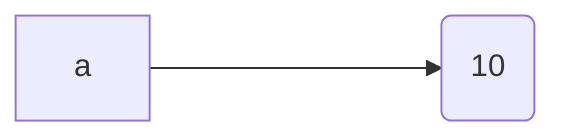
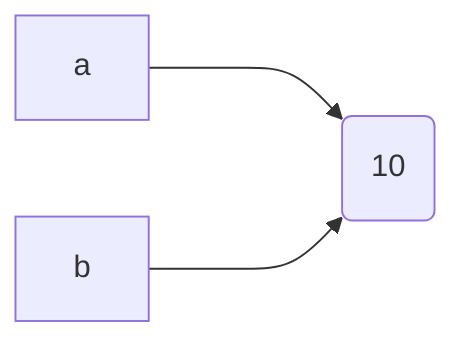
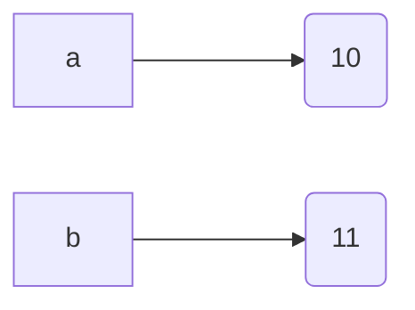
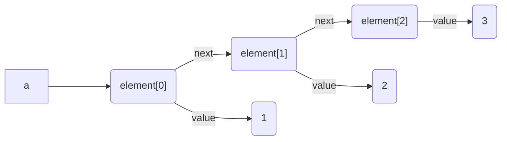
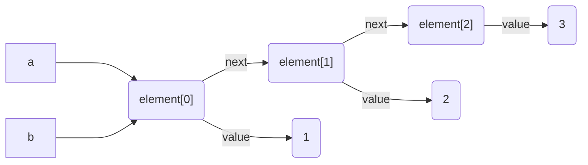
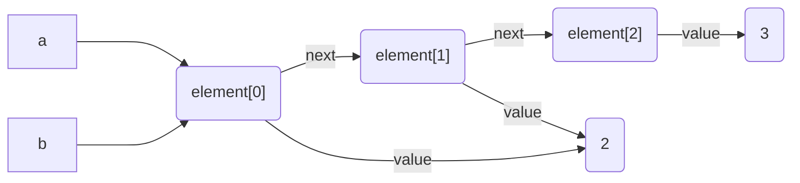
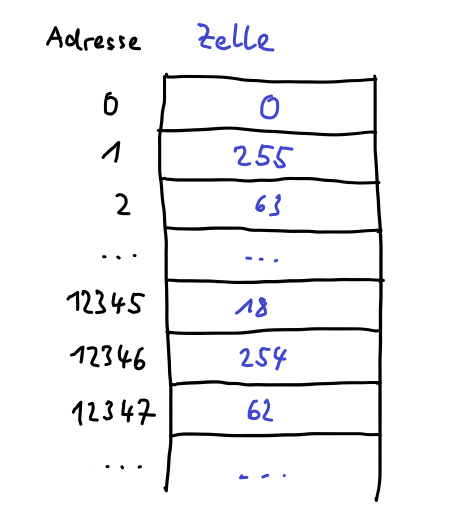

# Referenzen

:::aufgabe

<Answer type="state" webKey="53f51b74-c15b-4025-8839-0f31b2d1bf72" />

Dateiname
: __EF-Informatik/exercises/referenzen.py__

Jetzt, wo wir Listen in Python kennen, müssen wir unsere bisherige Vorstellung von Variablen überdenken und anpassen.

Lesen Sie die untenstehende Einführung zum Thema Referenzen durch und führen Sie im Anschluss das Programm angehängte Programm __referenzen.py__ im Debuuger von VS Code aus.

Führen Sie dann das Snippet refernzen.py im Debugger Ihres Visual Studio Code aus (falls Sie es noch nicht geklont haben, müssen Sie das zuerst tun).

Achten Sie auf die in der Konsole (unten) angezeigten Objekt-Ids und Datentypen. Daran können Sie erkennen, um welches Objekt es sich jeweils handelt und welchen Datentyp es hat.

Auf der linken Seite sehen Sie die aktuellen Objektwerte in den Variablen a und b. Achten Sie besonders, was dort passiert, wenn die Zeile 30 ausgeführt wird.

:::details __EF-Informatik/exercises/referenzen.py__
```py reference title="referenzen.py"
https://github.com/lebalz/ofi-blog/blob/main/docs/EF-Python/03-Python/10-referenzen/referenzen.py
```
:::

Zum Schluss den Selbsttest ganz am Ende der Seite durchführen...
:::

## Bisheriges Modell für Variablen
Bisher haben wir uns **Variablen** als *Karteikärtchen* vorgestellt, auf welchen sich der Computer einen bestimmten **Wert** (eine Zahl, ein Text, etc.) merkt. Das Kärtchen trägt einen Namen. Unter diesem Namen kann die Information zu einem späteren Zeitpunkt wieder hervorgeholt werden. Die **Zuweisung** 

```py
a = 10
```

führt dazu, dass eine Kärtchen mit dem Namen **a** entsteht, auf welchem der Wert **10** notiert ist.

<div className="center border">

| a   |
| --- |
| 10  |
</div>

Wenn man der Variablen einen neuen Wert zuweist, so wird der notierte Wert überschrieben und ersetzt.
```py
a = "blah"
```
führt zu:

<div className="center border">

| a    |
| ---- |
| blah |
</div>

Mit der Einführung von **Listen** stösst dieses Modell an seine Grenzen und wir brauchen ein besseres Modell.

------------------------------
## Etiketten statt Karteikärtchen - Referenzen und Objekte
In diesem Modell werden die Karteikarten durch *Etiketten* ersetzt, welche mit einer *Schnur* an beliebige *Gegenstände* gebunden werden können.

Solche Gegenstände können alles sein, von einer einfachen Zahl, einem Text, bis zu einer langen Liste. Die Gegenstände entsprechen also den Dingen, welche wir uns merken wollen, weil wir sie später wieder brauchen. Man spricht jetzt nicht mehr von Werten, sondern von **Objekten**. Man kann sich Objekte auch als *Behälter* vorstellen, welche die eigentlichen Werte enthalten.

Damit man ein bestimmtes **Objekt** später wieder findet, wird es mit einer *Etikette* versehen, auf welcher ein **Name** steht. Unter diesem kann später das mit der Etikette verbundene Objekt wieder hervorgeholt werden.

Man kann sich dass auch wie ein Eimer vorstellen, in welchem sich die Objekte befinden, mit denen ein Programm arbeitet. Über den Rand des Eimers hängen Schnüre, an welchen Kärtchen befestigt sind. Auf jedem Kärtchen steht ein Name, welcher dazu dient, die verschiedenen Schnüre zu unterscheiden. Wenn man an einer Schnur zieht, so kommt das damit verbundene Objekt hervor. Man kann nun das Objekt verändern, oder dieses gar durch ein anderes Objekt ersetzen.


Eine **Variable** ist im neuen Modell also nichts anderes, als eine *Etikette*, welche mit einer *Schnur* an ein bestimmtes **Objekt** gebunden ist. Die *Schnur* wir als **Referenz** bezeichnet. Der Eimer aus obigem Vergleich entspricht dann dem Speicher des Computers.

### In Python
Die Zuweisung
```py
a = 10
```

kann im neuen Modell also so dargestellt werden:

Das rechteckige Kästchen mit dem Namen `a` ist die **Variable** oder *Etikette*. Der Pfeil ist die **Referenz** oder *Schnur* und das runde Kästchen ist das **Objekt** mit dem Wert `10`.

Diese Modell hat entscheidende Konsequenzen, welche wir uns im folgenden anschauen wollen.

### Zuweisung von Variable zu Variable
Weist man eine Variable einer anderen zu, so läuft dies darauf hinaus, dass Etiketten mit **anderen Objekten** verbunden werden.

Die Zuweisung
```py
b = a
```
führt im neuen Modell dazu, dass die beiden Variablen `a` und `b` jetzt beide auf das **Objekt** mit dem Wert `10` zeigen.

Erst, wenn man einer Variablen einen anderen Wert zuweist, so zeigen beide Variablen auf verschiedene Objekte.
```py
b = 11
```
führt zu:


### Listen sind Objekte
Eine **Liste** ist ein Objekt, welches nicht nur einen Wert enthalten kann, sondern **viele**. Man kann sich eine Liste als **Kette** von **Elementen** denken. Dabei enthält jedes Element eine Referenz auf das unmittelbar **nachfolgende** Element und zusätzlich eine Referenz auf den in diesem Element gespeicherten **Wert**. Der Wert selber ist dann natürlich wieder in einem Objekt gekapselt. Die Elemente sind also **gleichzeitig** so etwas, wie Objekte und Variable.

Das Resultat der Zuweisung
```py
a = [1, 2, 3]
```
kann in unserem neuen Modell folglich so gezeichnet werden:

Wird die Variable `a` einer Variablen `b` zugewiesen
```py
b = a
```
führt diese zu folgender Situation

Wenn wir in einem Programm
```py
a[1]
```
schreiben, so wird über das Kärtchen mit dem Namen `a` auf das erste Element der Liste zugegriffen und von aus auf der Kette der Element entlang, bis das Element mit dem **Index 1** erreicht ist. Von da wird auf das dem Elment angehängte **Objekt** zugegriffen. Im obigen Fall ist das die Zahl`2`.

Interessant ist nun der Fall, wo ein einzelnes Element der Liste verändert wird:
```py
b[0] = b[0] + 1
```
Im Modell wird unmittelbar klar, dass es keine Rolle spielt, ob wir die Liste über die Variable `a` oder `b` ansprechen. Es gibt nur die eine Liste. `a[0]` und `b[0]` beziehen sich auf ein und dasselbe Element.


### Aufgabe
Laden Sie zur Illustration das folgenden **Snippet** auf Ihren Computer und führen Sie es aus.

---------------------------------

## Hintergrund
Das neue Modell für Variablen hat folgenden Hintergrund:

Alle Daten, mit welchen ein Programm arbeitet, müssen im **RAM** (Random Access Memory) des Computers gespeichert werden. Dies ist derjenige Speicher des Computer, der sehr schnell arbeitet, aber beim Ausschalten des Computers alle gespeicherten Daten verliert.


Man kann sich das RAM alls riesige **Tabelle** mit einer Spalte vorstellen. Jede **Zelle** in der Tabelle umfasst **1 Byte** (8 bit) und kann also ein Zahl von 0 bis 255 ($=2^8$ Zustände) speichern. Die Zellen sind von 0 beginnend durchnummeriert. Die Nummer einer Zelle wird als deren **Adresse** bezeichnet. Wenn der Prozessor auf eine bestimmte Zelle zugreifen will, um dort eine Zahl zu lesen oder zu schreiben, so muss er diese Adresse kennen.



Wenn in einem Programm eine **Variable** gebraucht wird, so läuft das darauf hinaus, dass das Programm auf eine Zelle mit einer bestimmten Adresse zugreift. Jede Variable hat also ihren **festen** Platz im RAM. Beim Start des Programms wird dieser Platz für alle **globalen** Variablen eines Programms dauerhaft festgelegt. Bei **lokalen** Variablen (Variablen in Funktionen und Funktionsparameter) wird der Platz unmittelbar nach dem Aufruf einer Funktion festgelegt.

Damit wir nun in unseren Programmen nicht mit physischen Speicheradressen arbeiten müssen, welche wir ja zum Zeitpunkt des Programmierens gar nicht kennen, verwendet man **Variablennamen** als Platzhalter.

### Speicherbedarf von Variablen
Je nachdem, welche Werte in einer Variablen gespeichert werden sollen braucht es mehr oder weniger Platz, sprich mehr oder weniger Speicherzellen. Zum Speichern einer Zahl mit Kommastellen (Datentyp `float` in Python) werden oft 64 bit (8 Byte) verwendet. In vielen Programmiersprachen werden auch für ganze Zahlen (Datentyp `int`) eine feste Anzahl Bytes verwendet (z.B. 4 Byte). Im Speicher könnte das dann so aussehen:


Neben den Datentypen mit fester Anzahl Bytes gibt es aber auch Datentypen, deren Speicherbedarf **variieren** kann. Z.B. beansprucht ein Text (datentyp `str` für String) je nach Inhalt mehr oder weniger Bytes zu seiner Speicherung. Zusätzlich ist es in Python auch so, dass eine Variable im Verlaufe der Programmausführung Werte von **unterschiedlichen** Datentypen speichern kann. Z.B. startet die Variable mit einer ganzen Zahl und wechselt dann später zu einem Text. Das könnte dazu führen, dass am Ort der Variablen plötzlich mehr Speicher gebraucht wird. Was aber, wenn dort kein Speicher mehr frei ist, weil die Variablen dicht gepackt sind?

### Referenzen und Objekte
Um das obige Problem zu umgehen, verwendet Python ein indirektes Verfahren, um von einer Variable zu den gespeicherten Werten zu gelangen:
- Am Ort der Variablen ist nur eine Adresse gespeichert. Unter dieser Adresse findet man dann den eigentlichen Wert. Diese Adresse wird als **Referenz** bezeichnet.
- Der eigentliche Wert, kann nun beliebig gross sein. Sie werden in Python (und vielen anderen Programmiersprachen) als **Objekt** bezeichnet. Bei der Speicherung eines neuen Objektes sucht Python im Speicher nach einer Stelle, wo es genug Platz hat und trägt dan bei der Variablen die Adresse des Objektes ein.
Das sieht dann so aus:


:::success Merke
In Python werden alle Daten als Objekte gespeichert.
:::

### Zurück zu den Listen
Objekte können wiederum Referenzen auf andere Objekte enthalten. So werden beispielsweise **Listen** gebildet. Eine Liste besteht aus **Elementobjekten**, welche einerseits eine Referenz auf den an dieser Stelle in der Liste gespeicherte **Wert** (auch ein Objekt, siehe oben) enthält und andererseits eine Referenz auf das unmittelbar **nachfolgende** Elementobjekt ethält.

Das sieht dann so aus:


## Selbsttest

<Answer type="state" webKey="bba044cc-03b6-4b0a-a989-3f550727576e">

Selbsttest bestanden?
</Answer>

<iframe src="https://learningapps.org/watch?v=pg5k2c8pj22" style={{border:'0px',width:'100%',height:'500px'}} allowFullScreen="true" webkitallowfullscreen="true" mozallowfullscreen="true"></iframe>