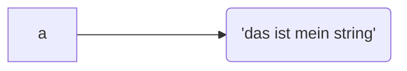
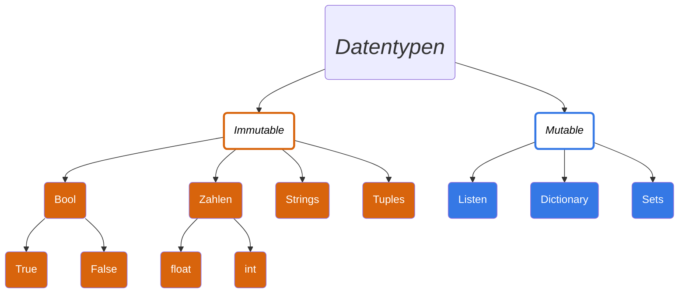

---
sidebar_custom_props:
  id: 131a3f92-27cd-437e-954c-e7856359c6e9
---

# Strings

Texte in Python können auf unterschiedliche Art und weise erzeugt werden.

:::def
### `'text'`, `"text"`
ob einfache- `'` oder doppelte `"` Anführungszeichen: Beides ist gleichbedeutend!
:::

:::def
### `f''`, `f""` Formatierter Text
Formatierter Text kann mehrere Texte zusammenfügen und dabei auch Zahlen oder Listen einfügen. Inhalt in geschweiften Klammern wird zuerst ausgewertet und dann dort abgedruckt.

```py live_py slim
name = 'Maria'
jahrgang = 1999
print(f'Hallo {name}, du bist heute {2022 - jahrgang} Jahre alt')
```
:::

:::def
### `'''`, `"""`, `f'''`, `f"""` Mehrzeiliger Text

Möchte man Text über mehrere Zeilen schreiben, kann entweder das Zeichen für eine neue Zeile (`\n`) verwendet werden, oder ein mehrzeiligen String mit `'''`  oder `"""` starten. Ebenso können mehrzeilige formatierte Blöcke aussehen. 

```py live_py slim
for name in ['Omi', 'Maria', 'Mami und Papi']:
    brief = f'''Hallo {name}

Ich bin in den Ferien und geniesse es.

Liebe Grüsse,
Reto'''
    print(brief)
    print('----------')
```

:::info Mehrzeilige Kommentare
Manchmal wünscht man sich einen Kommentar über mehrere Zeilen zu schreiben, ohne immer ein `#` am Beginn der Zeile zu schreiben. In anderen Sprachen gibt es spezielle "Start-" und "End-Kommentar" Zeichen, so dass auch mehrere Zeilen auskommentiert werden können. (Bspw. um eine ganze Funktion auszukommentieren...). In Python gibt es dies nicht. Es kann aber aus dem kommentierten Code Text gemacht werden, so dass dieser nicht ausgeführt (aber auch nirgends in eine Variable gespeichert) wird.

:::cards
*** --code
```py live_py slim
from math import sqrt

'''
def sqrt(zahl):
    # berechnet die Quadratwurzel
    return zahl ** 0.5
'''
print('Wurzel 2 = ', sqrt(2))
```
***
**Beispiel**: Ursprünglich wurde die Funktion `sqrt` selber implementiert. Nun brauchen Sie diese vermutlich nicht mehr, das diese aus der Bibliothek `math` importiert wird. Vorerst wollen Sie die eigene Funktion aber noch nicht löschten :mdi-arrow-right: vorerst **kommentieren** Sie diese.
:::
:::
:::


## Veränderbarkeit (Mutability)

Wie im Kapitel [Referenzen](./10-referenzen/index.md) besprochen, haben wir unsere Vorstellung des Speichermodells in Python soweit aktualisiert, dass der Computer für Variablen eine Etikette erstellt, die auf eine Speicherstelle zeigt, an welcher dann der effektive Wert gespeichert ist.

:::flex --min-width=200px
Der Python Code...
```py
a = 'das ist mein string'
```
***
... kann dargestellt werden als

:::

In Python gibt es unterschiedliche Sammel-Datentypen, daher Daten, die unterschiedlich gross sein können - Texte und Listen haben wir bereits kennengelernt, Dictionaries und Sets sind weitere.

Dabei macht Python einen grundlegenden Unterschied zwischen Veränderbaren- (*Mutable*) und Nicht-Veränderbaren (*Immutable*) Datentypen. Bei veränderbaren Datentypen können nach der Erzeugung und Zuweisung Änderungen an den zugrundeliegenden Speicherstellen vorgenommen werden.

:::info Listen vs. Tupel
:::flex --min-width=200px
Bei **Listen** können nach dem Erzeugen einzelne Listenwerte verändert, oder gar neue Werte hinzugefügt oder entfernt werden.
***
```py live_py slim
a = [1, 2, 3] # Liste initialisieren
a.append(4)   # 4 hinzufügen
a.pop(0)      # vorderstes Element entfernen
a[0] = 5      # erste Stelle auf 5 setzen
print(a)
```
:::

:::flex --min-width=200px
Im Gegensatz dazu gibt es das **unveränderbare** Äquivalent dazu: **Tupel**. Einmal initialisiert, lassen sich dessen Werte nur noch lesen, jedoch nicht mehr verändern. Tupel werden im Gegensatz zu Listen mit runden Klammern erzeugt (initialisiert).
***
```py live_py slim
a = (1, 2, 3) # Tupel - eine unveränderbare Liste
print(a)
a.append(4)   # FEHLER!
a.pop(0)      # FEHLER!
a[0] = 5      # FEHLER!
```
:::
:::

Eine Übersicht über die gängigen Datentypen in Python zeigt deren Veränderbarkeit **nach** der Initialisierung. 



Strings sind also auch immutable - es ist daher nicht möglich, deren Werte direkt zu verändern.


## Auf Buchstaben zugreifen

Wie bei Listen, lassen sich auch hier einzelne Buchstaben gezielt abrufen
```py live_py slim
vorname = 'Maria'
print(vorname[0]) # erster Buchstabe
print(vorname[-1]) # letzter Buchstabe
```

:::def
### `str[start:ende:schrittweite]` Zugriff

Es ist auch möglich, einen Bereich anzugeben. Wie beim `range()` Befehl, gibt man den Startwert und die obere Grenze an, die aber selber nicht erreicht wird.

```py live_py slim
vorname = 'Reto'
print(vorname[0:2]) # Buchstaben von 0 bis (ohne mit!) 2 Buchstaben
print(vorname[0:3]) # Buchstaben von 0 bis (ohne mit!) 3 Buchstaben
```

#### Alle Buchstaben ausser der erste
```py live_py slim
vorname = 'Reto'
print(vorname[1:5]) # entweder explizit "Länge + 1" angeben
print(vorname[1:]) # oder das Ende Weglassen...
```

#### Jeder zweite Buchstabe
Oder nur jeden zweiten Buchstaben

```py live_py slim
namen = 'Reto und Maria'
print(namen[0::2]) # Bemerke: der Endwert wird nicht angegeben = bis zum Schluss fortfahren...
```

oder **rückwärts** :mdi-emoticon-cool-outline:

```py live_py slim
vorname = 'Reto'
print(vorname[-1::-1]) # Start beim letzten Buchstaben, bis zum ersten
```
:::

### Über Buchstaben iterieren

Es kann auch über alle Buchstaben in einem String iteriert werden:

```py live_py slim
name = 'Maria'
for buchstabe in name:
    print(buchstabe, end='⭐')
```

### Kurzaufgaben
:::aufgabe 1.
<Answer type="state" webKey="c0ca7471-ffb2-4082-8d71-914cdc2fa942" />

Erklären Sie, was die Programmierer:in hier erreichen wollten, und weshalb aber ein Fehler entsteht.

```py live_py slim
name = 'jimmy'
name[0] = 'J'
print(name)
```

<Answer type="text" webKey="d0f2db5e-be9c-45ff-a056-c9f57975f7bb" />
:::

:::aufgabe 2.
<Answer type="state" webKey="218186b9-2c66-47af-98ad-08c54276934d" />

Why are humans known to be extremely afraid of computers?

Die Antwort finden Sie, indem Sie, startend beim 3. Buchstaben, jeden 13 Buchstaben ausgeben. Versuchen Sie, die korrekte Zugriffs-Methode zu verwenden.

```py live_py id=eeecc8c9-b055-4b86-9037-df97a554da6e title=riddle.py
joke = 'nuPLSGJwVLMtirKryXiBwBu!JcTtoSRBppmvstCTjbXACQXVFDQSVjaGPNsSDKVNIwhbczEg!B UtAgZlFmFGgwFrOm,WyDfO,qUksDgSe,.SROAMzvhTDA .xyyDTP!myzQbFDCcfHTTwA,EecYrlbCTj,dbAcJFcnWoWFuz .anNFdVrWapauRudWtfFBLuzX!kspOrgrKyf.wXieCpI ZpmMamTn xoQfMYFsbwRhtoj MsDaEuGeWhIqetWHzV YpdepptwPMnlwULsycWvctXTdzeCv GjFgzPBRLoLnbaepuVw,l?EyByDi, ,ERD!ehLt!XmI??AWsxTaeeoShEC .Bk.S!KIQBMyM.ID'
print(joke)
```

<Hint>

Der 3. Buchstabe ist das `P` in der Liste und kann mit `joke[2]` abgefragt werden.
</Hint>
:::


## Methoden von Strings

Im folgenden werden diverse Methoden im Umgang mit Strings vorgestellt. Wichtig dabei zu beachten ist die Terminologie. Betrachten Sie das folgende Beispiel:
```py live_py slim
index_von_welt = 'hallo, welt'.find('welt')
```

Hier wird die **Methode** `.find()` *auf den String* `'hallo, welt'` aufgerufen, wobei der Kontext durch den String selbst gegeben ist. Dies ist der **Unterschied** von Methoden zu Funktionen: Funktionen kennen keinen Kontext, alles muss mit Parametern übergeben werden (bspw. bei `len()` muss der String übergeben werden: `len('Hallo, Welt')`). Die Methode `.find()` ist hier eine vom String zur Verfügung gestellte "Funktion", die sich selber kennt und auf sich aufgerufen wird.


## Inhalt Untersuchen

Diese Methoden bieten Hilfestellung, wenn wir eine spezifische Information über einen String haben wollen.

:::def
### `.startswith(wort)`

Beantwortet die Frage ob ein String mit einem `wort` (oder auch nur einem Buchstaben) **beginnt** mit einem Boolean.

**Achtung**: Gross- Kleinschreibung.

```py live_py slim
a = 'Hallo'
print(a.startswith('H'))
print(a.startswith('h'))
```
:::

:::def
### `.endswith(wort)`

Beantwortet die Frage ob ein String mit einem `wort` (oder auch nur einem Buchstaben) **endet** mit einem Boolean.

**Achtung**: Gross- Kleinschreibung.

```py live_py slim
a = 'Hallo! '
print(a.endswith('!'))
print(a.endswith(' ')) # auch Leerzeichen sind Zeichen!
```
::: 

:::def
### `.isalpha()`

Beantwortet die Frage, ob ein String **nur aus Buchstaben** besteht mit einem Boolean.

```py live_py slim
passwort = 'p4sswort'
if passwort.isalpha():
    print('Schlechtes PW')
else:
    print('Gutes PW')
```
:::

:::def
### `.isnumeric()`

Beantwortet die Frage, ob ein String **nur aus Zahlen** besteht mit einem Boolean.

```py live_py slim
tel = '0797001234'
if tel.isnumeric():
    print('Könnte Telefonnummer sein')
else:
    print('Määh, keine Telefonnummer :(')
```
:::

:::def
### `.find(wort)`
Findet ein `wort` im String und gibt den Startindex des erstmaligen Auftretens zurück. Bei `'Hallo'.find('l')` wäre dies also der Startindex `2`, da bei `'Hallo'[2]` erstmalig ein das `l` vorkommt.

Wird das `wort` nicht gefunden, so gibt die Method `-1` zurück.

```py live_py slim
passwort = 'p4ssw*rt'
stern_index = passwort.find('*')
if stern_index >= 0:
    print('Passwort hat ein * Zeichen')
else:
    print('Passwort hat kein * Zeichen')
```
:::

## Inhalt verändern

Wie vorhin festgestellt, sind STrings **immutable**, können daher nicht verändert werden. Um dennoch möglichst einfach Operationen auf Texten auszuführen, wie etwa alles gross- oder kleinzuschreiben, gibt es Methoden, welche einen veränderten String zurückgeben, sich selber aber nicht verändern.

:::def
### `.upper()`
Schreibt den String in Grossbuchstaben, Sonderzeichen werden nicht verändert.

```py live_py slim
original = 'Alles Grossbuchstaben im Titel!'
gross = original.upper()
print(original, gross)
```
:::

:::def
### `.lower()`
Schreibt den String in Kleinbuchstaben, Sonderzeichen werden nicht verändert.

```py live_py slim
original = 'Alles Kleinbuchstaben in der Fusszeile!'
klein = original.lower()
print(original, klein)
```
:::

:::def
### `.strip(<zeichen>)`
Entfernt jeglichen *White-Space* ("weisse Zeichen", daher Leerschläge, Tabulatoren, Neue Zeilen)  entfernt Leerschläge am Start und Ende des Strings. 


```py live_py slim
vorname = '''   
Maria     

'''
print(vorname)
vorname = vorname.strip()
print('Vorname:', vorname)
```

**Optional** können mit einem Parameter auch die Zeichen angegeben werden, welche am Start und Ende entfernt werden sollen. Auch die im Standardzeichen müssen angegeben werden (Leerzeichen, neue Zeile `\n`, Tabulator `\t`)

```py live_py slim
vorname = '''!!!

# Reto 
# 
# '''
print(vorname)
vorname = vorname.strip(' \n\t!#')
print('Vorname:', vorname)
```
:::

:::def
### `.replace(wort, ersetzen)`
Ersetzt **alle** `wort`e im String mit dem Parameter `ersetzen`.

**Achtung**: `ersetzen` muss auch ein String sein, `.replace('fünf', 5)` gibt einen Fehler.

```py live_py slim
text = '''I'm at home at four or five'''
text = text.replace('at', '@')
text = text.replace('zero', '0').replace('one', '1').replace('two', '2').replace('three', '3').replace('four', '4')
text = text.replace('five', '5').replace('six', '6').replace('seven', '7').replace('eight', '8').replace('nine', '9')
print(text)
```
:::

:::aufgabe 3. Emoji-Sprache
Erstellen Sie eine Emoji-Sprache und ersetzen Sie typische Wörter in das entsprechende Emoji. Beispiel:

love, liebe, liäbä
: ❤️
coffee, kaffe, kafi
: ☕
...
: ...

```py live_py id=4f615b2f-cc4b-4a5b-add8-6625f15419ac title=emoji.py

```

:::

## Strings und Listen

Manchmal hilft es, Strings in Listen umzuwandeln und manchmal möchten wir eine Liste von Buchstaben oder Strings in einen String zu vereinen. 

:::def
### `.join(liste)`

benötigt als Parameter eine Liste von Strings. Diese werden dann zu einem ganzen String aneinandergehängt. Das Bindeglied bildet der String, auf dem die Methode aufgerufen wurde.
```py
tage = ['Montag', 'Dienstag', 'Mittwoch', 'Donnerstag', 'Freitag', 'Samstag', 'Sonntag']
woche = ' '.join(tage)
print('Wochentage: ', tage)

datum = ['18', '11', '2022']
datum = '-'.join(datum)
print('Heute ist der ', datum)
```
:::


`split(zeichen)` ist die umgekehrte Aktion von `join()`. Die Methode nimmt als Parameter einen String (`zeichen`). Der String auf dem die Methode aufgerufen wurde, wird dann bei jedem vorkommen des Parameters auseinandergebrochen. Die Teil-Strings werden schliesslich in einer Liste zurückgegeben.
```py
datum = '05:12:2021'
datum_als_liste = datum.split(':')
print(datum_als_liste)
monat = datum_als_liste[1]
print('Monat: ', monat)
print('Tag: ', datum.split(':')[0])
```

